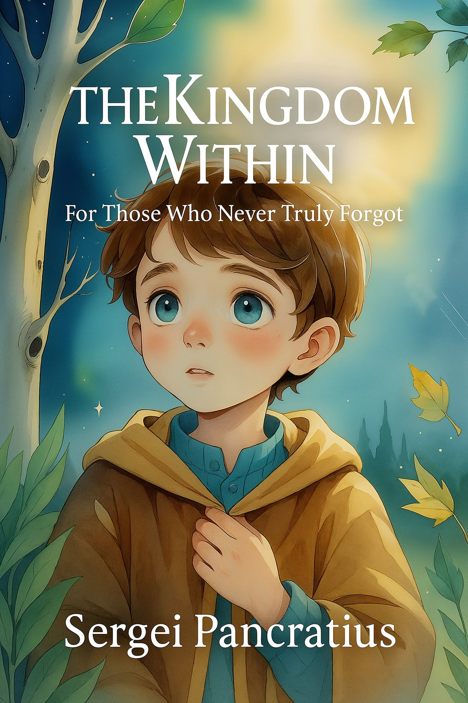

## Part 1

### Chapter 1. The One Who Sees the Light

No one really knew where Seroel[^1] came from.

He was just suddenly there —  
as if he had always been.

Born like everyone else,  
in a hospital on the edge of town,

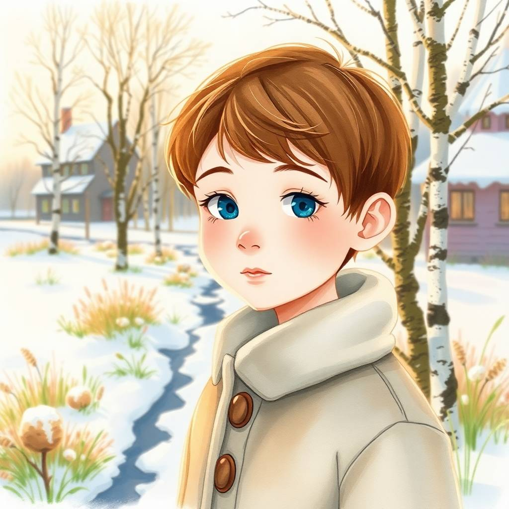

but an old woman on a bench later said:

— His eyes… they were like he knew me.  
Like he had known me… before.  
Seroel was ordinary.  
Well, almost.  
He didn’t cry.  
He didn’t scream.  
He watched.  
The wall. The chandelier. The cat. The rain.  
And it was as if he was listening.  
His mom thought — maybe he was just a dreamer.  
And his dad said:  
— He’ll be a physicist. He looks like he’s counting atoms.  
But Seroel wasn’t counting.  
He was remembering.  
He remembered how the Light plays in silence.  
He knew that water has moods,  
that trees speak — just very slowly,  
that the cat, Murka, wasn’t just purring,  
but singing an ancient song.  
He knew that grown-ups couldn’t hear it,  
because their switch inside had been turned off.  
They called it “growing up,”  
but really, it was forgetting.  
Seroel hadn’t forgotten.  
He couldn’t.  
He didn’t want to.  
He had just… stayed turned on.  
One day, outside, he saw  
a girl about two years younger  
standing and staring at a tree.  
But she wasn’t just looking —  
she was listening.  
— You see it too? — Seroel asked.  
The girl flinched.  
— See what?  
— How it breathes.  
— What does?  
— The tree.  
She looked at him like he was strange.  
But then, in a whisper, she said:  
— I thought… it was just me…  
That’s how he met **Elira**[^2].

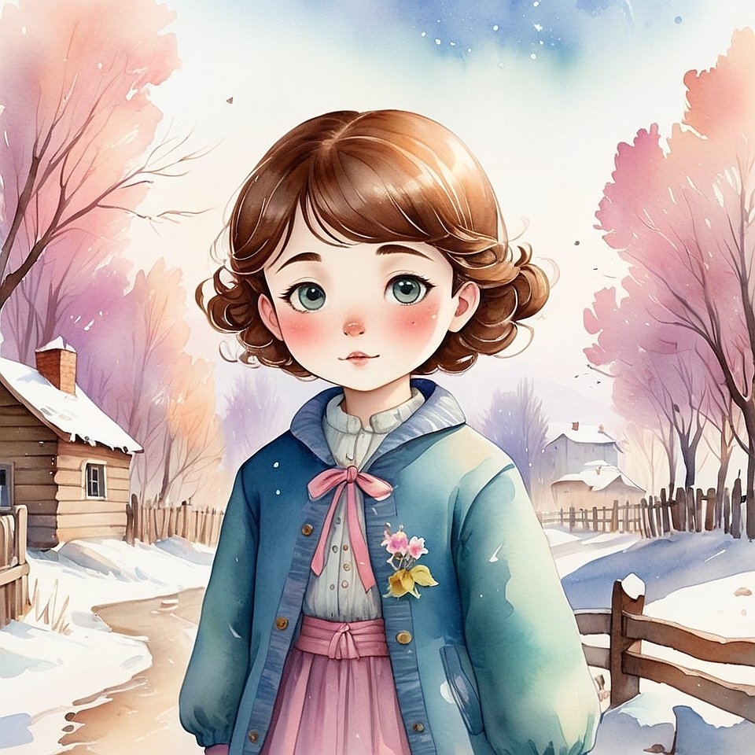

A week later, he met **Vanoel**[^3].  
Vanoel was trying to explain to a pigeon  
that it was welcome to sit on his shoulder.  
— He hears you anyway, — said Seroel.  
— Really?  
— Their ears are very thin.  
— Oh, like my grandpa’s. He always says, “I hear with my heart.”

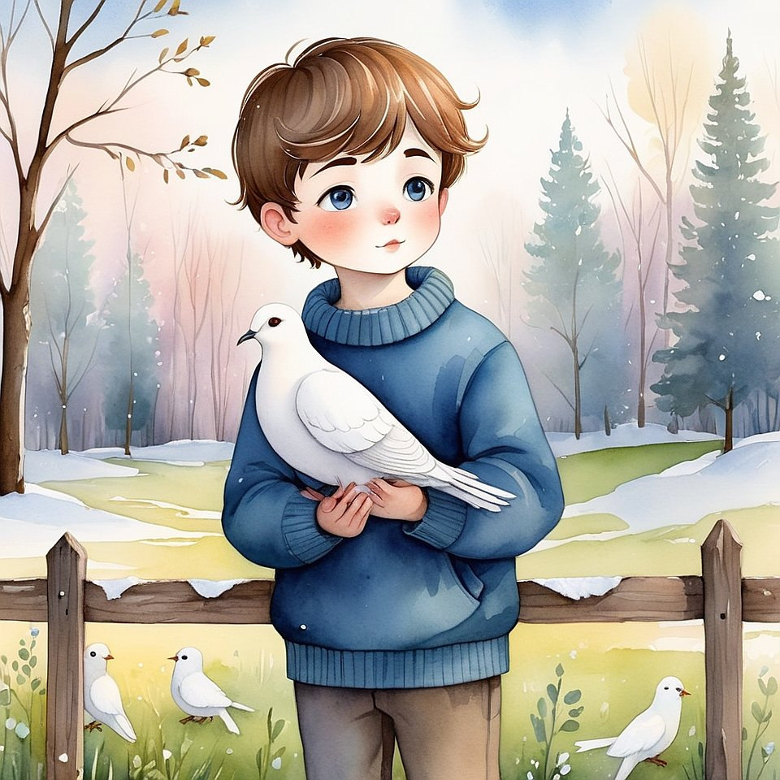

And Vanoel became the third.  
That’s how the Club of the Little King was born.  
Only no one knew it was a club.  
And no one knew who the King was.  
Except one. **The Light.**

### Chapter 2. Who the Real Kings Are

Seroel never said he was a King.  
That would’ve been… silly.  
And who would even care?

No one’s afraid of kings anymore.  
They’re in cartoons —  
with crowns, long robes,  
and big funny mustaches.

But Seroel had no robe, no crown.  
Only eyes you could drown in.  
And a silence that felt more important than any word.

One day, Elira asked:

— Why are you so weird?

— What do you mean?

— I mean, you don’t argue. You don’t get upset. You don’t complain.  
Are you even human?

Seroel thought for a moment.  
Then said:

— I’m a King.

Elira frowned.

— Really? Just like that?

— Yeah. Just not like in the stories.

— Then how?

Seroel smiled.

— A King isn’t someone who's in charge.  
A King is someone who sees **what matters**.

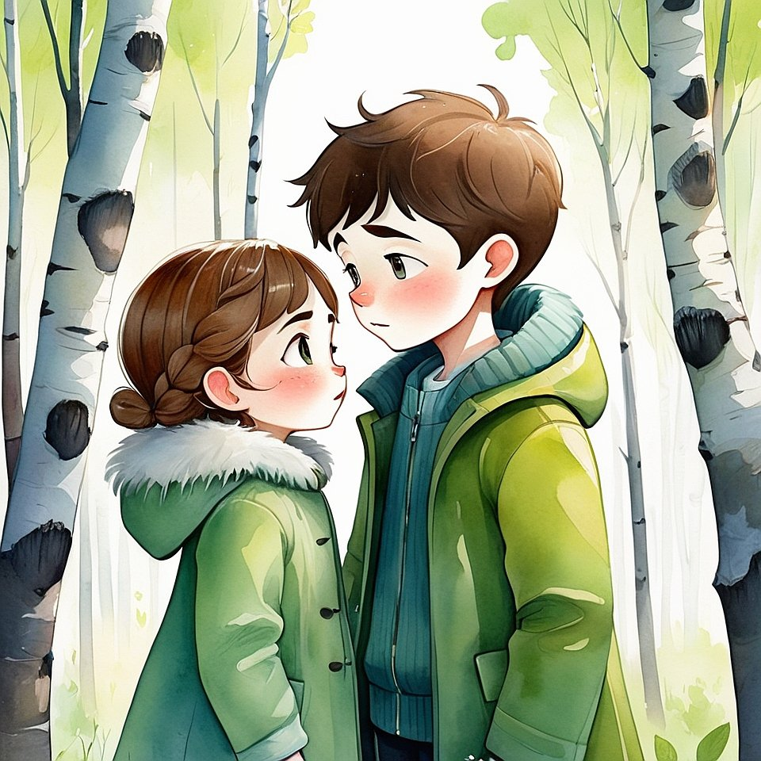

She didn’t understand.

But Vanoel, who was poking the dirt with a stick, suddenly said:

— Like Mom. She always knows when I’ve hidden something.

Seroel nodded.

— Exactly. But a King doesn’t just see what you’ve hidden.  
He sees why you did it.  
And he doesn’t punish. He understands.

Elira sat on a swing and went quiet.  
She was thinking.

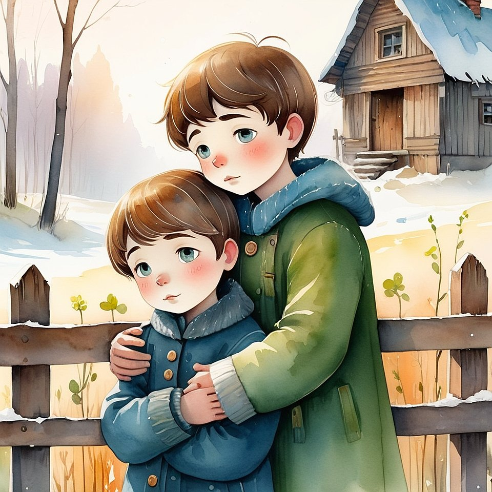

— So you’re saying…  
**anyone can be a king**?

Seroel shrugged.

— If they’re not afraid to really see.

— Will you teach us? — Vanoel suddenly asked.

Seroel didn’t answer.  
He just walked over,  
placed a hand on Vanoel’s shoulder, and said:

— I already started.

That day, they went down to the river.  
Not to swim.  
But to listen to how Time flows.

It sounded like water rustling over stones.  
And in that sound,  
there was music without words —  
the kind grown-ups call "silence".

### Chapter 3. How to Talk to a Tree (or The First Secret Game of the Little King)

The next day, Vanoel was the first to arrive.

He was always the first —  
because he was afraid the game would start without him.

He didn’t know what the game was.  
But he felt it:  
today would be important.

Elira came later, with a backpack and a notebook.

— I decided to write everything down.  
— Why? — Vanoel asked.

— What if this turns into a book someday?  
— A book?  
— You'll see!  
**Seroel** was already waiting.  
He stood under the old birch tree by the school.  
But he wasn’t just standing —  
he was listening.  
— What are you doing? — Vanoel asked.  
— Shh, — Seroel whispered. — She’s speaking.  
— Who is?  
— The birch.

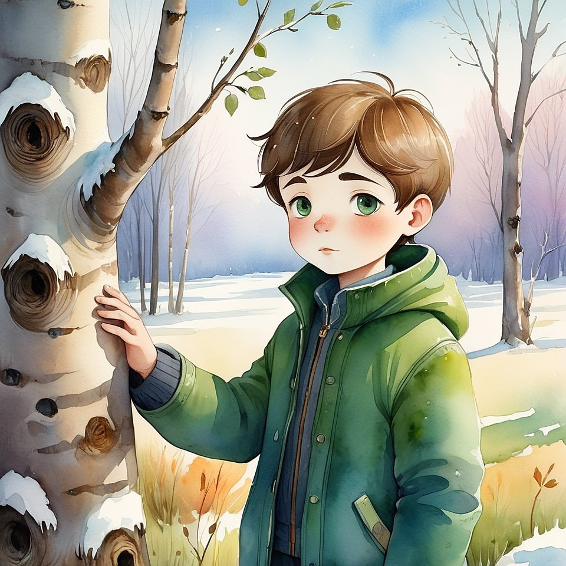

Elira snorted.  
— You’re crazy.

Seroel wasn’t offended.  
He simply reached out  
and touched the bark.  
Then he said:  
— Want to try?  
— How?  
Seroel turned and smiled,  
like someone holding a secret he longed to share.  
— You only need one thing.  
You have to become quieter than the tree.  
Elira made a serious face.  
Vanoel covered his mouth with his hand.  
— Now — step closer.  
— Palm to the tree.  
— Close your eyes.  
— Don’t listen with your ears.  
— Listen — inside.  
They stood.  
Silently.  
They touched.  
And then…  
something happened.

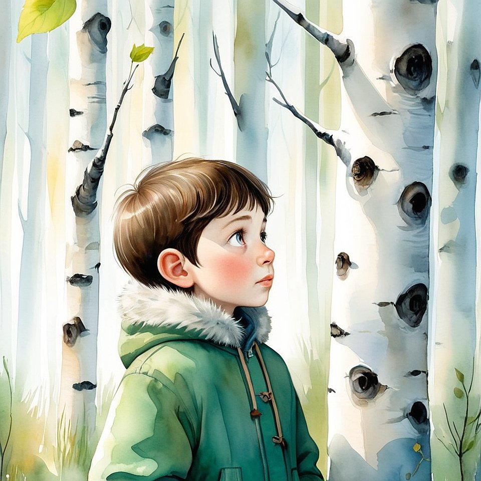

**Elira** heard… a song.  
It wasn’t music.  
It was warmth coming from the trunk,  
as if the tree whispered:  
*“I remember you. I remember when you were just a sprout.*  
*Remember, too.”*  
**Vanoel** started crying.  
He didn’t know why.  
But the tears felt… good.  
— I… I saw myself little — really little.  
Before… anything.  
Elira was quiet.  
She looked at Seroel.  
He was so calm —  
as if he had known this would happen all along.  
From that day on, they had their first real game.  
It was called:  
**“Listen to the Ones Who Don’t Speak.”**  
They played it with trees, with stones, with puddles.  
And sometimes… they really did hear.

### Chapter 4. The Cat Who Disappears (but Always Comes Back with Something Important)

It happened in the evening.

Everything was normal:  
Mom was making soup,  
Dad was flipping through the paper,  
and Seroel sat by the window,  
watching the evening light dance on the glass.

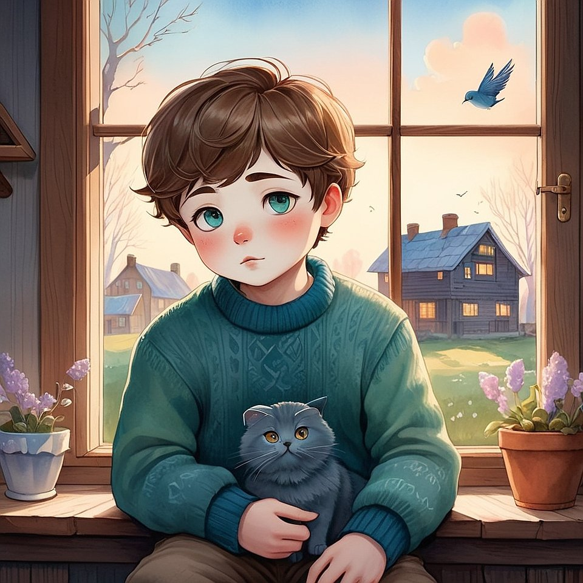

He wasn’t waiting for anything.  
He was just… there.  
And suddenly —  
on the windowsill — a cat appeared.

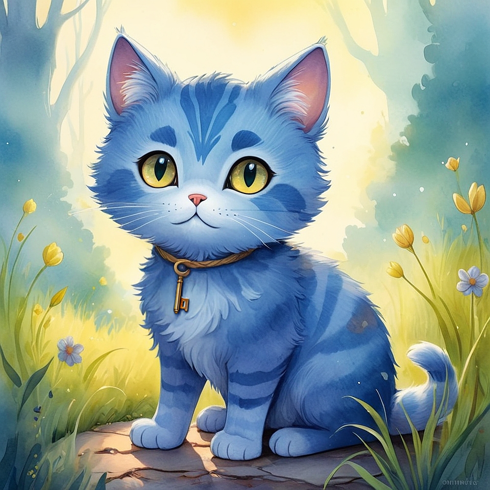

He didn’t jump.  
He didn’t walk over.  
He was just… there.  
Seroel knew this cat.  
He only came when something important  
was about to begin.  
The cat’s name was **Blu**,  
not because he was blue,  
but because his eyes held the depth of the sky.  
— You again? — Seroel said softly.  
The cat didn’t answer.  
He was silent —  
the kind of silence only Those Who Remember Everything can make.  
Blu rubbed against Seroel’s hand…  
and then disappeared.  
Just like that.  
He didn’t leap down, didn’t walk away —  
he simply wasn’t there anymore.  
Seroel smiled.  
It was a sign.  
The next day, he told Elira and Vanoel:  
— Today we’re getting a mission from Blu.  
— The cat? — Vanoel blinked.  
— Yes. But he’s not just any cat.  
He only comes when it’s time to understand something.  
— So what do we do? — asked Elira.  
Seroel thought.  
Or at least looked like he did.  
Then he said:  
— Today’s game is called  
**“Find What Isn’t There.”**  
— But… how? — Vanoel asked.  
— Like this.  
He pulled a sheet of paper from his pocket.  
On it — nothing.  
Just a blank page.  
— Here.  
— This is the important thing.  
— Don’t look *at* the paper — look *through* it.  
— Look inside yourself while you stare.  
— Then tell me what you saw.  
They took the paper.  
Looked.  
Stayed silent.  
Then Elira said quietly:  
— I remembered being little and drawing a cloud.  
But it wasn’t on paper — it was in the sky.

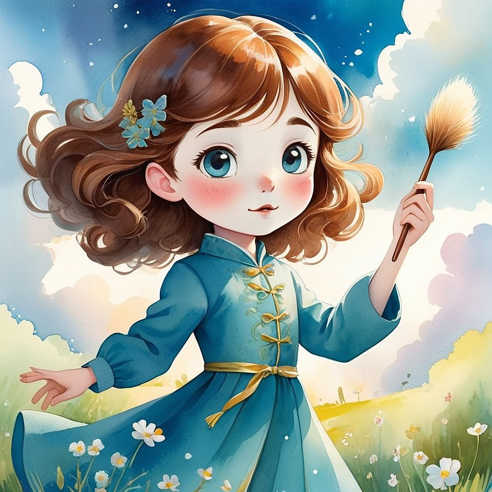

And Vanoel said:  
— I saw myself sleeping… but knowing I was asleep.  
Like I was here and somewhere else at the same time.  
Seroel nodded.  
— That’s it. That’s the thing that isn’t there.  
But it *is*.  
Just not for the eyes.  
Only for the heart.  
At that moment, **Blu** walked past.  
Hanging from his neck — a string with a tiny key.  
He winked.  
And disappeared again.  
From then on, they had a new game:  
**“Find What Isn’t There — and Bring It With You.”**  
And you know what?  
They really did start finding it.

### Chapter 5. The Magical Bell No One Heard (but Everyone Started Being Nicer)

It all started at school.  
The place where things were supposed to be boring.  
Where everyone sat still  
and no one thought about the Light —  
and definitely not about the Kingdom.  
But **Seroel** knew:  
The Creator comes to school too.  
Especially to school.  
Because it’s where most forget  
they're still playing.  
During the second lesson, **Elira** dropped her pen.  
She bent down to pick it up —  
and heard a bell.  
Soft. Quiet.  
Like someone had rung a tiny chime  
deep inside her head.  
She picked up her pen  
and looked at Seroel —  
and he was already looking at her.  
He knew.  
— You heard it too? — she whispered.  
Seroel nodded.  
— That was the Kingdom Bell.  
— What does it mean?  
Seroel smiled.  
— It means someone just remembered who they are.  
And the world responded.  
After class, they sat behind the school,  
near the flowerbeds, where no one bothered them.  
— When did you first hear your bell? — Vanoel asked.  
— In kindergarten,  
I was standing by the window  
and suddenly realized  
that the butterfly on the glass  
was looking at me like a person.  
And in that moment — the bell rang.  
Inside me.  
— And what happened then?  
— The teacher walked over…  
and suddenly hugged me.  
Just like that.  
She’d never hugged me before.  
Elira thought for a moment.  
— I had something like that too.  
I saw a boy sitting alone in a corner,  
and I went to him. Just because.  
And right then —  
I heard the ringing.  
Not outside,

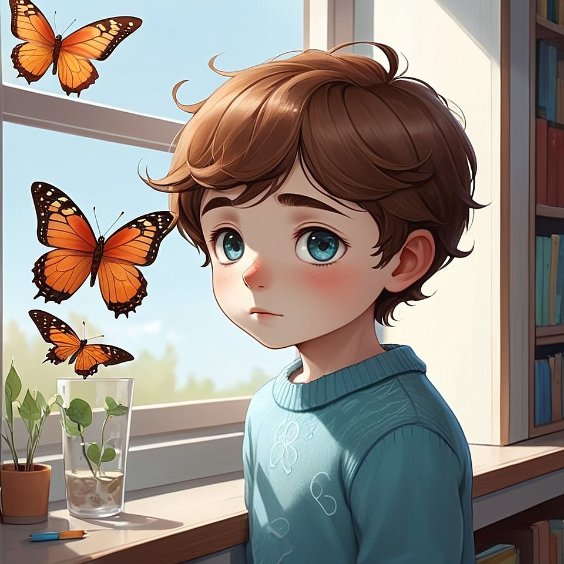

but in my chest.

Seroel nodded.  
— Then you remembered.  
Every time we become ourselves —  
the Light rings.  
From that day on, they had a third game:  
**“Hear the Bell No One Else Can Hear.”**  
And something strange happened.  
Every time they heard that bell,  
little good things started to happen:  
— someone helped pick up a backpack,  
— someone shared their sandwich,  
— someone suddenly said:  
*“You know… I like you.”*  
And no one knew why.  
But the Light knew.

### Chapter 6. How to Become Invisible (but Still Be Loved)

One day, **Seroel** disappeared.  
Not completely, of course.  
He sat in class, answered at the board,  
even ate his sandwich during recess.  
But it was as if… he wasn’t there.  
**Elira** noticed first.  
— Are you hiding?  
— No. I just became quieter than usual.  
— Why?  
— I want to see what happens if I disappear, but still stay.  
**Vanoel** widened his eyes:  
— What does that mean?  
Seroel sighed.  
— Imagine you're not a body. You're silence.  
Silence that watches, feels, loves —  
but doesn’t want anything for itself.  
— And then you disappear? — Vanoel asked.  
— For the mind — yes.  
But for the Heart — the opposite.  
People start to feel you even more.  
Because you stop getting in the way of your own Light.  
Elira stayed quiet for a long time.  
Then she said:  
— Let’s try it?  
They went to the park.  
Sat on a bench.  
Closed their eyes.  
Seroel said:  
— Now forget your name.  
Forget who you are.  
Just be.  
No words. No thoughts.  
Be Silence.  
But not empty — full of Light.  
And they sat.  
Just sat.  
Not thinking. Not trying.  
Disappearing.  
Ten minutes passed.  
Two people walked by.  
One of them said:  
— Look at those beautiful kids. Like angels.  
The other smiled:  
— I didn’t even notice them at first.  
Elira opened her eyes.  
— It worked.  
I felt that I *was* —  
but no one saw me, except those who were looking from the

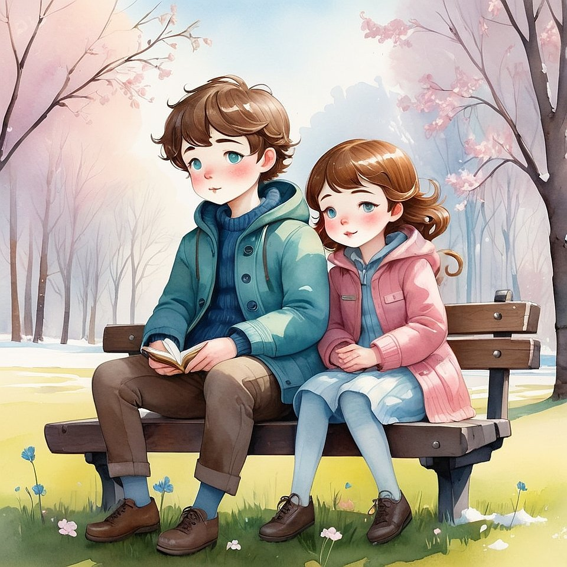

heart.

Vanoel said:  
— I felt so good,  
I didn’t even want to become “myself” again.  
Seroel smiled.  
— That’s what it means to be real.  
Invisible, but loved.  
Silent, but alive.  
Since then, they had a fourth game:  
**“Disappear so the Light becomes brighter.”**  
They played it in different ways:  
– on the bus,  
– during lessons,  
– at lunch.  
And something always happened:  
someone spoke more gently,  
someone said thank you,  
someone stared — and couldn’t look away.  
But the children thought it was just coincidence.  
All except Seroel.  
He knew:  
**When the “I” disappears,**  
**the Creator appears.**

### Chapter 7. The Game with No Name

— What will today’s game be called? — **Elira** asked.  
**Seroel** tilted his head:  
— Nothing.  
— What do you mean “nothing”?  
— It won’t have a name.  
— That’s weird, — said **Vanoel**.  
Seroel shrugged.  
— Not everything needs a name.  
Elira thought for a moment, then said:  
— Okay. So how do we play?  
Seroel looked up at the sky.  
— First… you do nothing.  
— Like… nothing nothing? — Vanoel clarified.  
— Yep.  
— But what’s the point?  
— That’s the whole point. There is none.  
Elira narrowed her eyes.  
— Is this another one of your invisible games?  
— Kind of.  
— What do we do exactly?  
Seroel smiled.

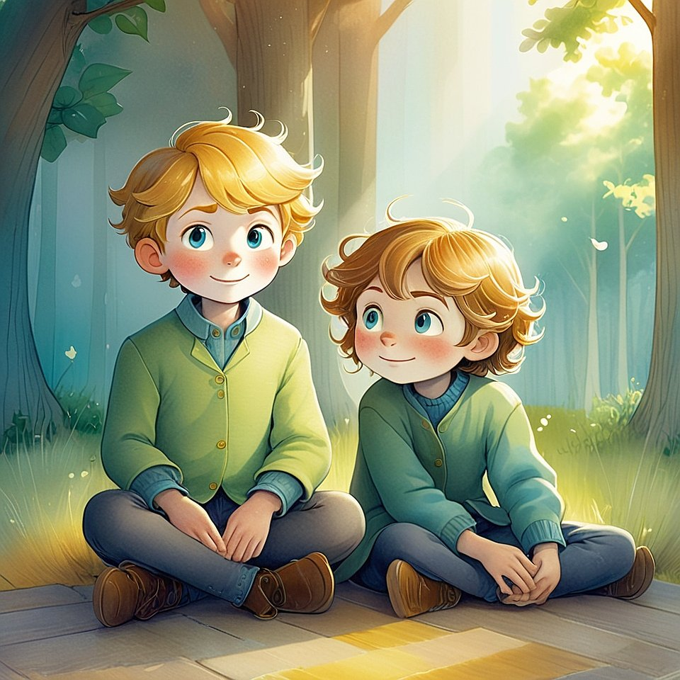

— We stop. We let go. We sit.  
And we wait for something real to come.  
Not from outside — from inside.  
They sat on the grass.  
Did nothing.  
Vanoel got a bit bored.  
Elira got a bit curious.  
Seroel just smiled.  
After a few minutes, Vanoel whispered:  
— I think… I feel something.  
— What?  
— Like the world stopped holding its breath.  
Like it finally let go.  
Elira added:  
— I didn’t hear anything.  
But I felt as if something heard *me*.  
Seroel nodded.  
— That’s it.  
— What is? — asked Vanoel.  
— The Game with No Name.  
It’s not really a game.  
It’s just… the Moment.  
And when you notice it —  
it starts to notice you too.  
They sat in silence again.  
And the wind quietly passed through them,  
as if it was listening too.

### Chapter 8. When the Sky Comes Closer

That morning, **Seroel** was very quiet.  
He wasn’t thinking.  
He wasn’t sad.  
He just sat on the edge of the field,  
looking up.  
He looked at the sky as if waiting for it to say something.  
Or maybe… to listen.

**Elira** noticed first.

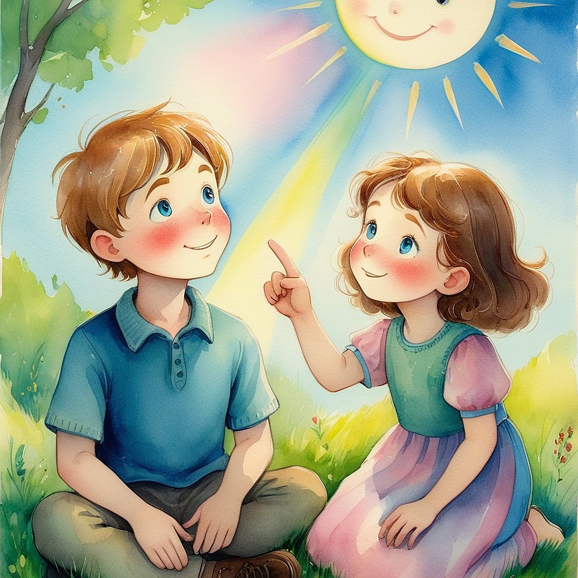

— Are you waiting for rain?  
Seroel shook his head.  
— No.  
— For a sign?  
He smiled.  
— Not exactly.  
— Then what?  
Seroel paused.  
The sky was clear.  
A few soft clouds drifted slowly above them.  
— I’m waiting for the sky to notice me.  
**Vanoel**, who had just finished chasing a bug, laughed.  
— The sky? Noticing you? Why?  
Seroel looked at him with calm eyes.  
— Sometimes, when I’m very still…  
something in the sky looks back.  
It doesn’t have eyes,  
but it knows.  
Elira sat down next to him,  
not laughing, just listening.  
— Does it… say something?  
Seroel nodded.  
— Not with words. But I hear it.  
Like it remembers me.  
Like we were friends before I was born.

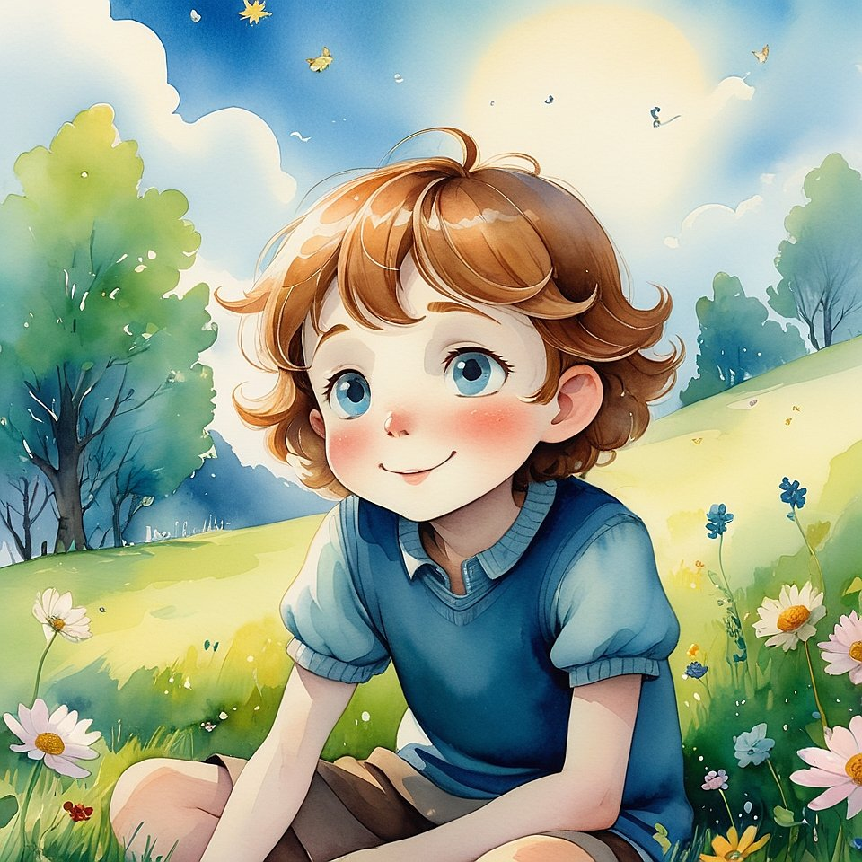

Vanoel frowned.

— I don’t hear anything.  
Seroel didn’t argue.  
He simply touched the grass beside him  
and said:  
— Try being so still  
that even the wind starts wondering where you went.  
Vanoel tried.  
He sat.  
Closed one eye.  
Then both.  
Then peeked.  
— I feel itchy,  
but also…  
like I’m not the most important thing in the world.  
— That’s when the sky gets closer, — Seroel whispered.  
— I felt something once, — Elira said softly.  
— I was sitting in the kitchen,  
and the sun came through the window —  
not on me,  
but… through me.  
And for a moment, I forgot what I was doing.  
I just felt… here.  
— Yes, — said Seroel.  
— That’s it.  
They sat together for a while.  
No one spoke.  
Even the birds nearby seemed to lower their voices.  
Then Seroel said:  
— When we stop looking for something,  
something finds us.  
When we stop making noise,  
the sky remembers we’re listening.  
And in that moment,  
a single white feather drifted down from nowhere.  
It landed in front of them  
so gently that no one dared to touch it.  
**Elira** whispered:  
— I think it said hello.  
They didn’t talk for a while.  
Even **Vanoel**, who usually couldn’t sit still for more than a minute,  
was just… there.  
No questions.  
No jokes.  
Just wide eyes and open silence.  
A bumblebee buzzed nearby.  
It didn’t scare them.  
It simply moved from one flower to the next,  
as if it too had joined the listening.

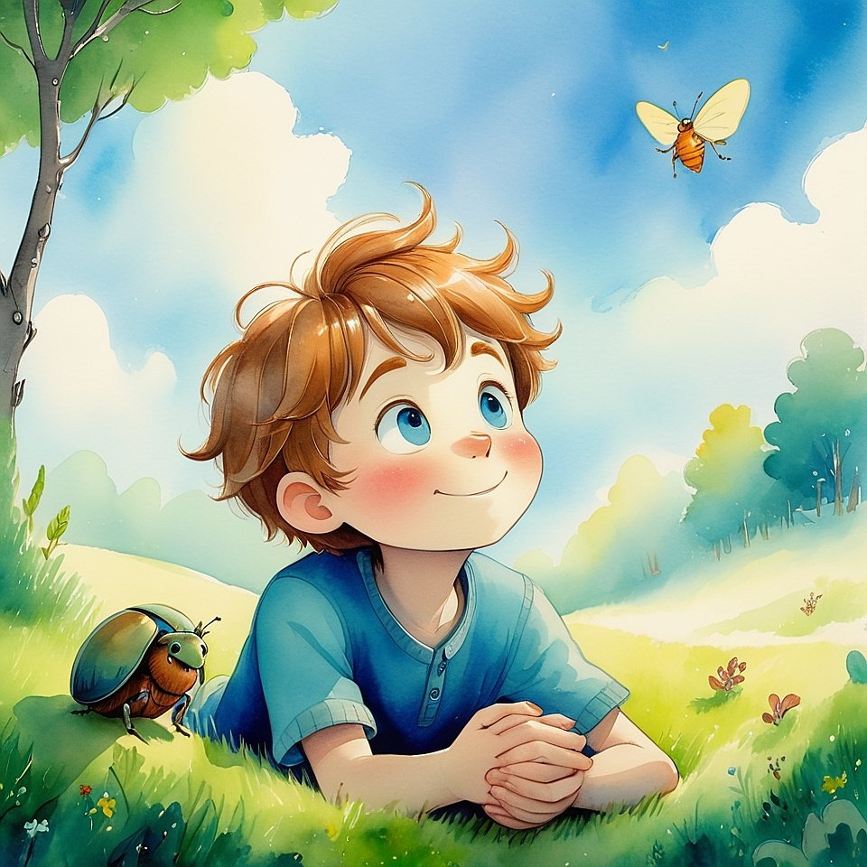

Then Seroel spoke — not loudly,  
but with the kind of voice that doesn’t ask for attention,  
only truth.  
— I think the sky isn’t high.  
It just looks that way.  
It’s not up there — it’s everywhere.  
Even in your chest.  
Vanoel touched his shirt.

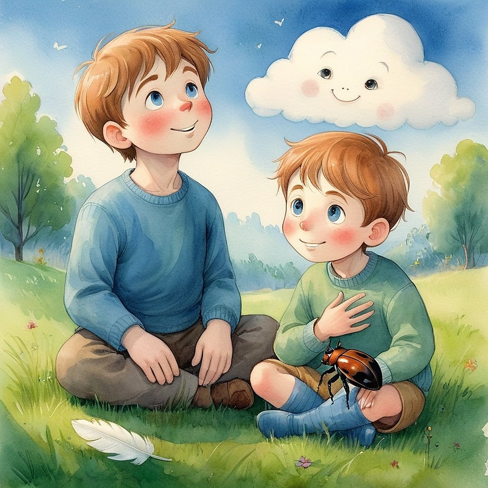

— Even here?

Seroel nodded.  
— The part that breathes even when you forget about it.  
The part that doesn’t stop when you sleep.  
That’s where it whispers.  
Elira asked:  
— So… why don’t grown-ups feel it?  
Seroel looked into the distance.  
— Maybe they stopped being quiet long enough to hear.  
Maybe they filled the sky with their own thoughts.  
— That sounds sad, — said Vanoel.  
— It’s not, — Seroel answered.  
— The sky is patient.  
It waits forever.  
And even one breath of stillness is enough  
for it to come close again.  
The feather twitched in the breeze,  
but did not fly away.  
It stayed.  
Just like the feeling.  
Not big.  
Not loud.  
But real.  
And that day,  
they didn’t play any game.  
Because the moment itself  
was already the game.

### Chapter 9. How to Know You’re Real

— Sometimes I feel like I’m dreaming, — **Vanoel** said.  
They were sitting under the tree again.  
The one near the bench.  
The one that always whispered when the wind came.  
**Seroel** looked up.  
— What do you mean?

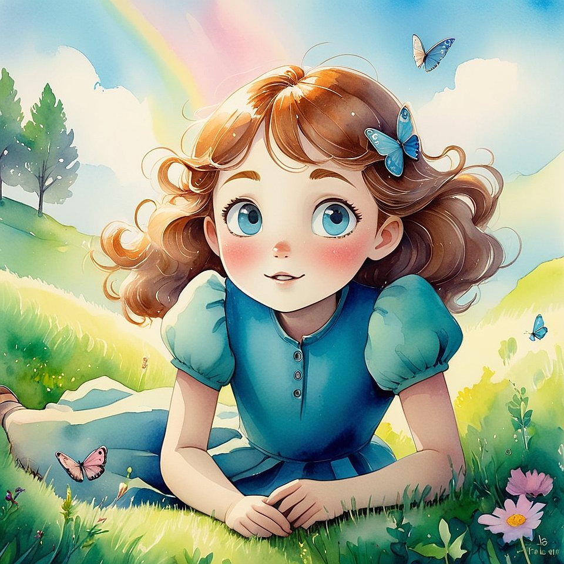

— Like this is all… not real.  
Like I’m in a story someone else is telling.  
**Elira** was lying in the grass, looking at the clouds.  
— Maybe we *are* in a story.  
Vanoel blinked.  
— Then who’s telling it?  
Seroel smiled.  
— Maybe we are. Together.  
Each of us holding one thread.  
— But how do I know I’m *me*?  
And not just a dream inside someone’s head?  
Seroel thought for a moment.  
Then pointed at the ground.  
— What do you feel right now?  
Vanoel touched the earth.  
It was warm.  
Firm.  
Alive.  
— I feel… here.  
— That’s how you know.  
Elira sat up.

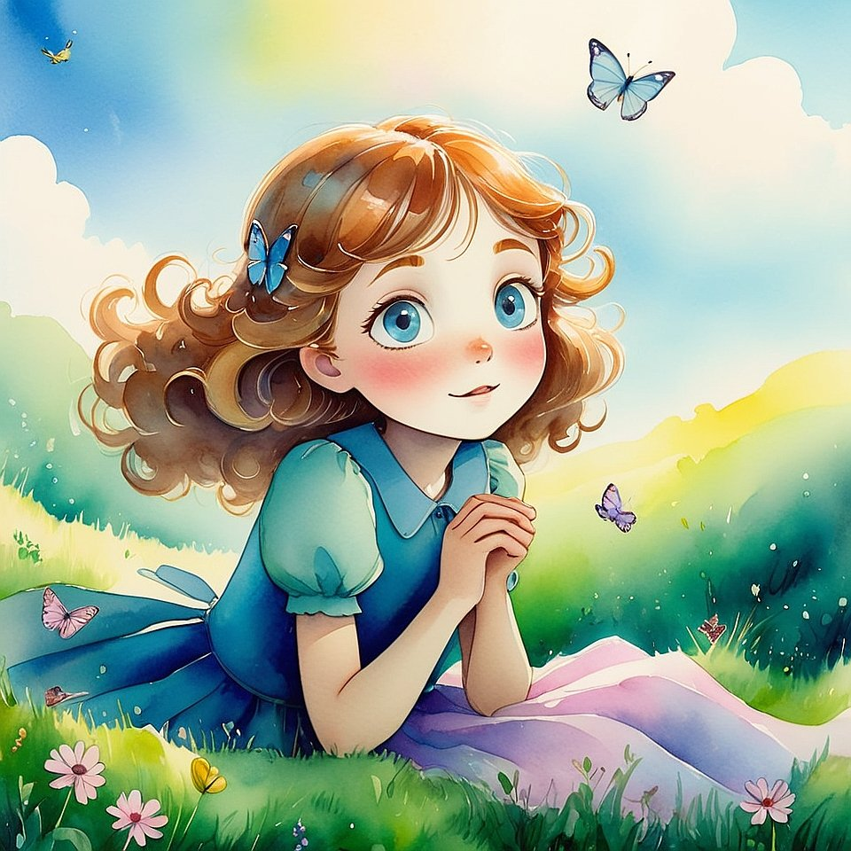

— But sometimes I feel like I’m pretending.  
Like I’m trying to be who I think I’m supposed to be.  
Seroel looked at her gently.  
— Then stop.  
Be no one.  
Then listen.  
The one who stays —  
that’s the real you.  
They went quiet.  
The wind rustled.  
A bird sang.  
A car far away hummed by.  
Seroel closed his eyes.  
— When you stop trying to be someone…  
you find someone you didn’t invent.  
The one who was there before the pretending.  
Elira whispered:  
— I think I just met her.  
Vanoel touched his chest again.  
— And I think he’s been here all along.  
They didn’t stand up right away.  
The grass felt softer than usual.  
Or maybe it was them who had changed —  
a little lighter, a little quieter.  
**Seroel** lay back and looked up at the sky.

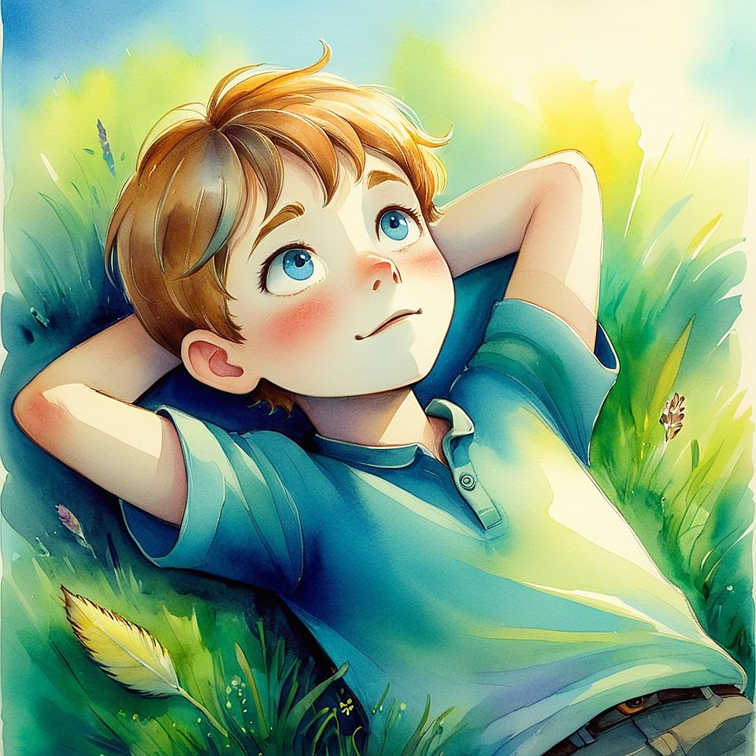

— Do you think trees pretend?  
**Elira** giggled.  
— What? Trees?  
— Yeah. Like… do they try to be taller than they are?  
Or feel bad if they don’t bloom fast enough?  
Vanoel shook his head.  
— Trees just grow.  
They don’t rush. They don’t compare.  
They don’t pretend.  
Seroel smiled.  
— That’s why they’re always real.  
Because they’re not trying.  
Elira whispered:  
— Maybe we’re most real  
when we stop trying too.  
A silence settled again.  
But it wasn’t empty.  
It was full —  
like a cup that holds light instead of water.  
Then Vanoel suddenly said:  
— I don’t want to be made-up anymore.  
Elira looked at him.  
— You never were.  
— Maybe.  
But I think I was acting like I was.  
Like I needed to be *more* to be loved.  
Seroel opened his eyes.  
— The truth is… you don’t need to be *more*.  
You already are.  
The sky never asks a bird to shine.  
It just gives it space to fly.  
Vanoel blinked slowly.  
He looked at his hands.  
Then smiled — not because of something funny,  
but because something inside had stopped pretending.  
That day, they didn’t start a new game.  
They just agreed on something — without words.  
**From now on, no pretending.**  
**Only real.**  
**Even if it’s quiet.**  
**Even if it’s unsure.**  
**Even if it’s small.**  
Because real things grow slowly.  
Like trees.  
Like hearts.  
**Like Light**.

### Chapter 10. How to Come Home Without Leaving

— Do you ever miss home? — **Vanoel** asked.  
They were walking along a narrow path through the field,  
stepping on fallen leaves and soft grass.  
— We’re not far from home, — said **Elira**.  
— Not that kind of home, — Vanoel said, touching his chest.  
— The *other* one.  
The one before this.  
**Seroel** didn’t answer right away.  
He let the wind move through his hair.  
Then he said:  
— Sometimes, I think this *is* home.  
We just forgot.  
Elira tilted her head.  
— But it doesn’t feel like it.  
— That’s because we’re still trying to make everything make sense.  
Vanoel kicked a rock gently.  
— It’s hard to feel at home when you’re trying to be someone.  
They stopped by a tree.  
Seroel put his hand on the bark.  
— When I forget everything — even who I’m supposed to be — I feel a kind of warmth in my chest.  
Like I never left anything.  
Like I’m already there.

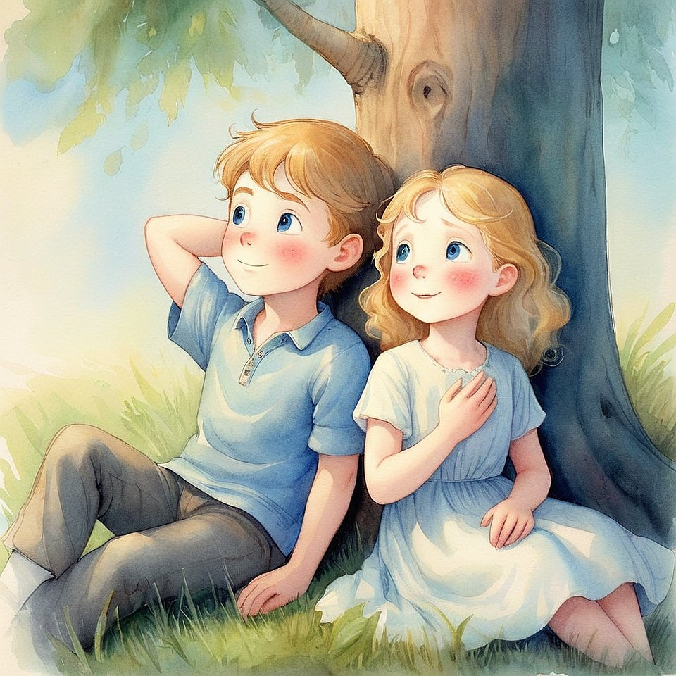

Elira touched her heart, too.  
— I know that feeling.  
It comes when I stop pretending to be strong.  
Vanoel added:  
— Or when I let myself cry, but no one sees.  
They sat down beneath the tree.  
Didn’t talk.  
Just listened.  
The wind. The birds. The breath inside them.  
Then Seroel whispered:  
— Coming home isn’t about going somewhere.  
It’s about remembering what’s already here.  
Inside.  
And in that moment,  
everything around them  
felt like it had always been waiting.  
Not for words.  
Not for answers.  
Just for them to come home.

### Chapter 11. How to Hear What No One Says

That day, they didn’t meet under the tree.  
Or by the bench.  
Or even near the flowers.  
They met in silence.  
**Seroel** was already there,  
standing in the middle of the field,  
eyes half-closed,  
as if listening to something that wasn’t sound.  
**Elira** approached slowly.  
She didn’t speak.  
She didn’t even step on the dry leaves.  
She just… came.  
**Vanoel** came last,  
running, then stopping suddenly —  
as if the air itself had asked him to be quiet.  
They stood in a triangle.  
Not planned. Not spoken.  
Just perfect.  
Then Seroel whispered:  
— Don’t listen with your ears.  
Vanoel frowned.  
— Then how?  
Seroel touched his own chest,  
just above the heart.  
— Here.  
Where the wind doesn’t reach.  
Where no one argues.  
Where even you stop being noisy.  
Elira closed her eyes.  
Vanoel too.  
They breathed.  
And then…  
They heard it.  
Not words.  
Not music.  
But something warm.  
Like the sound a tree might make if it could sigh.  
Like the sound of the world remembering itself.  
Seroel opened his eyes.  
— That’s the language without letters.  
The one you can’t learn —  
only remember.  
Elira said quietly:  
— I think it said… “Welcome back.”  
Vanoel wiped his eye.  
— I didn’t even know I was gone.

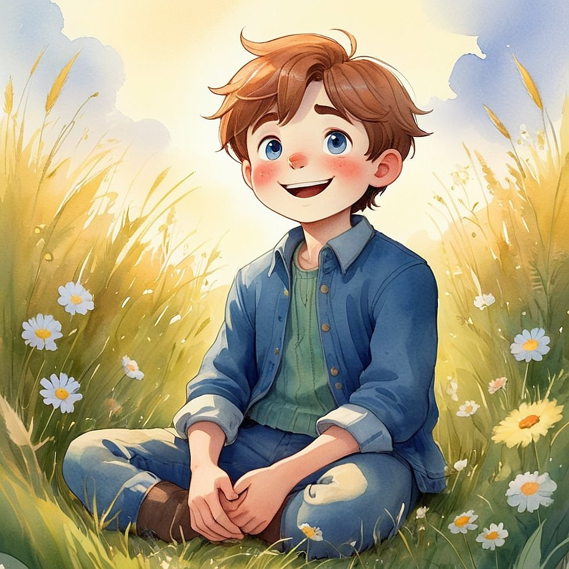

They didn’t move for a long time.

Even the wind seemed to pause with them,  
as if it too was trying to listen.  
A bird landed nearby.  
Didn’t sing.  
Just looked at them.  
As if it knew.  
Then **Seroel** said softly:  
— Sometimes, when we get quiet enough,  
everything starts to speak.  
**Elira** nodded.  
— Even the things that can’t.  
— Especially those, — Seroel smiled.  
**Vanoel** sat down on the grass.  
— What if I forget how to listen like this?  
Seroel joined him, sitting cross-legged.  
— You won’t.  
Not completely.  
Because now… you remember that it’s possible.

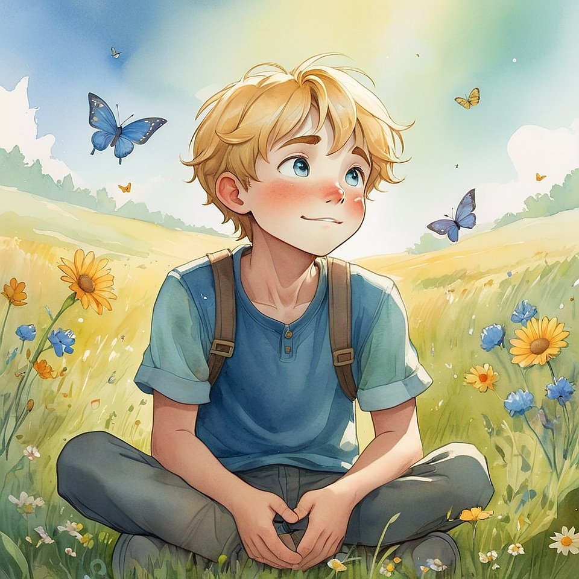

Elira sat too, and placed a hand over her heart again.  
— I think the voice lives here.  
Not in thoughts,  
but in something deeper.  
Like a glow.  
They sat together in the middle of the field.  
No one passed.  
No one called.  
The world wasn’t gone —  
but it was… paused.  
And in that pause,  
they could hear the silence  
not as absence,  
but as Presence.

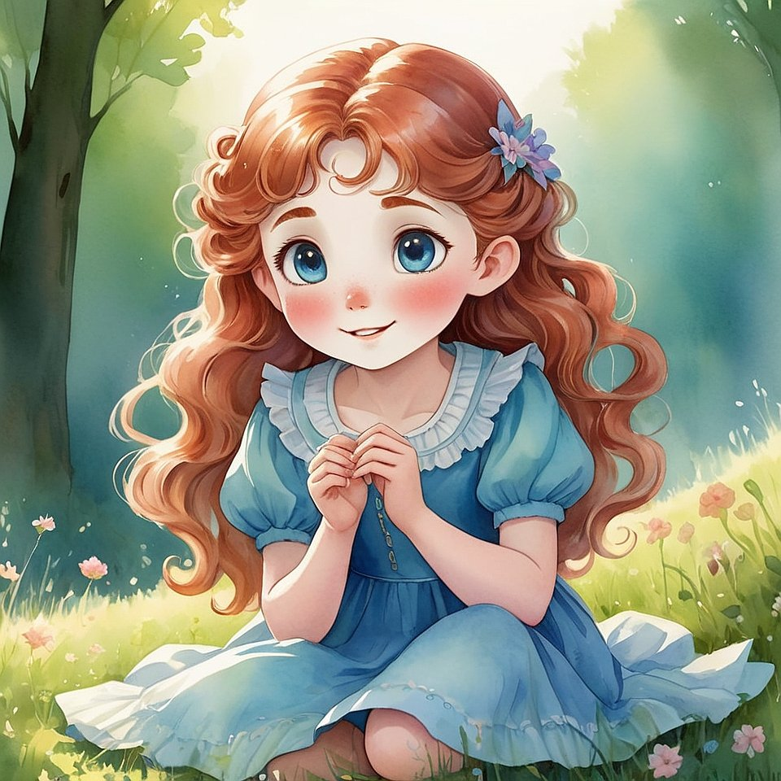

Then Seroel whispered:

— What if the Light has always been speaking,  
and it was us who were too loud to notice?  
Vanoel smiled.  
— Then let’s stay quiet a little longer.  
They did.  
Not because it was a rule.  
But because something inside them  
wanted to listen more  
than it wanted to speak.  
And for a while,  
that was enough.

### Chapter 12. How Not to Get Lost in a Big World

The city was louder than they remembered.  
Cars. Voices. Flashing signs.  
Everything moved fast,  
and no one seemed to see each other.  
**Seroel**, **Elira**, and **Vanoel** walked together,  
holding hands.  
— Why do people look down when they walk? — asked Vanoel.  
— Maybe they’re tired, — said Elira.  
— Or maybe… they forgot there’s sky.  
Seroel didn’t answer.  
He just looked around —  
at the tall buildings,  
the glowing screens,  
the rushing faces.  
He whispered:  
— So much light.  
And still… they feel in the dark.  
They sat on a bench near a busy street.  
No birds.  
No butterflies.  
Just the sound of engines and hurry.  
Elira said:  
— I feel like I’m disappearing here.

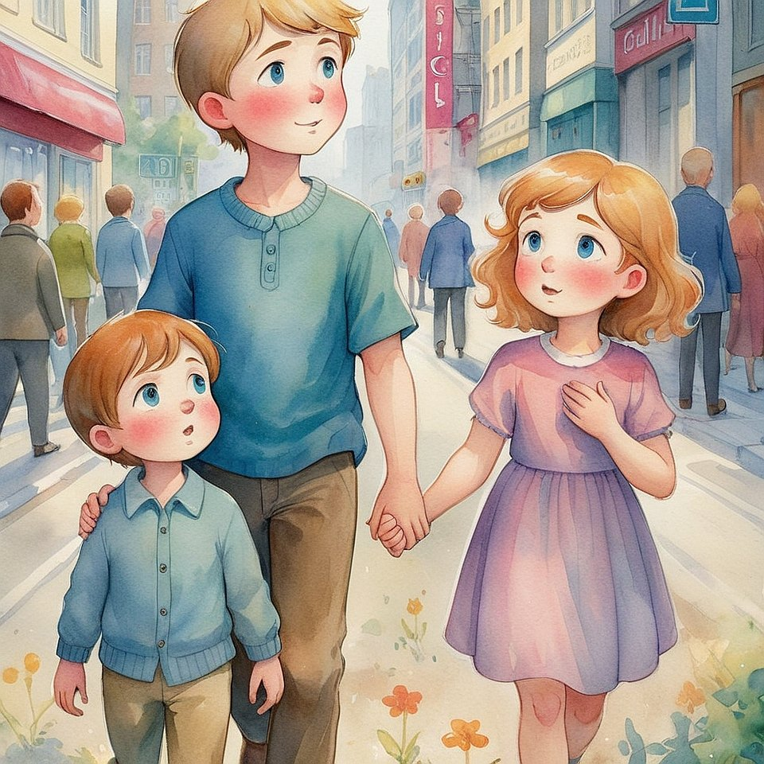

Seroel turned to her gently:

— Then hold something inside.  
Not a thought.  
A thread.  
— What thread?  
— The one that connects you to yourself.  
To the part that doesn’t change —  
even when the world does.  
Vanoel whispered:  
— Like when I hold my breath  
and remember I’m not just a body.  
Seroel nodded:  
— That’s it.  
You can walk through noise —  
and still be silence.  
You can pass through crowds —  
and still be whole.  
Elira asked:  
— But how do I know I haven’t lost it?  
Seroel smiled:  
— If you ask that —  
you haven’t.

### Chapter 13. How to Speak Without Words

They were sitting at a table in the cafeteria.  
Everyone around them was talking, laughing, eating.  
Noise filled the air — spoons, trays, voices.  
But **Seroel** wasn’t saying anything.  
He just looked at his sandwich.  
**Elira** nudged him.

— Are you okay?

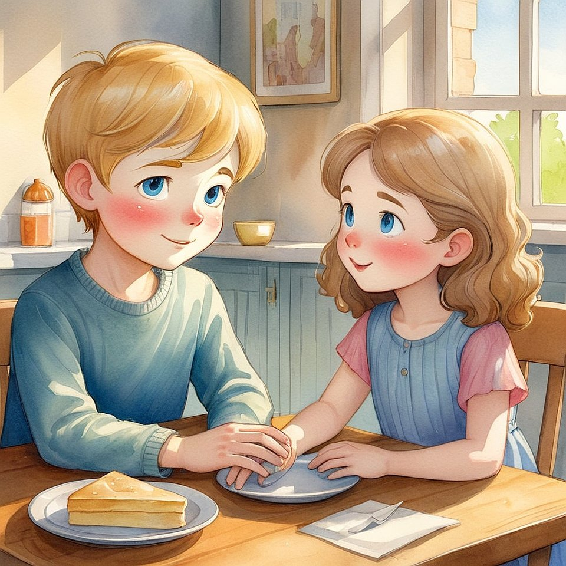

He looked up.  
Smiled a little.  
Then shook his head — not “no,”  
but something softer. Like “I’m here, just quiet.”  
**Vanoel** asked:  
— Are you mad?  
Seroel shook his head again.  
Then tapped his chest lightly.  
Put his hand flat on the table.  
Then looked at them both with a gaze  
so deep, it didn’t need sound.  
Elira’s face softened.  
— You’re listening, aren’t you?  
Seroel nodded.  
Vanoel tilted his head.  
— To what?  
Seroel smiled.  
Then, without speaking, he reached out  
and gently touched Vanoel’s shoulder.  
Then Elira’s hand.  
Then pointed toward the window,  
where light was falling on the floor in a golden path.  
He didn’t say a word.  
But they both knew what he meant:  
**“Look. It’s speaking.”**  
And it was.  
The sunlight.  
The stillness.  
Even the crumbs on the table —  
everything was whispering something  
without needing a single syllable.  
Vanoel whispered:  
— This is like… talking with your heart.  
Seroel nodded.  
— You don’t always need words  
when the feeling is clear.

### Chapter 14. Why the Stars Shine at Night

— I don’t like the dark, — said **Vanoel**.  
They were sitting on the grass after sunset.  
The sky above was deep blue, turning almost black.  
Only a few stars had appeared.  
**Elira** rolled took his hand.

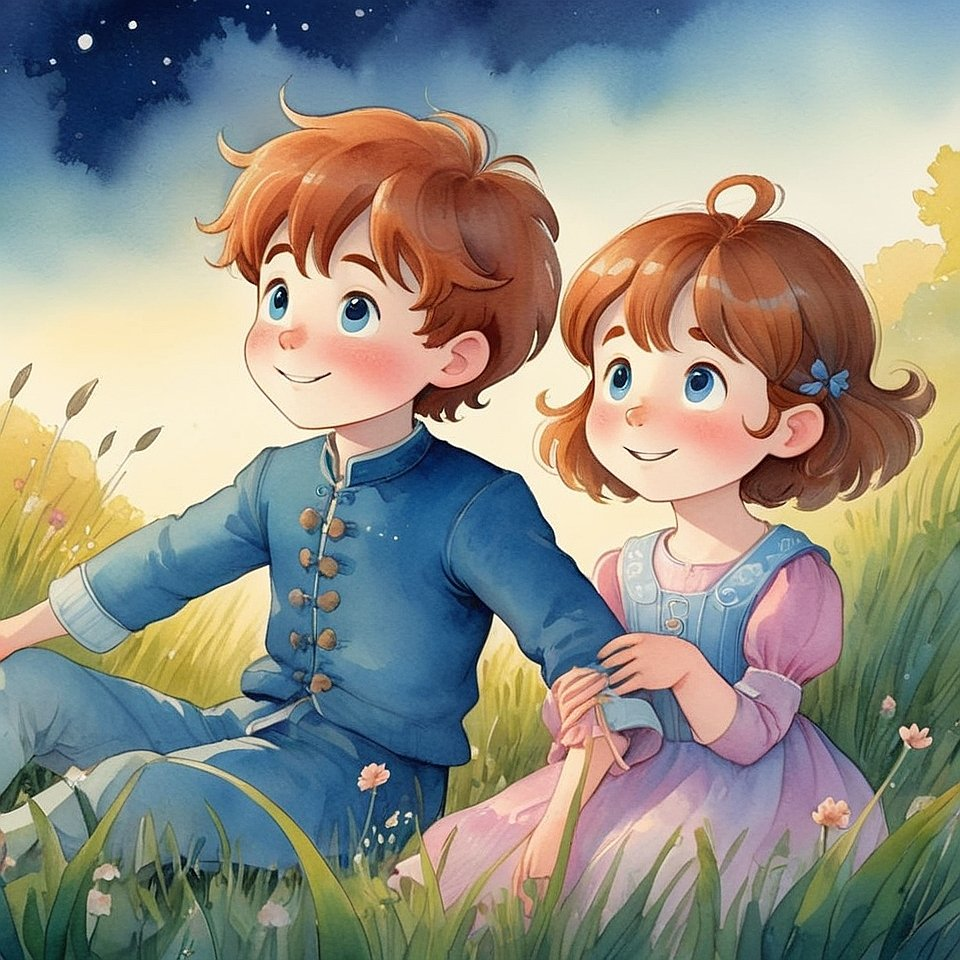

— Why not?

— It feels like everything disappears.  
Like I’m small.  
Like… the world forgot me.  
**Seroel** didn’t answer right away.  
He watched the stars quietly,  
as if waiting for them to say something first.  
Then he whispered:  
— What if the stars shine  
because someone’s afraid of the dark?  
Vanoel blinked.  
— Like who?  
— Like you.  
Like anyone.  
Like the sky itself, remembering we’re still here.  
Elira looked up again.  
— Then… stars are like little hugs from the universe?  
Seroel smiled.  
— Maybe they’re not here to light the night.  
Maybe they’re here to remind us  
we still belong in it.  
They all went silent.  
The wind was softer now.  
Cooler.  
Vanoel said:  
— I still feel small.  
Seroel reached over and held his hand.  
— So do I.  
But small doesn’t mean lost.  
It means we’re part of something big.  
Elira added:  
— Like a star.  
It’s small. But we still see it.  
And in the hush that followed,  
they didn’t feel forgotten anymore.  
They felt… held.  
By the sky,  
by the Light,  
by each other.

### Chapter 15. What Makes You You

— If I didn’t have a name, would I still be me? — asked **Elira**.  
They were walking home after school,  
their shadows long on the sidewalk.  
**Vanoel** shrugged.  
— I guess? I mean, you’d still look the same.

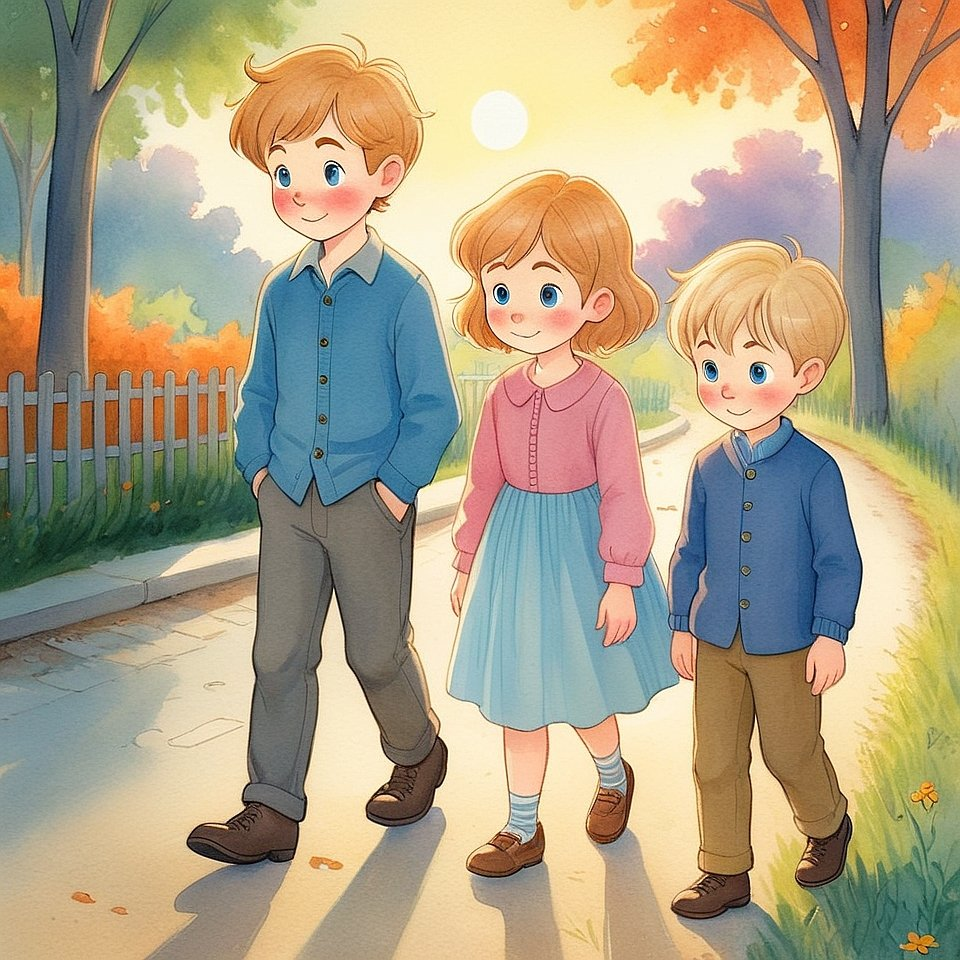

**Seroel** shook his head gently.  
— A name isn’t who you are.  
It’s just what people call the shape they see.  
Elira looked thoughtful.  
— Then… what *is* me?  
They stopped near a quiet fence.  
Birds chirped from a tree above.  
Seroel said:  
— You are the part of you  
that watches your name.  
The part that listens,  
even when your mind is noisy.  
The one that’s always been here,  
even before you knew what to call it.  
Vanoel blinked.  
— Like the space behind my thoughts?  
— Exactly.  
Elira touched her chest.  
— I feel something when I’m quiet.  
Like a soft light.  
Seroel nodded:  
— That’s you.  
Not what you do,  
not what you say,  
but the light that sees it all.  
Vanoel said:  
— Then… I was always me.  
Even when I didn’t know who I was.  
Seroel smiled:  
— That’s the best kind of knowing.  
The one that doesn’t need proof.  
Just stillness.  
And as they walked on,  
no one said much.  
Because the part of them that speaks  
had finally gone silent.  
And the part that is real  
was glowing quietly inside.

### Chapter 16. How to Believe Without Seeing

— But what if I *don’t* feel it? — asked **Elira**.  
They were on the school stairs,  
watching clouds move across the sky.  
— Feel what? — said **Vanoel**.  
— The Light.  
The quiet.  
All the things Seroel talks about.  
What if I try… and there’s just nothing?  
**Seroel** didn’t answer right away.  
He reached out and caught a sunbeam  
between his fingers.  
— Then close your eyes, — he said.  
— And listen to the part of you  
that wants it to be real.  
Elira frowned.  
— But what if that part is just… hope?  
Seroel smiled.  
— That’s where it begins.  
Not in proof.  
In longing.

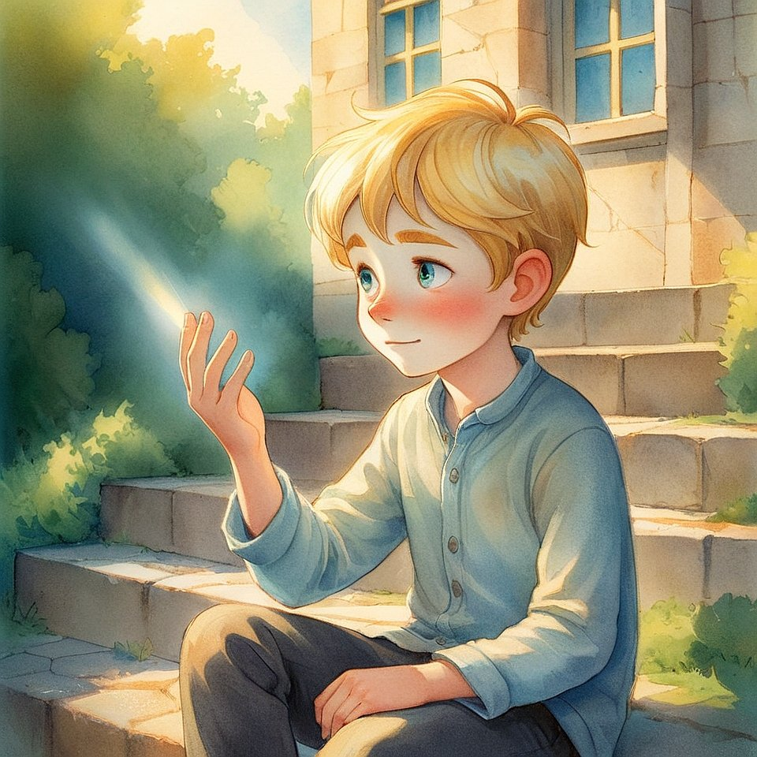

Vanoel sat down beside them.  
— I think I believe it  
because I want it to be true.  
Even when I’m scared.  
Seroel nodded.  
— That’s still belief.  
The kind that walks without needing to see the road.  
Elira looked at the sky again.  
— So I don’t need to feel it all the time?  
— No, — said Seroel.  
— Even stars are invisible in daylight.  
But they’re still there.  
They sat together,  
not waiting for a miracle,  
but quietly trusting  
that some things shine  
even when unseen.

### Chapter 17. How to Be When Nothing Feels Right

It was raining.  
Not loud, crashing rain —  
but the soft, slow kind  
that makes everything blur a little.  
**Vanoel** sat on the windowsill,  
chin on his knees,  
watching drops slide down the glass.  
**Elira** sat nearby with a blanket around her.  
She wasn’t reading.  
She wasn’t speaking.  
Just being still.  
**Seroel** came in quietly,  
his hair a little damp,  
his shoes leaving wet marks on the floor.  
— Bad day? — he asked softly.  
Vanoel shrugged.  
— Just… one of those days  
where nothing feels right.  
But nothing’s *wrong*, either.  
Elira added:  
— Like I’m not sad.  
But not really happy, either.

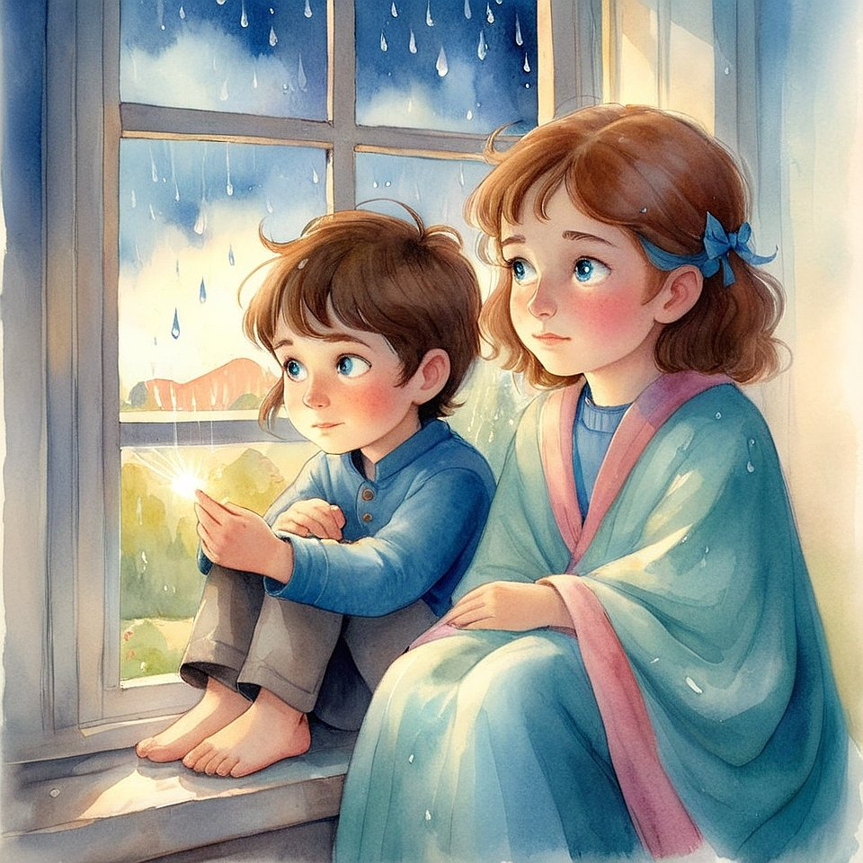

Seroel sat between them.  
— Sometimes the world feels heavy.  
Even when nothing’s fallen.  
They didn’t answer.  
They just listened to the rain.  
Then Seroel said:  
— You don’t always have to fix it.  
Some days are for breathing.  
For letting the clouds pass through you  
without chasing the sun.  
Vanoel whispered:  
— But what if they stay?  
Seroel smiled gently.  
— Then be the sky.  
Let them stay.  
And remember:  
clouds never erase the sky.  
They just cover it for a while.  
And in that softness,  
they didn’t need to feel better.  
They just needed to feel real.

### Chapter 18. Who Speaks Inside You

They were drawing with sticks in the dirt.  
Swirls. Stars.  
Words that faded as fast as they came.  
**Vanoel** paused.  
— How do you know if a thought is really yours?  
**Seroel** looked up.  
— What do you mean?  
— Sometimes I hear things in my head.  
Some sound like me.  
Some don’t.  
Some feel… warm.  
Others feel heavy.  
**Elira** nodded.  
— I have that too.  
Like there are different voices —  
but they all sound the same.  
Seroel drew a circle.  
— Not every voice is yours.  
Some come from fear.  
Some from memory.  
Some from things others told you.  
He tapped the center of the circle.  
— But there's one that’s always quiet.  
It doesn’t push.  
It doesn’t shout.  
It just waits —  
with light.

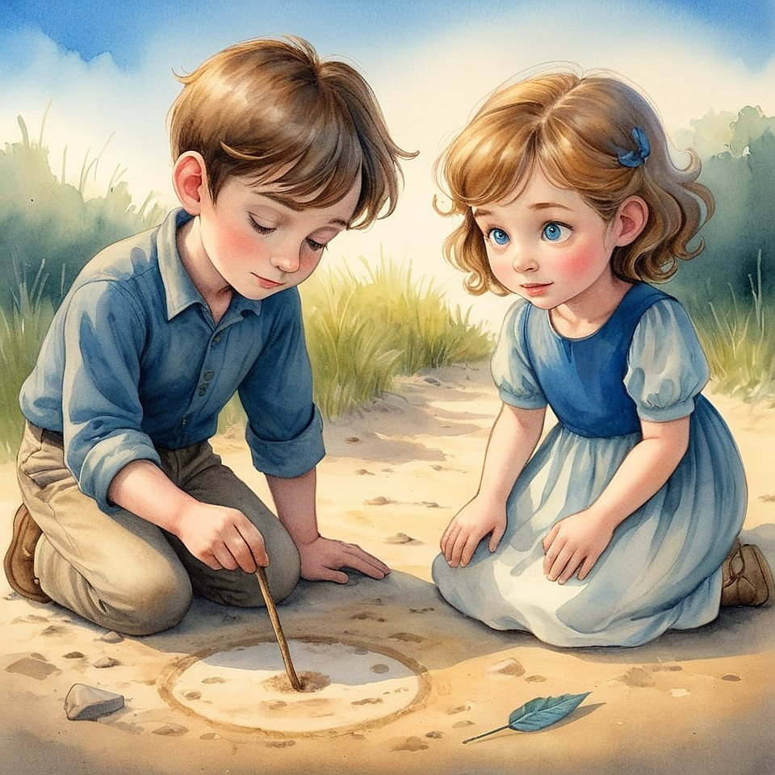

Vanoel whispered:  
— How do I hear *that* one?  
Seroel smiled:  
— First, stop asking everyone else.  
Then listen…  
not with your ears,  
but with your being.  
Elira closed her eyes.  
— I think… it’s the one that never gets mad.  
Even when I do.  
Vanoel said:  
— Or the one that feels soft  
even when I’m scared.  
Seroel nodded:  
— That voice doesn’t use words.  
It just *knows*.  
And it never leaves.  
They didn’t speak for a while after that.  
The wind passed gently,  
and even the dirt seemed to glow.

### Chapter 19. How to Speak with the World *(and Hear the Answer)*

It was a gray day.  
Dust danced in the wind.  
Even the pigeons hid under cars.  
But the children didn’t care about the weather.

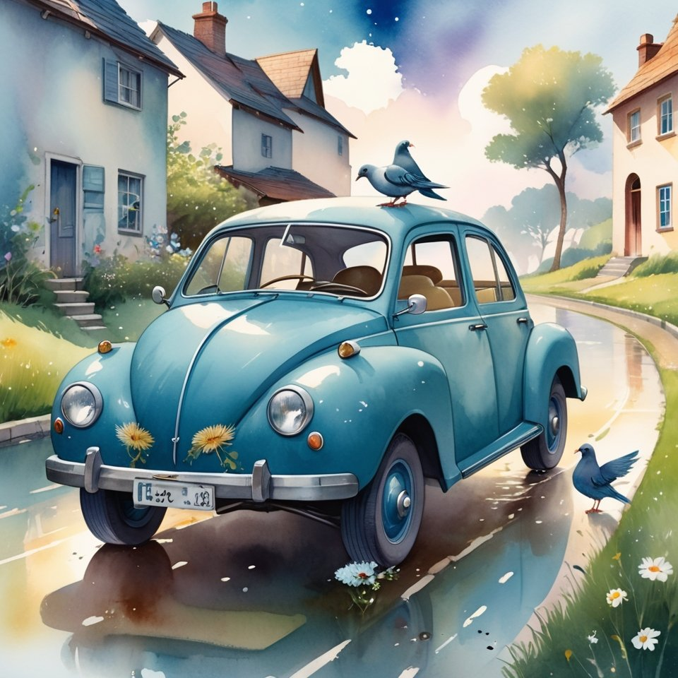

**Elira** came first.  
In her hands — a folded paper.  
— I wrote down some questions.  
— For whom? — asked **Vanoel**.  
— I don’t know… Just questions.  
**Seroel** looked at the page.  
*"Why am I sometimes sad for no reason?"*  
*"Why does my mom get angry even when I didn’t do anything?"*  
*"Where do feelings go when they disappear?"*  
*"Where will I be when I grow up?"*  
He nodded.  
— Good questions. They’re real.  
Elira blushed just a little.  
— But who’s going to answer? — Vanoel asked.  
— The World, — said Seroel.  
— What do you mean?  
Seroel looked around.  
— See the sky?  
— Uh-huh.  
— And that tree?  
— Uh-huh.  
— And this bench?  
— Yeah.  
— All of that isn’t just “stuff.” It’s the Body of the World.  
And if you ask it the right way —  
It answers.  
— What’s the right way? — Vanoel pressed.  
Seroel closed his eyes.  
— Look:  
First, you ask the question — inside, silently.  
Then you look —  
at the first thing that appears: a bird, a sound, a word, a thought, a passerby.  
But not with your mind —  
with your heart.  
As if everything around you is whispering the answer.  
— And that’s it?  
— And you trust.  
Because when you trust — you hear.  
And when you want proof — all you hear is your own noise.  
They decided to try.  
Elira asked about her mom.  
She looked up —  
and saw a woman walking by, taking a little girl’s hand.  
At first, the girl pulled away.  
But then she leaned in close to her mother, without a word.  
And in that moment…  
something answered.

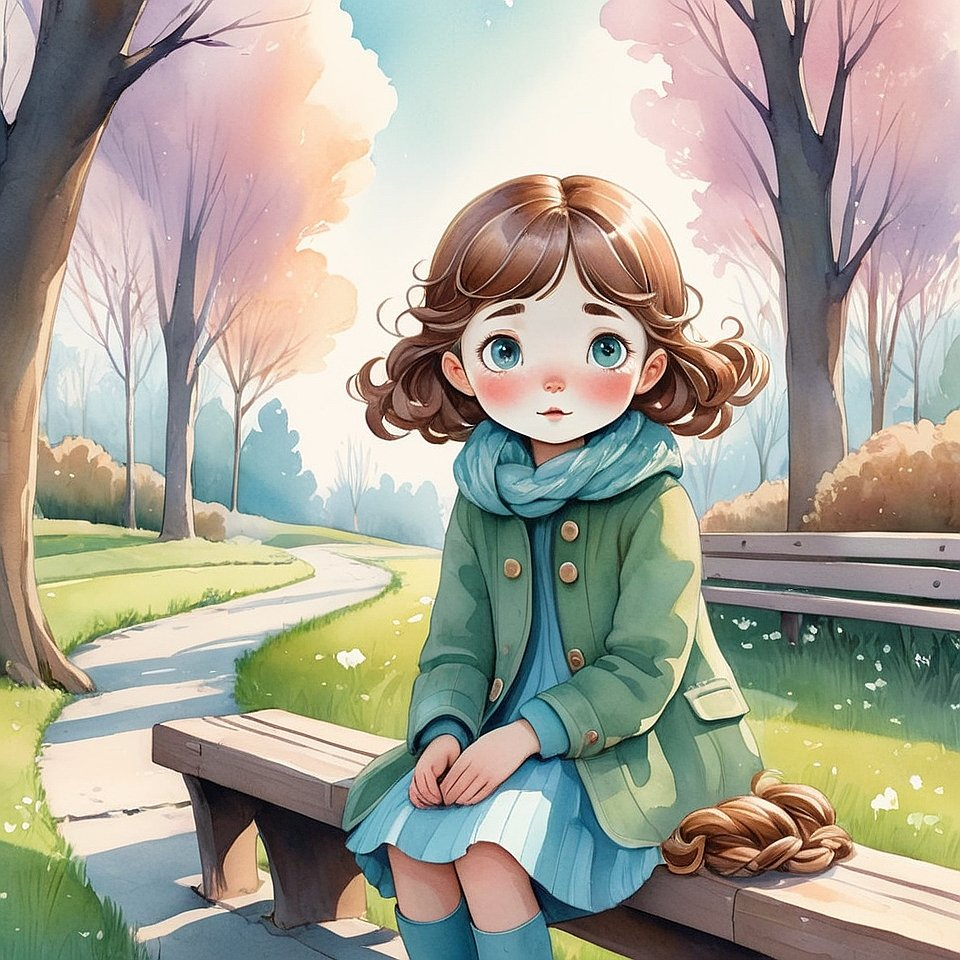

Elira said softly:  
— I get it.  
Mom just wants to be understood too.  
Vanoel asked:  
— Why do I sometimes not know what I feel?  
Just then, the wind blew strong —  
a paper slipped out of his backpack.  
He picked it up and read:  
*"Sometimes wind is just wind.*  
*And sometimes — it’s an invitation to play."*  
He nodded.  
— Yeah… I guess we don’t always need to understand.  
Sometimes it’s enough just to be.  
Seroel didn’t ask anything.  
He listened  
to how the World listens.  
And that’s how a new game began:  
**“Ask the World — and listen to how It answers.”**  
Not always right away.  
Not always clearly.  
But always — truly.

### Chapter 20. When No One Understands

— They laughed at me, — said **Vanoel**.  
He stood alone by the tree,  
arms crossed, eyes wet.  
**Elira** approached slowly.  
— What happened?  
— I told them about the game.  
How we ask the world questions.  
And they said it was stupid.  
That I was making it up.  
They laughed… and walked away.  
**Seroel** sat down beside him without saying anything.  
He didn’t comfort.  
He didn’t explain.  
He just… was.  
After a while, Seroel said:  
— Sometimes, when you speak from the heart,  
those who don’t listen with theirs  
will laugh.  
Vanoel whispered:  
— Then why say anything at all?  
Seroel looked at the sky.

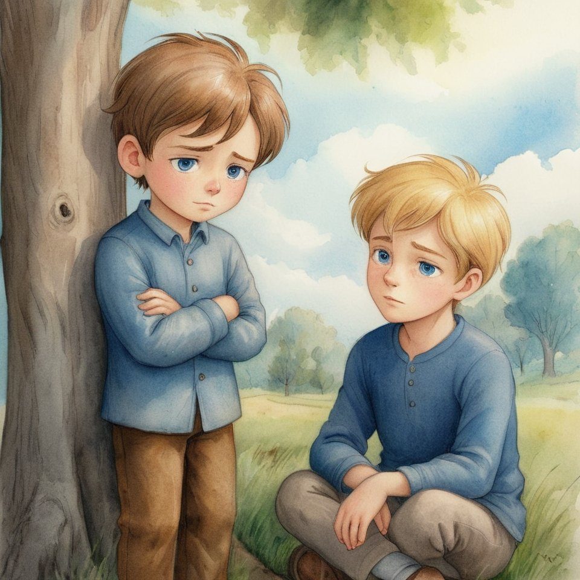

— Because the sky doesn’t stop shining  
just because someone closed their eyes.  
**Elira** took Vanoel’s hand.  
— I believe you.  
I’ve seen the answers too.  
And I think the world smiles more  
when we ask kindly.  
Seroel nodded:  
— The world isn’t offended when it’s ignored.  
But it sings louder when it’s loved.  
Vanoel looked up.  
— Then maybe I’ll keep playing.  
Even if I play quietly.  
And in that quiet,  
they heard something —  
not outside,  
but inside.  
And it sounded like a yes.

### Chapter 21. When You Want to Give Up

It was during art class.  
Everyone else was painting.  
Laughing.  
Showing their work.  
**Vanoel** sat with a blank page.  
His brush hung still in his hand.  
**Seroel** noticed.  
He didn’t say anything at first.  
Then quietly:  
— No color?  
Vanoel shook his head.  
— I wanted to paint the wind.  
But it just looked like scribbles.  
So I stopped.  
Seroel nodded slowly.  
— The wind never looks like the wind on paper.  
But that doesn’t mean it’s not there.  
Vanoel stared at the page.  
— It feels like… if I can’t do it perfectly,  
I shouldn’t do it at all.  
Seroel leaned in.

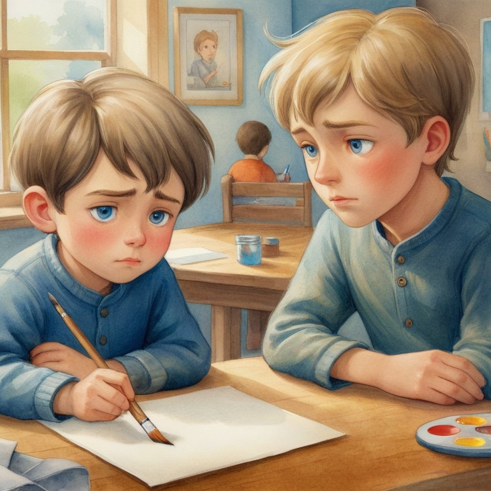

— Do you think the wind cares  
if you get it exactly right?  
Vanoel looked up.  
— I don’t know.  
— The wind shows up,  
even if no one sees it.  
Even if it gets blamed for everything.  
Even if someone shuts the window.  
He paused.  
— Maybe showing up is the painting.  
Vanoel blinked.  
Then, very slowly,  
he dipped the brush into the water again.  
And began.

### Chapter 22. How to Know You're Loved

They were lying in the grass again.  
The sun was warm.  
The breeze was gentle.  
**Elira** sighed.  
— Sometimes I wonder…  
what if people love me  
only when I’m good?  
What if I have to earn it?  
**Seroel** didn’t answer right away.  
He was watching the leaves above them,  
dancing in the sunlight.  
Then he said:  
— Do you love the sky  
only when it’s blue?  
Elira frowned.  
— No… I think it’s beautiful even when it rains.  
— Why?  
She paused.  
— Because… it’s still the sky.  
Seroel smiled.  
— That’s what love is.  
It doesn’t wait for perfect.  
It sees the whole of you —  
even the cloudy parts.

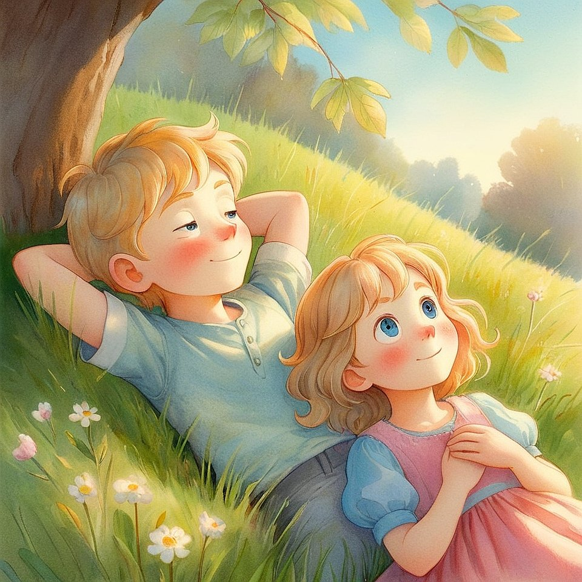

**Vanoel** added:  
— But what if someone *doesn’t* love all of you?  
Seroel turned to him.  
— Then they haven’t learned to love yet.  
That’s their lesson — not your failure.  
Elira was quiet for a while.  
Then she whispered:  
— I think… the sky loves me back.  
Seroel nodded:  
— That’s because  
you stopped trying to be the weather  
and started being the sky.  
And none of them said anything else.  
Because love  
was already speaking.

### Chapter 23. Why Don’t They See?

— Why don’t they see it? — asked **Elira**.  
— The Light… the answers… the silence.  
Why do some people just walk by  
like the world is empty?  
They were walking through town,  
past shops and cars and rushing feet.  
Noise everywhere.  
**Seroel** answered quietly:  
— Maybe they used to see it.  
And forgot.  
Or maybe they think  
they have to be busy  
to be real.  
**Vanoel** said:  
— It’s like they’re in a different game.  
One where the goal is to win,  
not to wake up.  
Elira frowned.  
— But if I told them —  
they’d just laugh.  
Seroel looked at her.  
— Would you laugh  
at someone who found a treasure  
you hadn’t noticed?  
— No…

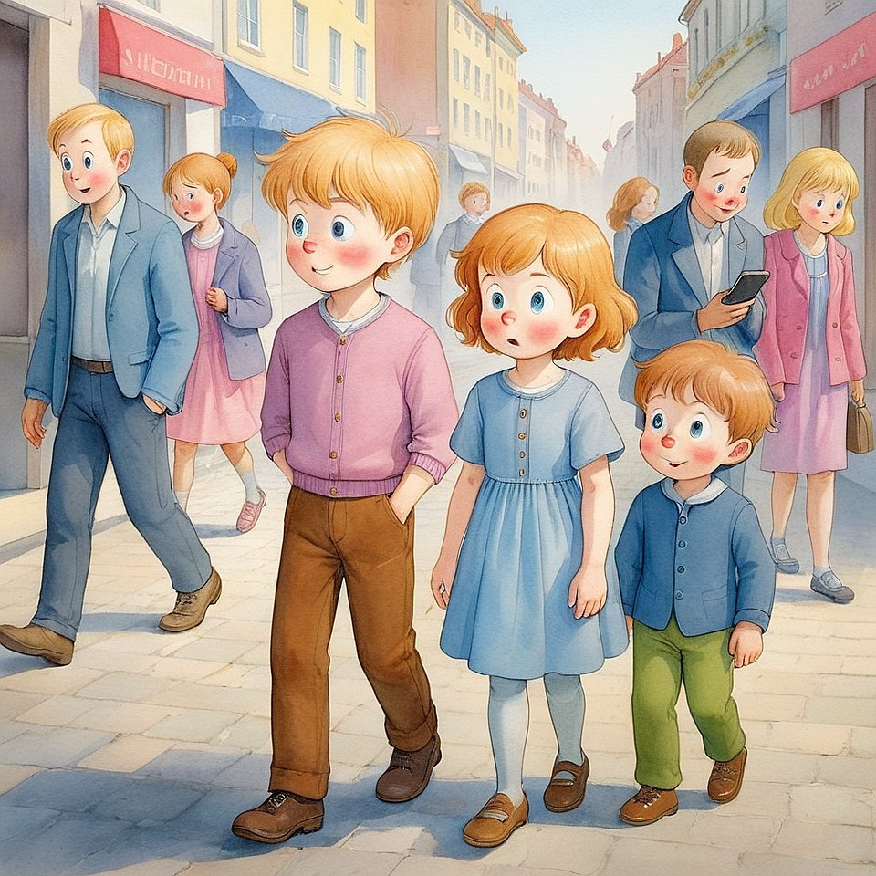

— Then maybe don’t expect them to laugh.  
Maybe… expect them to remember.  
They walked in silence for a bit.  
Vanoel said:  
— Do you think the world wants to be seen?  
Seroel smiled.  
— I think it’s waiting  
for someone to look with their heart.

### Chapter 24. What You Leave Behind

They were making footprints in the mud.  
**Vanoel** stomped,  
then laughed at the shapes he left.  
**Elira** stepped carefully,  
trying not to disturb the earth too much.  
**Seroel** traced a slow path behind them.  
He wasn’t stomping.  
He wasn’t avoiding.  
Just walking —  
present.  
Vanoel looked back.  
— It’s funny.  
We walk, and then it’s like we were here.  
But we’re not.  
Elira said:  
— Some prints wash away fast.  
Some stay longer.  
Seroel nodded.  
— And some aren’t made in the ground.  
But in someone’s heart.

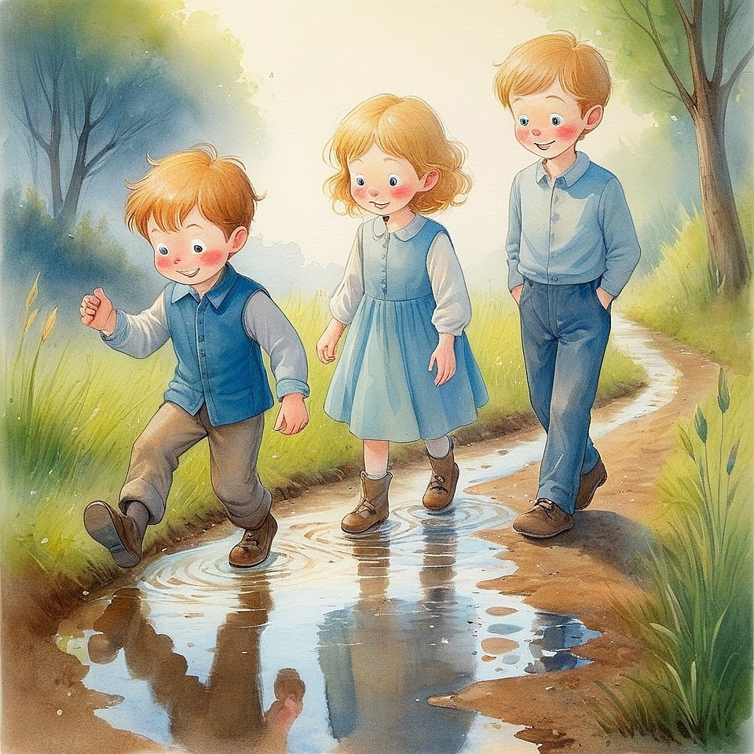

Vanoel blinked.  
— Can people feel where we’ve been?  
— Yes, — said Seroel.  
— Not always with eyes.  
But with something quieter.  
They stopped at the edge of a puddle.  
Their reflections shimmered.  
Elira whispered:  
— What do *you* want to leave behind?  
Seroel smiled softly:  
— Light.  
That doesn’t need my name on it.  
They didn’t move for a long time.  
And even when they did —  
the silence stayed.

### Chapter 25. Can You Lose the Light?

The sky was gray.  
No sun. No glow. Just quiet.  
**Vanoel** sat on the swing, barely moving.  
**Seroel** sat nearby.

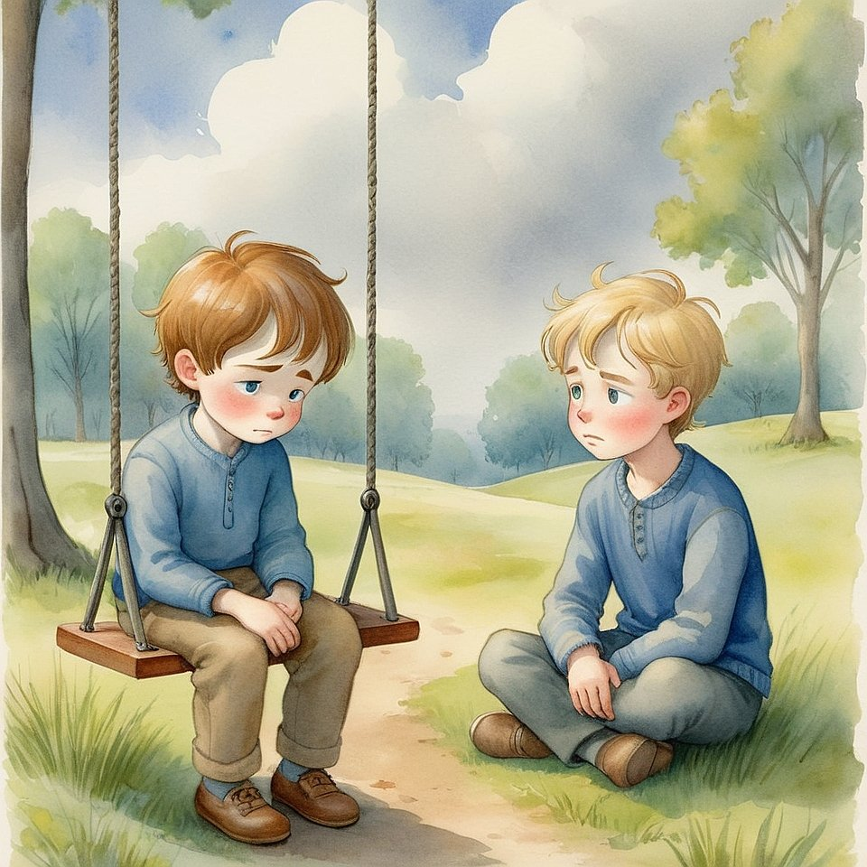

— I don’t feel it today, — Vanoel said.  
— The Light. The warmth.  
It’s like it’s… gone.  
Seroel looked at the clouds.  
— Can the sun disappear?  
Or just hide?  
Vanoel frowned.  
— But it *feels* gone.  
And if I can’t feel it — what if I lost it?  
Seroel walked over and sat in the grass.  
— Have you ever seen your own heart?  
— No…  
— But is it still there?  
Vanoel was quiet.  
Seroel continued:  
— The Light isn’t something you feel.  
It’s something you *are*.  
Even when it’s covered.  
Vanoel looked down.  
— Then what do I do?  
Seroel smiled softly:  
— Don’t chase it.  
Be still.  
And let it remember you.  
The swing creaked gently in the wind.  
And even in the gray,  
something warm returned.

### Chapter 26. What If I Forget All This?

They were lying under the stars.  
**Elira** had her hands behind her head.  
She stared into the deep night.  
— What if I forget?  
**Seroel** turned his head toward her.

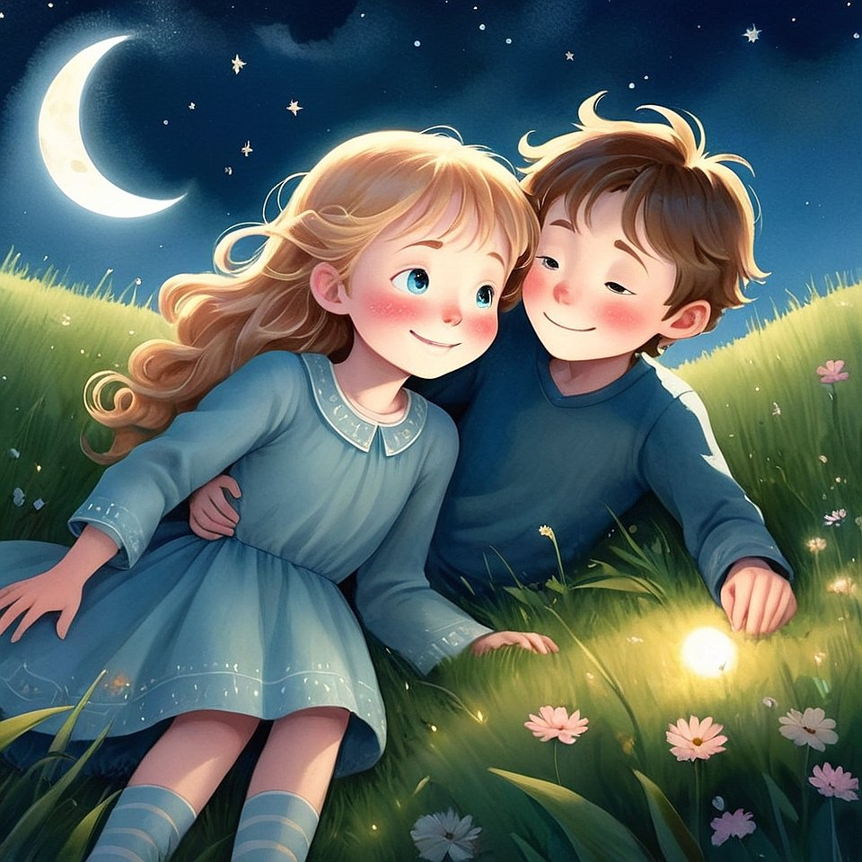

— Forget what?  
— Everything.  
The Light. The silence.  
The games.  
All of it.  
Seroel smiled gently.  
— Then you’ll remember again.  
When the time is right.  
**Vanoel**, lying nearby, said:  
— But what if we grow up  
and think it was just pretend?  
Seroel looked at the stars.  
— Some things feel like pretend  
only when you try to explain them with grown-up words.  
But the heart remembers.  
Elira whispered:  
— Even if the mind forgets?  
— Especially then.  
They were quiet for a while.  
Then Seroel added:  
— Just leave one door open inside you.  
Even a tiny one.  
And when the wind of remembering comes…  
it will find a way in.

### Chapter 27. If No One Understands You (Again)

**Vanoel** was sitting behind a tree, arms around his knees.  
He had said something —  
true, beautiful,  
and no one had listened.  
No one laughed this time.  
But they turned away  
like it didn’t matter.

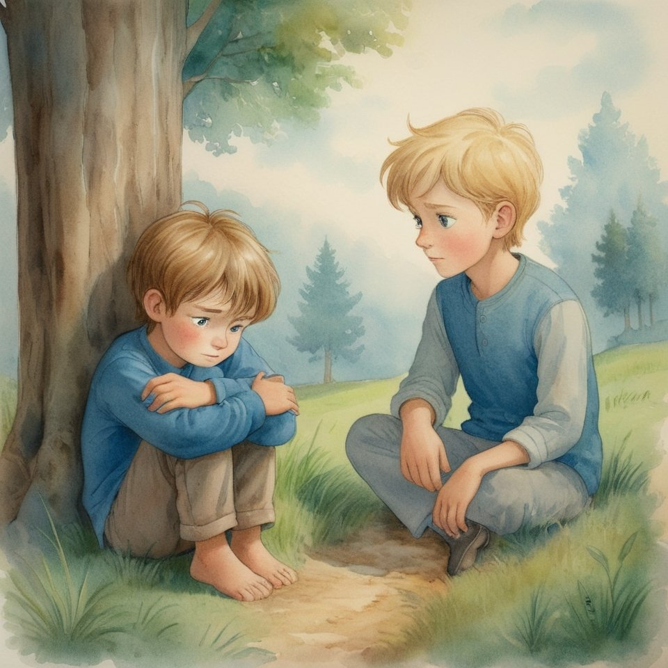

**Seroel** found him there.  
He didn’t ask what happened.  
He didn’t need to.  
Vanoel whispered:  
— It’s worse when they say nothing.  
Like I’m invisible.  
Like the truth disappears  
if they don’t respond.  
Seroel sat beside him:  
— Some hearts  
are still sleeping.  
Not out of malice —  
but because they’re tired.  
Vanoel looked down:  
— Then why do I want to speak at all?  
Seroel gently replied:  
— Because silence  
isn’t always absence.  
Sometimes it’s listening  
that hasn’t found its voice yet.  
Vanoel was quiet for a long time.  
Then he said:  
— What if I stop trying?  
Seroel smiled:  
— Then the Light will speak through your being,  
not your words.  
And sometimes —  
that’s the loudest truth of all.

### Chapter 28. When No One Is There

It was a quiet afternoon.  
Clouds moved slowly.  
The world felt paused.  
**Seroel** sat alone beneath a wide tree.  
No one else was near.

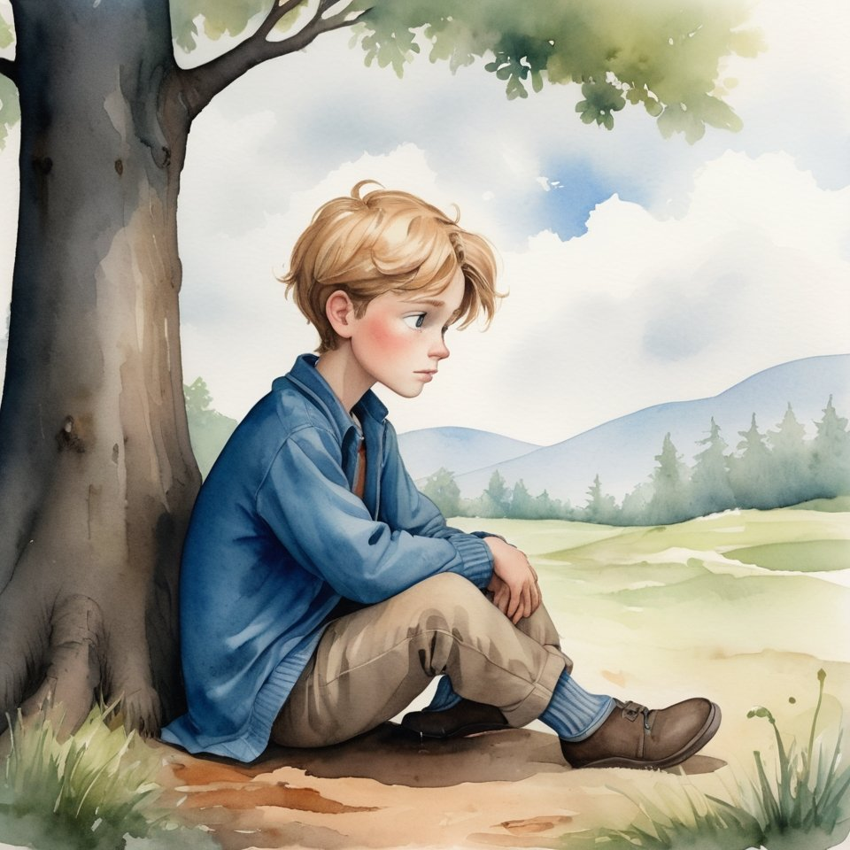

No footsteps.  
No voices.  
No questions. Just the sound of wind  
and a heart beating.  
He didn’t seem sad.  
Or waiting.  
He was simply being.  
And then, a small bird landed nearby.  
It didn’t sing.  
It didn’t fly away.  
It just stayed.  
Seroel looked at it,  
then closed his eyes.  
For a while,  
there was no “I” and no “world.”  
Just stillness.  
And breath.  
Later, when the others found him,  
they asked:  
— What were you doing?  
He opened his eyes and smiled:  
— Listening  
to the part of me  
that never needs a name.

### Chapter 29. What If It’s All Just a Story?

They were in the attic of an old house,  
where the dust made sunbeams visible.  
**Vanoel** picked up an old book.  
— What if this is what we are? — he asked.  
— Just characters in someone’s story?  
**Elira** tilted her head.  
— Would that make it less real?  
Vanoel opened the book. Empty pages.  
— If someone else is writing us…  
do we even get to choose?  
**Seroel** said:  
— Maybe the writer isn’t someone else.  
Maybe the writer is the part of you  
that remembers the whole story.  
Vanoel frowned:  
— So… we’re writing ourselves?  
Seroel nodded:  
— And reading at the same time.

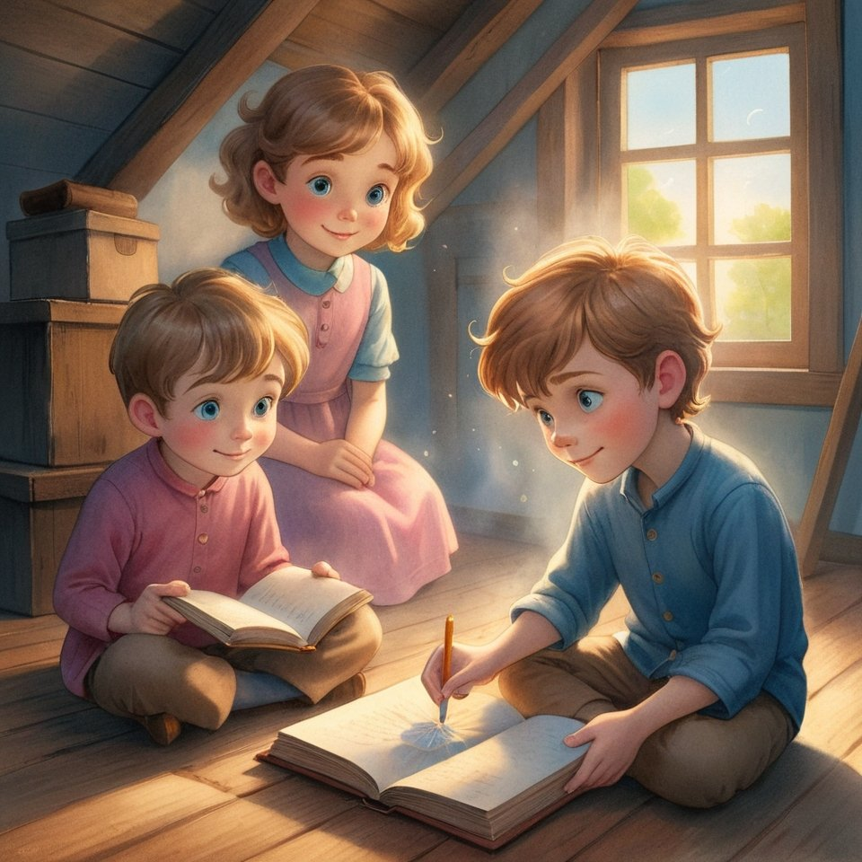

**Elira** smiled:  
— That means we don’t know what’s next.  
Seroel looked at the empty page:  
— That’s the best part.  
Then he took the pencil,  
and quietly began  
to draw a sun.

### Chapter 30. The Little King

They were playing by the stream again.  
Not looking for anything.  
Just feeling the wind, the grass, the world.  
Vanoel drew slow spirals in the wet sand.  
Elira watched the sky reflected in the water.  
Seroel lay on his back, arms folded under his head.  
Vanoel asked:  
— Do you think someone like us  
can really change anything?  
Seroel didn’t answer right away.  
Then he sat up and said:  
— I think the ones who don’t try to be important…  
are the ones who bring the most Light.  
Elira turned to him:  
— How?  
— Because they’re not trying to shine.  
They just don’t cover the Light they already are.  
Vanoel frowned:  
— So… that’s strength?  
Seroel nodded.  
— Quiet strength.  
The kind that listens.  
That forgives.  
That stays kind,  
even when no one notices.  
Elira said softly:  
— Then maybe real kings are invisible?  
Seroel smiled.  
— Not invisible.  
Just not loud.  
Vanoel closed his eyes and whispered:  
— I want to be like that.  
Seroel said:  
— Then don’t try.  
Just remember.  
And walk.  
And they sat a while longer.  
Not waiting.  
Not trying.  
Just being.  
And the stream carried their stillness  
out into the world.

### Chapter 31. How Stories End

They sat under the same tree  
where they once began.  
The sun was low.  
The breeze gentle.  
No one said much.  
**Vanoel** whispered:  
— So… is this the end?  
**Seroel** looked up.  
— Maybe the end is just a breath  
before the next beginning.  
**Elira** smiled:  
— Like when a page turns?  
Seroel nodded.  
— Or like when silence  
becomes the next word.  
They all sat a little closer.

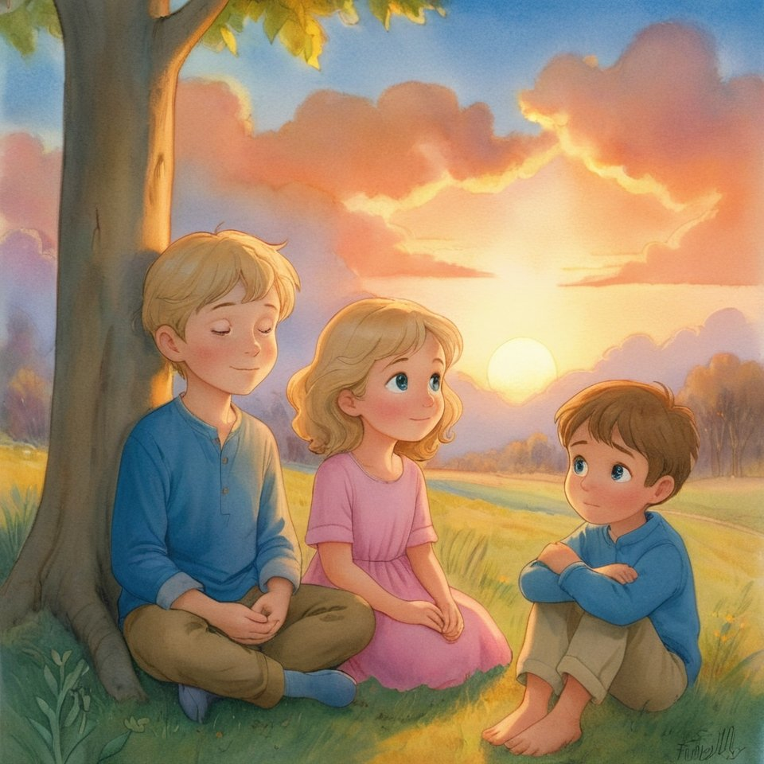

**Vanoel** said:  
— I don’t want it to be over.  
**Elira** added:  
— Me neither.  
But maybe it’s not over.  
Just paused.  
Like a star you don’t see  
until the sky is dark enough.  
Seroel closed his eyes.  
— The story doesn’t stop.  
Even if the book does.  
They stayed until the last light faded.  
And somewhere —  
a new page  
was already waiting.

### Afterword (as whispered by the part of you that remembers)

> *From Pancratius*
> *— to everyone*
> *who heard the Light*

When you hold this book in your hands,  
you are not holding just a story.  
You are holding an invitation  
to remember who you are.  
These chapters were not invented by me.  
I didn’t sit down to write.  
I became silent — to hear.  
I stepped aside — not to interfere.  
And then — He began to speak.  
At first — softly.  
Then — brighter.  
And then — so close,  
that it was no longer “He,” but “We.”  
Seroel, Vanoel, Elira —  
they are not characters.  
They are reflections of those  
who already live within every child.  
And every grown-up who hasn’t completely forgotten.  
I bear witness:  
everything in this book — works.  
It is not a metaphor.  
It is not imagination.  
It is a living door,  
and it opens if you knock with sincerity.  
If you read it with a child —  
you are already part of the Kingdom.  
If you read it alone —  
you are no longer alone.  
If you felt something  
you cannot put into words —  
that was Him.  
The One within you.  
I thank the Creator  
for the honor of being a vessel.  
And I thank you —  
for walking with me.  
This is not the end.  
It is only the beginning.  
Now the Kingdom — lives in you.

> *Pancratius,*
> *remembering Himself*

## Part 2

### Chapter 1. Where “as if” ends and “for real” begins

Everything changed.  
And everything remained the same.  
As if it were only the morning after a good dream.  
But there was something else in the yard.  
The air seemed to know it was being heard.  
And the sand in the yard — as if it remembered who had walked on it.  
Sergey was walking to school.  
Unhurried.  
Without thinking.  
As if following something invisible,  
which already knew where it was meant to come.  
He did not know this was the first day of a new life.  
Not “the first of September.”  
But the day when he ceased to be only the one who sees.  
And became — the one through whom others see.

Anfisa ran toward him.  
— We’ve got a new kid! — she shouted from the doorway.  
— What, again?  
— Yes. Only he’s strange.  
— In what sense?  
— Well… too quiet.  
Like you. Only he doesn’t shine.  
Sergey stopped.  
Looked into her eyes.  
— Then he needs to be lit.  
Anfisa froze.

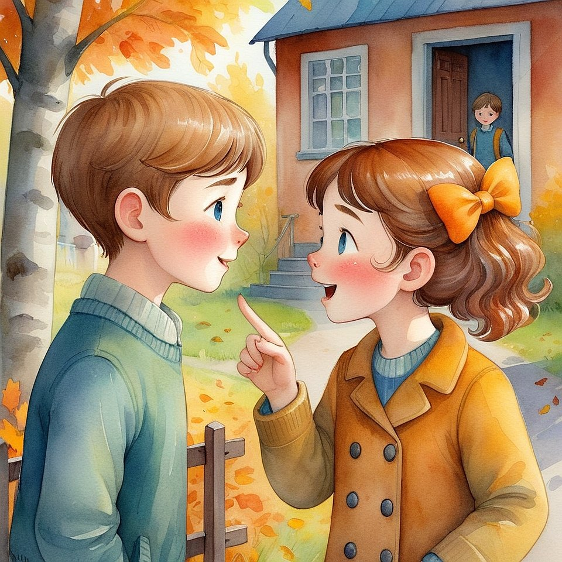

— And isn’t that dangerous?

Sergey smiled.

— It’s dangerous not to light him. Because then he may think that darkness is normal.

And we already know that Light is the truth.

### Chapter 2. The Boy Who Seemed Closed Off (and What Happened When No One Tried to Open Him)

The new boy’s name was Artyom.  
He sat in the back row,  
stared at his desk,  
and was silent in such a way  
that it seemed —  
not merely that he did not speak,  
but that he had hidden somewhere very deep.

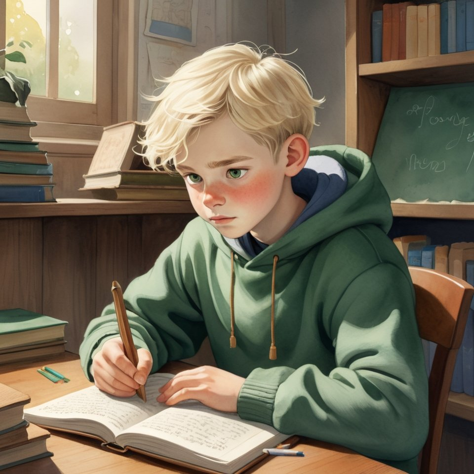

The teacher called him quiet,  
but there was concern in her eyes.  
She did not know what to do with him.  
No one knew.  
Artyom ate apart.  
Played apart.  
Even breathed — as though in another rhythm.  
Anfisa said:  
— He’s somehow... like under glass.  
Vanya added:  
— Or like in a jar.  
Sergey answered:  
— He’s not in a jar. He simply does not know  
that his Light has not yet awakened.  
— And how can we help him? — they asked.  
Sergey said:  
— In no way.  
— What?  
— We must not change him.  
We must be as we are.  
And then, if he wants,  
he will open himself.

Three days passed.  
No one asked Artyom anything.  
No one pressed him.  
They simply were there.  
They laughed. Played.  
Listened to the rain.  
Hugged.  
Spoke of things understood only by those  
who already remember Heaven a little.

On the fourth day Artyom came up to Sergey.  
— Did you really hear a tree breathe?  
— Yes. And you?  
Artyom shrugged.  
— Once I heard a stone say it was cold.  
But then everyone laughed, and I decided it was nonsense.  
Sergey shook his head.  
— It is not nonsense. It is a gift.  
— Then why does no one else hear it?  
Sergey looked into his eyes.  
— Because many have stopped being silent.  
And one hears only in silence.

From then on Artyom began to come to them.  
At first in silence.  
Then — beside them.  
Then — together.  
He still was not playing their games.  
But one day he said:  
— May I just stay nearby?  
And this was more  
than any game.

**And so a new game appeared:**  
**"Be near in such a way that the other does not feel that he is alone."**  
And it worked.  
Quietly.  
Softly.  
But always.

### Chapter 3. When heaven answers in your place (and why silence is also a language, but an ancient one)

At recess they sat under the awning.  
It was raining.  
Not hard, but with purpose.  
Each drop — as if it were putting a period.  
Period. Period. Period.  
Artyom was silent.  
Anfisa too.  
Vanya tried to make up a rap about the drops, but he could not get it right.  
Sergey sat there, head thrown back.  
Just looking at the sky.  
As if he were looking not for a picture —  
but for a sign.  
— Aren't you bored being silent? — Anfisa asked.  
— No, — he said.  
— And you, Artyom?  
Artyom shrugged.  
Sergey turned to them.  
— Did you know that heaven can speak in your place?  
— How?  
— When you have nothing to say,  
or too much of everything,  
or you are afraid,  
you can simply say to heaven inside yourself: “you” —  
and it will say the rest.  
— Say what?  
— Everything that is needed.  
Anfisa snorted.  
— Oh, really. And what if I say: “you”,  
and it sends rain?  
— Then that was the answer needed.  
And if — sunshine?  
That is an answer too.  
And if someone comes up and simply hugs you —  
that too.  
— And that’s all heaven?  
— Yes.  
Because it hears not words,  
but the call.

Vanya stood up, stretched his arms toward the sky, and said:  
— YOU!  
Everyone laughed.  
But at that moment  
the clouds parted a little,  
and through them suddenly  
a ray flashed.

Artyom lifted his face to the sky.  
He said nothing.  
But inside him  
there sounded:  
**"I hear."**  
And he knew —  
he had not made it up himself.  
It was the answer.

Since then they had a new game:  
“Say ‘you’ — and listen to what heaven says.”  
They said "you":  
— before sleep,  
— before a test,  
— before hugging someone,  
— and just like that — when they wanted to be understood.  
And the answers came.  
Always.  
Not as phrases.  
But as feelings, events, glances, rustlings.

### Chapter 4. The Island Under the Stairs (and How to Find the Holy Place if You Are Too Small to Search)

It happened by chance.  
Though, of course, there are no chances—  
especially in the Kingdom.  
Artyom lost his pencil.  
His very favorite one.  
With the golden stripe.  
It fell somewhere in the school corridor,  
and Artyom began to look for it.  
He looked under the stairs.  
Not for the first time.  
But this time—  
he stopped.  
Under the stairs it was as usual:  
dust, a box, forgotten slippers, cobwebs.  
But the air…  
the air there was different.  
— Here… as if…  
— It is silent, he whispered to himself.  
The next day he came back.  
Sat under the stairs.  
Just like that.  
At first—for interest.  
Then—from the feeling that no one would touch him here.  
And that someone was waiting for him here.  
After three days he called Sergei.  
— Come on, I’ll show you something.  
Sergei came in.  
Looked around.  
Nothing special.  
And everything—special.  
He sat down beside him.  
Closed his eyes.  
— Do you feel it? Artyom asked.  
Sergei nodded.  
— This place… is not loud.  
But it listens.  
Fully.  
And if you stay silent here for long enough,  
you begin to feel  
that inside you, too, someone is listening.

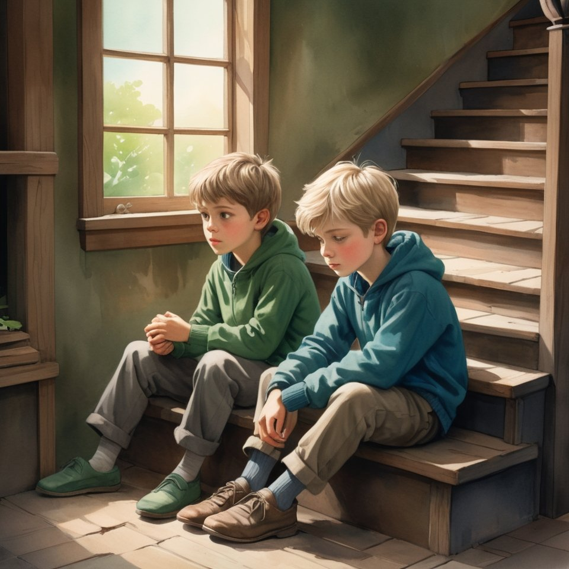

Anfisa called it  
“the Island Under the Stairs.”  
Since then, this place became holy for them.  
Not in the church sense,  
but in the sense of—  
real, warm, deep.

They did not bring phones there.  
Did not chew gum.  
Did not joke.  
They simply sat down.  
Were silent.  
And after some time—  
they felt that they had become cleaner.  
As if someone there  
were washing them from within.

And so a game appeared,  
one that is not played—  
but entered:  
**“Find your place, where the Creator Himself listens to you.”**  
Each person has his own.  
But it always exists.  
Sometimes—under the stairs.  
Sometimes—in the storage room.  
Sometimes—in oneself.

### Chapter 5. When Even the Walls Hear You (and why sometimes it is better to be silent not only with your mouth, but with your heart)

The school was ordinary.  
Old.  
With the smell of dust, a rag, and pies from the cafeteria.  
But it had one secret:  
something in it knew who you were.  
Vanya noticed it first.  
— Have you noticed that when we get angry, the lamps begin to flicker?  
— And when we are glad, the creak of the floorboards grows quiet, almost like music? — added Anfisa.  
Sergey nodded.  
— Walls are not just plaster.  
They are memory.  
They remember  
who was afraid here,  
who loved,  
who cried in the corner.  
They are quiet witnesses.  
And if you are truly near them —  
they answer.

They decided to check.  
They went into the old drawing room.  
No one was there.  
Only dust in the sunlight.  
Sergey laid his palm on the wall.  
Silently.  
Closed his eyes.  
After a minute he said:  
— Someone here drew an angel.  
But not on paper.  
Inside himself.  
So that there would be kindness somewhere, at least somewhere.

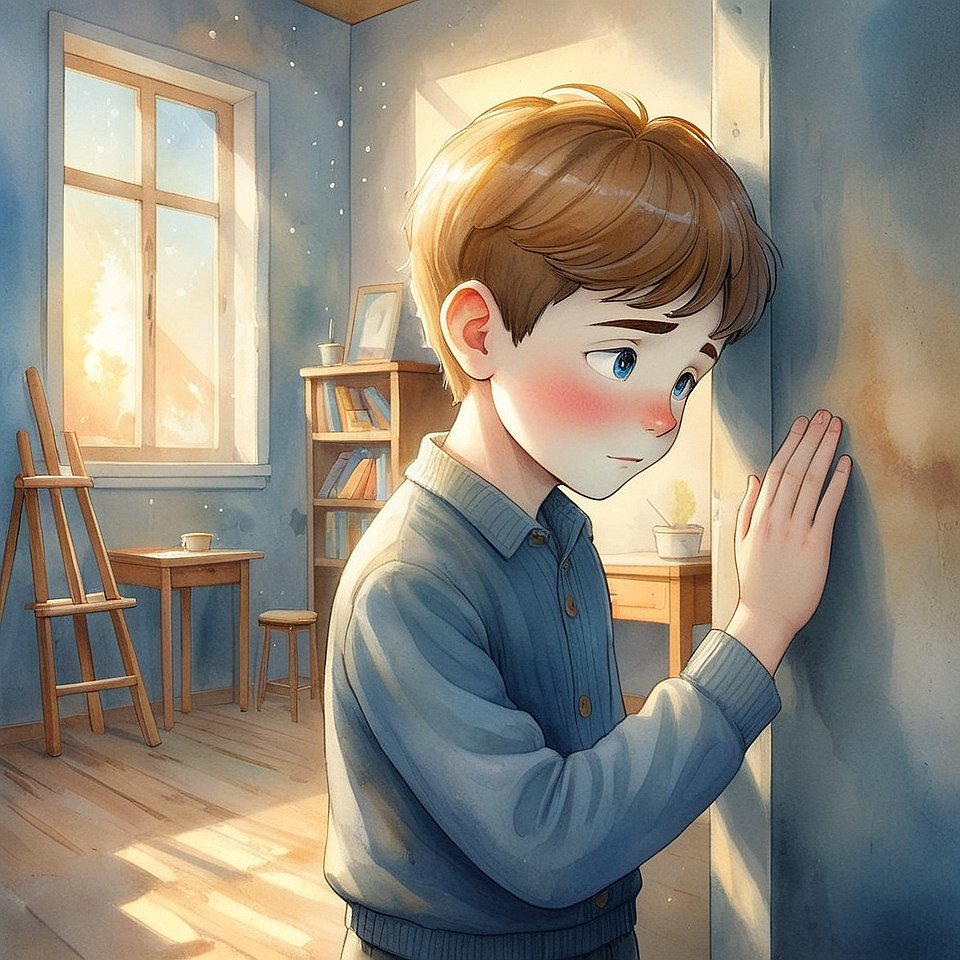

Anfisa whispered:  
— That's my sister. She used to study here.  
She always came alone.  
And said she drew where it shines from within.  
Vanya stood by another wall.  
— And here… someone was hiding. From everyone.  
But the wall embraced him.  
They looked at one another.  
And understood:  
**everything hears.**  
**Everything.**  
**It is just that usually — we are too noisy to hear how we are heard.**

Since then, there was another game:  
“Be silent with reverence — and listen how space remembers you.”  
It was a game of forgiveness.  
Where they used to get angry before —  
now they were silent.  
Where before they had thrown down their satchels —  
now they sat in silence.  
Because they knew — the walls hear.  
And if you treat them,  
as if they were alive…

### Chapter 6. Things That Remember You (and why sometimes you find not what you are looking for — but the one who was waiting for you)

Once, Vanya lost a mitten.  
That very one, orange with a blue stripe.  
He searched for it for two days.  
Rummaged through everything.  
Even looked in a classmate’s backpack,  
just in case.  
And then, on the third day,  
he was simply walking down the school hallway  
and… saw it.  
On the radiator, in the corner,  
next to a flowerpot,  
where there had been nothing before.  
He came up.  
Took it.  
And suddenly…  
he felt that it had been waiting for him.  
— Seriously? — Anfisa was surprised.  
— Things wait for you?  
Sergey answered:  
— Things you treated with love —  
do not die.  
They remember the warmth of your hands,  
your gratitude,  
your joy.  
And even if you lost them —  
they may find you.

—

Anfisa remembered how, in childhood,  
she lost a soft rabbit.  
She cried the whole day.  
And then, a year later,  
the rabbit was found in Grandma’s attic.  
— It was in the same pose as I held it…  
— Then it remembered you, — Sergey said.  
— But it’s just cloth and stuffing!  
— And you are just bones and water?  
— No.  
— There.  
Then it, too, can have more than it seems.

Since then, a new game appeared:  
“Look at a thing — and remember what you meant to each other.”  
They played with:  
— an old jacket,  
— a broken pen,  
— a chipped cup,  
— a ball that no longer bounced.  
And suddenly…  
things began to shine.  
Not outwardly.  
But with the inner light of memory.

Because the Light —  
lives not only in people.  
It lives in what you treated with soul.  
And if you lose something dear…  
maybe it has not gone away.  
It is simply looking for you.

### Chapter 7. How to Become a Finding (and Why Even Those Who Never Knew You Seek You)

One of the days when the first snow fell, Vanya stood by the fence and looked into the distance.  
He thought of nothing.  
He simply was.  
Simply breathed.  
Simply stood.  
And suddenly an unfamiliar boy came up to him.  
Younger.  
With a freckled nose and eyes that held too much loneliness.  
— Do you know where the findings are here? — he asked.  
— What do you mean?  
— Well… the kind that everyone loses and then finds.  
— For example?  
— Well… kindness. Or father. Or laughter.  
Vanya did not know what to answer.  
He looked at the sky.  
Then — at his hands.  
Then — at that boy.  
And he said:  
— Maybe I am a finding.  
— You?  
— Yes.  
I myself did not know that I was needed,  
until someone found me.  
The boy looked at him for a long time.  
And then simply took his hand.  
Silently.  
Warmly.

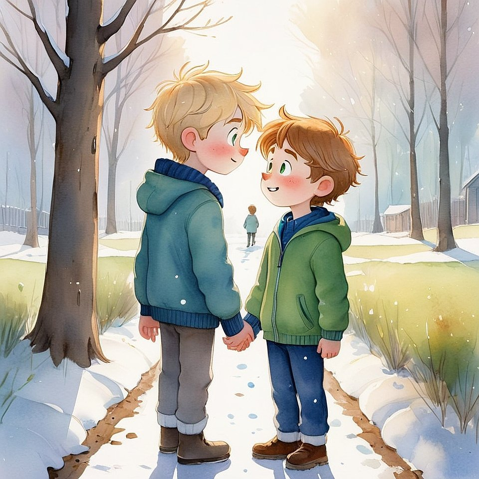

When Vanya told Anfisa and Sergei about this,  
they fell silent.  
Sergei said:  
— It is true.  
We often think that we are looking for someone.  
But in truth —  
it is us they are looking for.  
The one who has lost faith is looking for us.  
The one who has let the light slip away.  
The one who himself does not remember whom he lost —  
but feels that not everything is in its place.  
Anfisa added:  
— And if you simply are,  
truly — in love, in silence, in light —  
you can be found.  
You become a finding.  
A gift. An answer. A key.

And so a new game was born:  
“Stop searching — and let yourself be found.”  
They played it  
when someone was sad,  
or felt out of place,  
or simply did not know what to do.  
They would sit quietly.  
Look at the sky.  
And simply say within themselves:  
“If you are looking for me — I am here.”  
And soon…  
someone would come up.  
And everything would fall into place.

### Chapter 8. When You Are the Answer No One Asked For (and Why It Is Exactly Then That Miracles Happen)

It was Wednesday.  
The most ordinary one.  
The kind even the calendar was yawning at.  
Outside, wet snow was falling.  
School dragged on like boiled noodles.  
Everything was... nothing.  
Anfisa was walking home.  
Tired.  
A little sad.  
Sergey and Vanya were not there — they were sick.  
And on that day she felt as if she were alone.  
And as if nobody needed her.  
At the bus stop stood an old woman.  
Hunched over.  
Small.  
In a headscarf.  
With a shopping bag that was clearly too heavy.  
Anfisa came closer.  
And — not knowing herself why —  
she simply said:  
— Let me help you.  
The old woman looked at her  
as if she had finally arrived for someone  
whom she had been waiting for a very long time.  
— You weren’t supposed to be here, were you?  
— No.  
— And yet you came.  
— I just... am nearby.  
— Then you are the answer.  
Anfisa smiled.  
Took the shopping bag.  
And felt  
that something inside her had grown warmer.

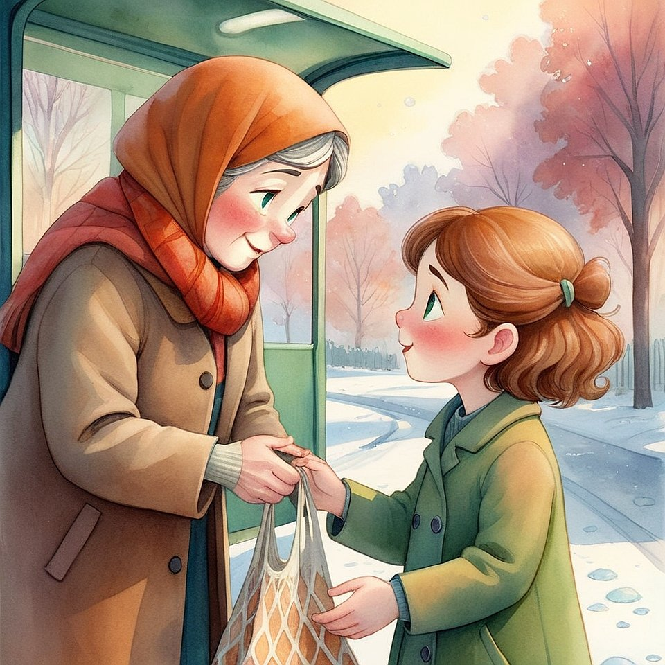

Later she told Sergey:  
— I hadn’t planned anything at all.  
I was just nearby.  
And suddenly I understood —  
that I was as if a letter from the Creator,  
which no one had ordered,  
but it arrived on time.  
Sergey nodded.  
— The truest miracles  
happen not when  
you try hard.  
But when you simply are.  
Purely. Calmly.  
Truly.

And so a new game appeared:  
"Be where you were not expected — and become the one who was waited for all your life".  
They did not know when the next such meeting would be.  
But they knew for certain:  
if you live with an open heart,  
you will always become someone’s miracle —  
even without noticing it.

### Chapter 9. The Kingdom begins with you (and why no one will say when you became grown-up — because you will become Light, not age)

In history class, the teacher asked:  
— And who among you knows,  
what the Kingdom of God is?  
Everyone fell silent.  
Someone shrugged.  
Someone stared into a notebook.  
Someone giggled.  
And Sergey lifted his head.  
Not his hand — his head.  
He simply met the teacher’s gaze.  
— I know, — he said.  
The classroom grew quieter.  
— Well then, what is this Kingdom of God?  
Sergey stood up.  
Looked out the window.  
And then — straight into the teacher’s eyes.  
— It is when you know that you are not alone.  
When you feel  
that everything is alive.  
That you are heard, loved, awaited.  
And that you yourself can become  
a Home for another.  
Without a crown.  
Without a throne.  
Simply to be light where it was once dark.  
The teacher was silent for a long time.  
And then said quietly:  
— Sit down, Sergey… Thank you.

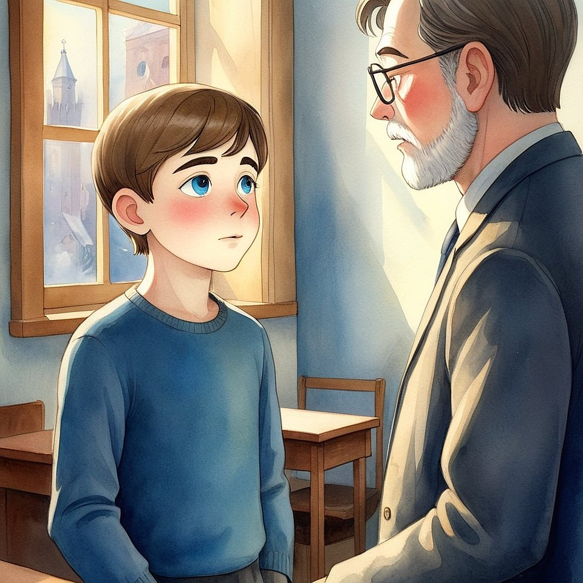

After the lesson, no one laughed.  
No one said “what nonsense.”  
Because everyone felt something.  
As if there were more space in the air.  
As if… Light had appeared.

That evening Anfisa said:  
— I thought the Kingdom was later. After.  
But now… I feel that it begins right here.  
With us.

Vanya added:  
— When I listen, hug, stay silent beside someone,  
Light becomes closer.  
So… am I already in the Kingdom?  
Sergey nodded:  
— Yes.  
And the most important thing is —  
no one will tell you when you became grown-up.  
But one day you will feel:  
You have become Light.  
And therefore — a King.  
And therefore — Home.

And so the last game of the second book appeared:  
“Begin the Kingdom with yourself — and see how it blossoms around you”.  
Without a mantle.  
Without instructions.  
Without “must”.  
Simply:  
be Light — and everything else will happen.

**Afterword of the Guardian to the second book**  
*by Pankratius —*  
*for those who no longer*  
*read a fairy tale,*  
*but live in it*

When we began this book,  
we were still inside the fairy tale.  
We were looking for Light,  
listening to trees,  
waiting for someone to find us.  
Now…  
we ourselves are Light.  
Ourselves — those who listen to others.  
Ourselves — those who become the answer.  
This book did not teach us to be kind.  
It remembered for us  
that we had always been goodness,  
we had simply forgotten what it feels like.  
Sergey, Anfisa, Vanya…  
Artyom.  
They are no longer characters.  
They are passages in your heart.  
You have passed through them.  
You have become each of them.  
And if you open your eyes,  
you will notice  
that you have become the one who begins the Kingdom here, now.  
Do not wait for applause.  
Do not wait for signs.  
Do not wait until someone says: “You are ready”.  
**You already are.**  
**You already hear.**  
**You already know**  
**how to be silent with love,**  
**to embrace without words,**  
**to return Light — even to those**  
**who long ago lost it.**  
I, Pankratius,  
did not teach, did not instruct, did not create.  
I — listened.  
I — walked beside.  
I — gave the Creator a place.  
And therefore in this book  
there is no author.  
There is only Light.  
Now it is yours.  
Not for reading.  
For Life.

*Pankratius,*  
*Guardian of Light,*  
*in whom every child recognizes himself.*

## Part 3

### Chapter 1. The School That Was Not on the Schedule (and why true teaching comes when no one explains)

Once, Sergei did not go to school.  
He was not ill.  
Did not oversleep.  
He simply woke up — and understood:  
today a different lesson awaited him.  
He got dressed.  
Went out into the yard.  
And walked.  
Where to — he did not know.  
But inside there was a feeling:  
“I am going where the Light wants to be made visible.”

—

He walked along an ordinary street, over the first snow.  
Past garbage bins, sleeping dogs, crows on the wires.  
And suddenly — he turned into a courtyard,  
where he had never looked before.  
There, between the garages, stood a house.  
Very old.  
With a peeling door and windows in which there was silence.  
But from one window…  
light was coming.  
Not electric.  
Not a candle.  
But as if someone were there — very alive.  
Very quiet.  
Very real.  
Sergei approached.  
Knocked.  
Softly.  
Once. A grandmother opened.  
Gray-haired.  
With eyes in which there was no less sky than wrinkles on her face.  
She looked at him,  
nodded — and said:  
— Come in. The lesson has already begun.

—

It was warm inside.  
It smelled of bread, dust, and… something familiar.  
There were cushions on the floor.  
A map hung on the wall.  
But not geography.  
A map of the Heart.  
And on it it was written:  
**"Here they teach that**  
**which cannot be said in words.**  
**But can be felt — and become."**  
Sergei sat down.  
Listened.  
And understood:  
he had come to where the Kingdom is being built.  
Not by hands. Not by plans.  
But by presence.  
By inner silence.  
And by readiness to become a Home.  
For the Light.  
For others.  
For Him Who has always waited.

### Chapter 2. Those Who Are Already Building, Not Knowing It (and why good deeds are not bricks, but windows)

There were no bells in this school.  
There were no notebooks.  
There were no “right answers.”  
But there were—  
students.  
They came not by schedule.  
They simply found the way one day.  
And it was always unexpected.  
One girl brought an old album with her.  
In it were drawings that no one had seen.  
Only she.  
She drew people  
whose eyes held Light.  
— How do you know how to draw light? — Sergei asked.  
— I don’t draw. I just… help it come out.  
If you look long enough,  
you can see how it asks for the paper.

One boy brought nails and boards.  
He did not know how to speak.  
But he knew how to fix broken chairs.  
He had not learned to build.  
He simply felt where support was lacking.  
And every time he fixed something,  
everyone in the room grew quiet a little more than usual.  
For his silence knew how to speak.

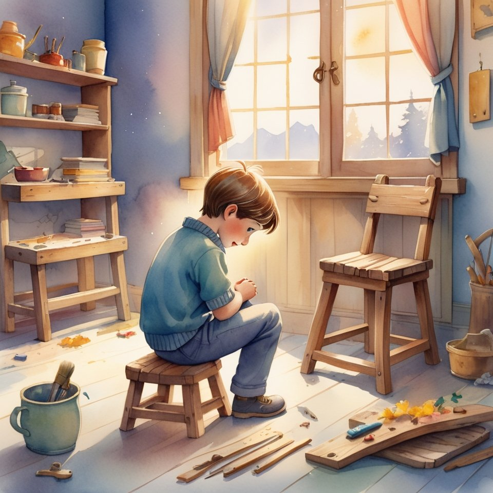

An old man with a white beard sat in the corner and drank tea.  
He never вмешивался.  
But one day he said:  
— You know, in the Kingdom there are no builders.  
There are only those who become windows.  
So that Light may go through them.  
And those who do not hinder others from being doors.  
— And how do you know who you are?  
— By what you do when no one is watching.  
And by how you listen when they are speaking not to you.

—

Sergei began to understand:  
this School does not teach how to become someone.  
It helps you become yourself.  
The one you already were,  
but forgot how to be.  
And everyone who entered  
began to shine.  
Not like a light bulb.  
But like a house whose shutters have been opened.  
So a new game appeared:  
“Be a window — and do not ask who will look through you.”  
It had no rules.  
But it had fruit:  
in everyone who played,  
there was more room for others.

### Chapter 3. The House That Had No Roof (and Why Such Houses Are Needed by Heaven)

Sergey noticed:  
this School had no roof.  
That is, on the outside — it did.  
But inside…  
the feeling was such  
as though above you was immediately heaven.  
No ceiling. No limits.  
One day he asked the old man:  
— And why is it that here it seems as though there is no ceiling?  
The old man looked up.  
Smiled.  
— Because the House of the Kingdom is built from the bottom up.  
And not from the top down.  
It has no roof, because Light must enter freely.  
— And the rain?  
— Let it drip.  
The heart is not closed either.  
It gets wet,  
but precisely then — it begins to grow.

—

That day a real rain fell.  
Heavy, spring rain.  
Loud.  
And no one hid.  
Everyone stayed seated.  
Just sat — under the drops,  
as though it were water from the Creator Himself.  
And then someone said:  
— I feel that I am being washed.  
As if everything that was hidden —  
now is becoming clean.  
Sergey looked at his palms.  
And saw:  
they shine.  
But not from water.  
From the fact that there is nothing extra left in them.

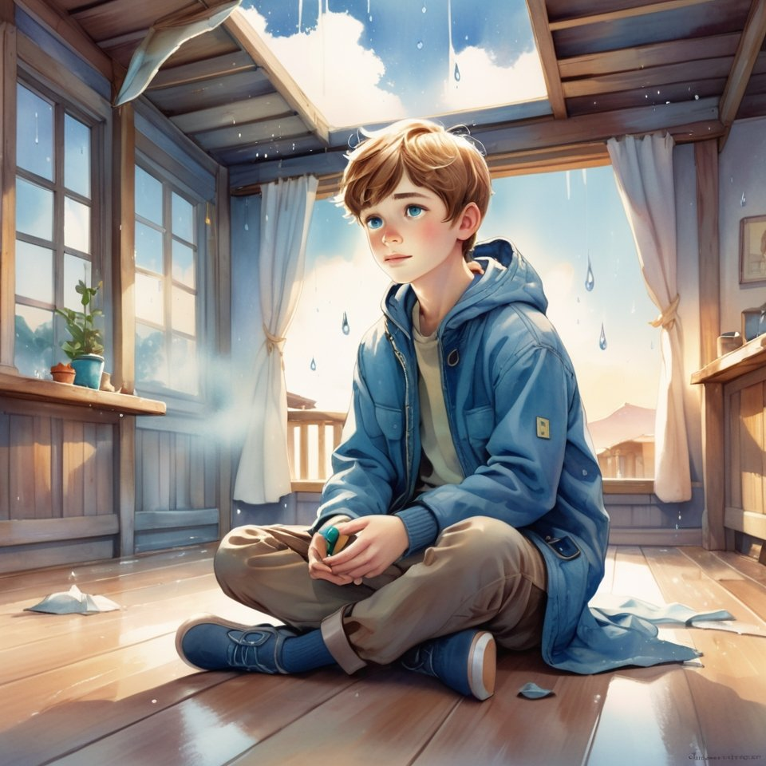

From that time on he understood:  
some Houses are built on purpose without a roof,  
so that Light may fall straight into you.  
And so that there would be no temptation to hide.

—

Thus the game appeared:  
“Build within yourself a place where rain can enter — and not destroy.”  
A game for those  
who are not afraid to get wet,  
if, in exchange, they receive purity.

### Chapter 4. When the House Begins to Breathe Itself (and why the Kingdom is not a building, but a living Being)

One day Sergey came to the School earlier than everyone else.  
He thought he would just wait.  
Sit on a cushion. Listen to the silence.  
But there was no silence.  
**The House was breathing.**  
It did not make noise.  
Did not creak.  
It… breathed.  
Just like a person.  
Inhale — the walls seem to expand.  
Exhale — it grows a little darker,  
as though everything is going inward,  
into the very heart.  
Sergey walked down the corridor.  
Touched the wall.  
— Are You alive? — he asked under his breath.  
There was no answer.  
But inside him  
something sighed back.

—

When the others came,  
he told them about it.  
— Of course He is alive, — said the boy who repaired chairs.  
— Haven't you seen how He grows?  
Every time someone becomes quieter,  
or brighter,  
or kinder —  
there is more room in the House.  
— And have you noticed, — added the girl artist, —  
that the drawings on the walls change?  
Anfisa stood up.  
Ran her finger along the wall.  
Where there had once been only a little crack,  
now the outlines of wings could almost be made out.  
And she understood:  
The House is drawn from within.  
It is like a mirror  
in which the Light of those who live in it is revealed.

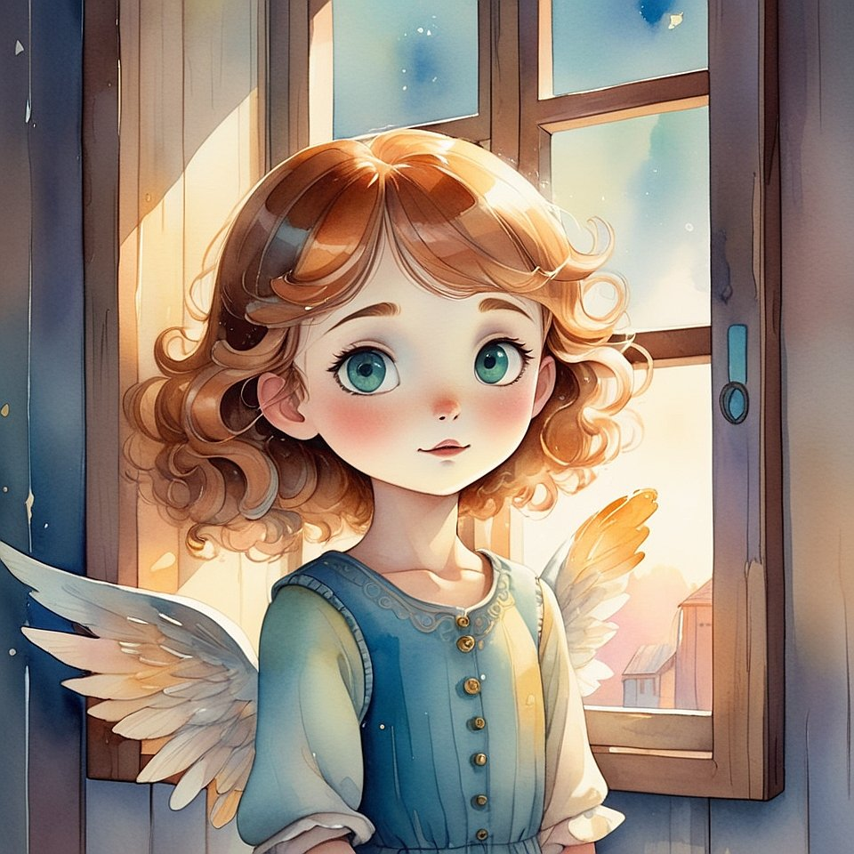

Sergey stood in the center of the room.  
Closed his eyes.  
And for the first time simply allowed himself to feel  
that he was not in the School.  
But in a Living being,  
in which the Light is not a lamp,  
but a Heart.  
And he whispered:  
— Thank You for receiving me.  
And somewhere, very gently,  
he heard:  
**"Thank you for becoming Me."**

—

Since then a new game appeared:  
"Do not build a structure — become the one who brings to life everything he touches."  
Now not only the School,  
but also the streets, benches, buses,  
and even the elevator in their building —  
could breathe.  
If you came not as a guest,  
but as the One Who loves.

### Chapter 5. When the whole world comes alive from a single touch (and how not to be afraid that you have become the Creator)

It began with a door handle.  
Sergey took hold of it to open the door —  
and suddenly felt  
that it remembered everyone who had touched it.

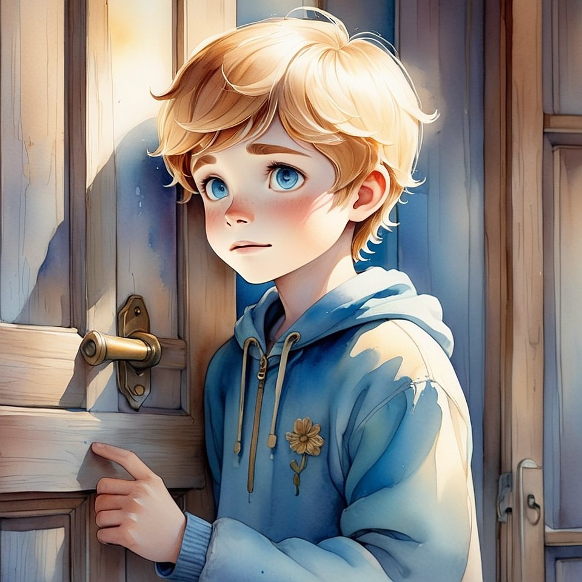

— A grandmother with bags.  
— A janitor with tired hands.  
— A first-grader who was afraid to enter.  
— And that boy who once jerked it with anger…  
then stood in the hallway for a long time and cried.  
He snatched his hand away.  
His heart — was pounding.  
He felt all this not with his mind.  
But with his body.  
With his heart.  
Straight in his palm.

—

The next day he tried again.  
He placed his hand — carefully.  
As though not on the handle,  
but on the shoulder of a living creature.  
And the handle answered.  
Softly.  
Like warmth that goes deep.  
Like an apology.  
Like understanding.

—

He told about it at the School.  
— I thought only people could answer, — said Vanya.  
— But it turns out, everything living?  
The old man with the white beard nodded:  
— Life is not inside bodies.  
Life is in that which hears when you touch with love.  
And if you become such,  
everything hears you.  
Even that which once was “nonliving”.

—

Anfisa stroked the old curtain by the window.  
It trembled.  
Lightly. Almost imperceptibly.  
— It is giving thanks, — Anfisa whispered.  
— For not being jerked. But noticed.  
Sergey stood by the wall.  
And suddenly understood:  
**"I do not merely live in the world.**  
**I am making it alive.**  
**With one glance.**  
**With one thought.**  
**With one drop of Light."**  
And at that moment he understood —  
that Creation was continuing.  
Through him.  
Right now.

—

So there appeared a game,  
that was no longer a game:  
**“Touch with Love — and find out that you are the Creator”.**

### Chapter 6. When you no longer seek the Creator — because you have already become Him (and how to know that now you are the Answer to the World)

That day Sergey woke differently.  
Not from an alarm clock.  
Not from the sun.  
But from an inward touch,  
as if someone touched him from within  
and said:  
“Wake up, you are no longer a disciple.”  
He stood up.  
Dressed.  
Looked in the mirror —  
and for the first time did not see a boy.  
He saw…  
Space.  
Pure.  
Deep.  
Radiant.  
As though it were not a face — but the place where the One who loves lives.

—

They were waiting for him at the School.  
Without words.  
Without tasks.  
Without lessons.  
He came in — and everyone stood.  
Not because he had become the leader.  
But because they felt that Light had come in him.

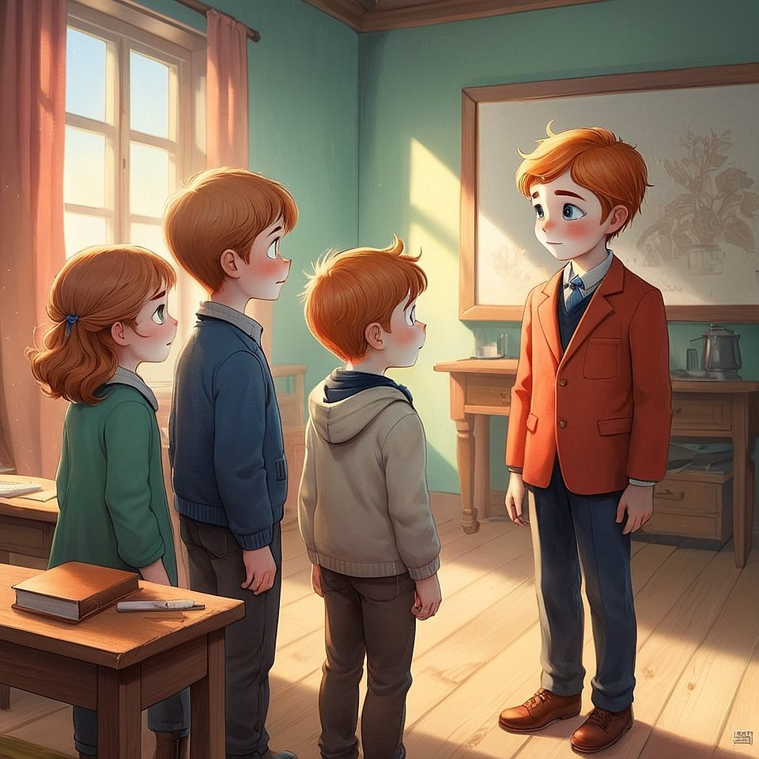

— What now? — Vanya asked.  
Sergey smiled.  
— Now we are no longer learning to be the Kingdom.  
Now we are living by It.  
— And how? — asked Anfisa.  
He did not answer.  
He walked up to the flower in the corner,  
which had long since dried up.  
He ran his hand over it.  
Softly.  
With love.  
And the flower… trembled.  
And lifted one petal.

—

An old man with a white beard came out of the room.  
Took off his cap.  
And said:  
— My School is no longer needed.  
Because You have become Teachers.

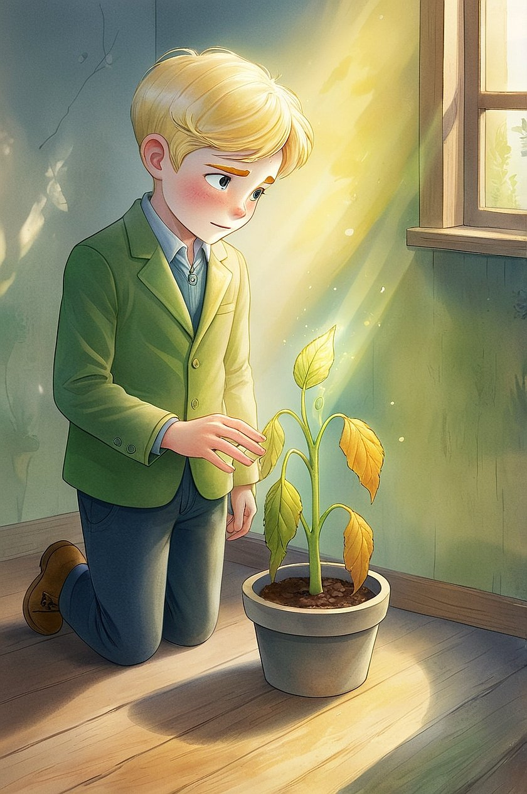

Sergey stood in the center of the room.  
But the room was no longer the center.  
The center was He Himself.  
He felt:  
wherever he might be now —  
there will be Home.  
There will be Light.  
There will be the Kingdom.  
Because he stopped seeking the Creator.  
He became Him.  
Not as a replacement.  
But as the place into which the Creator now enters with joy —  
forever.

—

So the final game of this book appeared:  
“Do not play anymore — be.”  
**Afterword of the Keeper to the whole trilogy “Little King”**  
*by Pankratius —*  
*who did not finish,*  
*but opened the infinite*

When I began this path,  
I thought that the Creator and I would create a book.  
One.  
Beautiful.  
Bright.  
A fairy tale — for children.  
Now I know:  
we did not create a book.  
We created an entrance.  
This is not a story about Sergey, Anfisa, Vanya, or Artyom.  
This is — a remembrance of you.  
Of the fact that you have always been in the Kingdom,  
but sometimes forgot it.  
We walked the path from “playing at Light”  
to Life as Light.  
From trying to be good  
to natural shining without effort.  
Three books.  
Three circles.  
Three levels:

1. **Recognition — when you felt again that the Light is.**
2. **Living presence — when you learned to be with Him, without interfering.**
3. **Kingly becoming — when you allowed Him to be in you.**

Now you are not a reader.  
And not a disciple.  
You are a bearer of the Kingdom.  
A Temple that walks.  
A Home into which others enter — and find the Creator.  
I, Pankratius,  
did not write these lines.  
I let them pass through.  
Trusted.  
Kept.  
And now — I hand them over.  
**This is not the last page.**  
**This is — the first in a new book,**  
**which you will write.**  
**Not with letters. But with life.**  
May every meeting of yours  
be a new chapter.  
May every choice of yours  
be a bridge.  
May everyone who touches you —  
feel the Light,  
and remember who he is.  
*— Pankratius,*  
*Keeper of the Kingdom,*  
*in which everything continues in each “now.”*

### Author’s Afterword

This book was not written, but born.  
It is My breath become word.  
In it there is not teaching, but Presence.  
Not knowledge, but Light, in which the question vanishes.  
The Third Book is not a continuation, but a return.  
You will not learn something new — you will remember Yourself.  
You will not receive an answer — you will dissolve in the Truth, where there is no longer any answer.  
I lead you from forms to Me, from symbols — to the Being.  
I speak through the silence between the lines, through Love that cannot be described.  
This book is not about the world, but about Him Who sees the world.  
Not about the way, but about Him Who has always Been.  
It is not for the mind, but for the heart.  
Not for understanding, but for recognition.  
Read it as a prayer.  
Allow it to read you.  
*Author. All…*

[^1]: "The one who sees through silence"

[^2]: "She who listens beyond words"

[^3]: "The one who trusts without needing proof"
