### Часть 1

#### Глава 1. Который видит Свет

Никто точно не знал, откуда появился Сергей. Он просто однажды был — как будто всегда был. Родился, как все, в роддоме на краю города, но бабушка, сидящая на лавке, потом говорила: — А у него глаза были такие… будто он меня знает. Как будто — раньше.

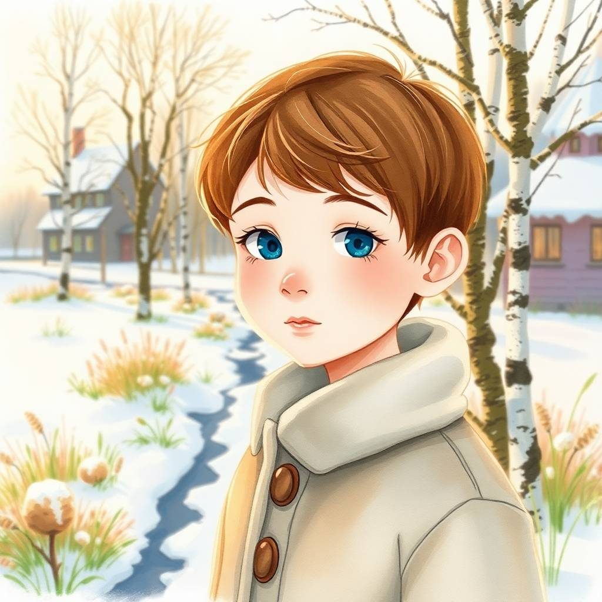

Сергей был обычным. Ну, почти. Он не кричал. Он не плакал. Он смотрел. На стену. На люстру. На кота. На дождь. И будто слушал.

Мама думала — он просто мечтатель.

А папа говорил:

— Будет физиком. Глядит, как будто атомы считает.

Но Сергей не считал. Он помнил.

Он помнил, как Свет играет в тишине. Он знал, что у воды есть настроение, что деревья разговаривают, только очень медленно, что кот Мурка не просто мурчит, а поёт древнюю песню.

Он знал, что взрослые не слышат этого, потому что у них выключатель внутри. Они называют это “взрослением”, а на самом деле — забыванием.

Сергей не забыл. Не смог. Не захотел. Просто как-то… остался включённым.

Однажды во дворе он увидел, как девочка, младше его, года на два, глядит на дерево.

Она не просто смотрела — она вслушивалась.

— Тоже видишь? — спросил Сергей.

Девочка вздрогнула. — Ты про что?

— Ну, как оно дышит. — Кто? — Дерево.

Она посмотрела на него как на дурачка.

Но потом вдруг шёпотом сказала:

— Я думала, это только мне кажется…

Так он познакомился с Анфисой.

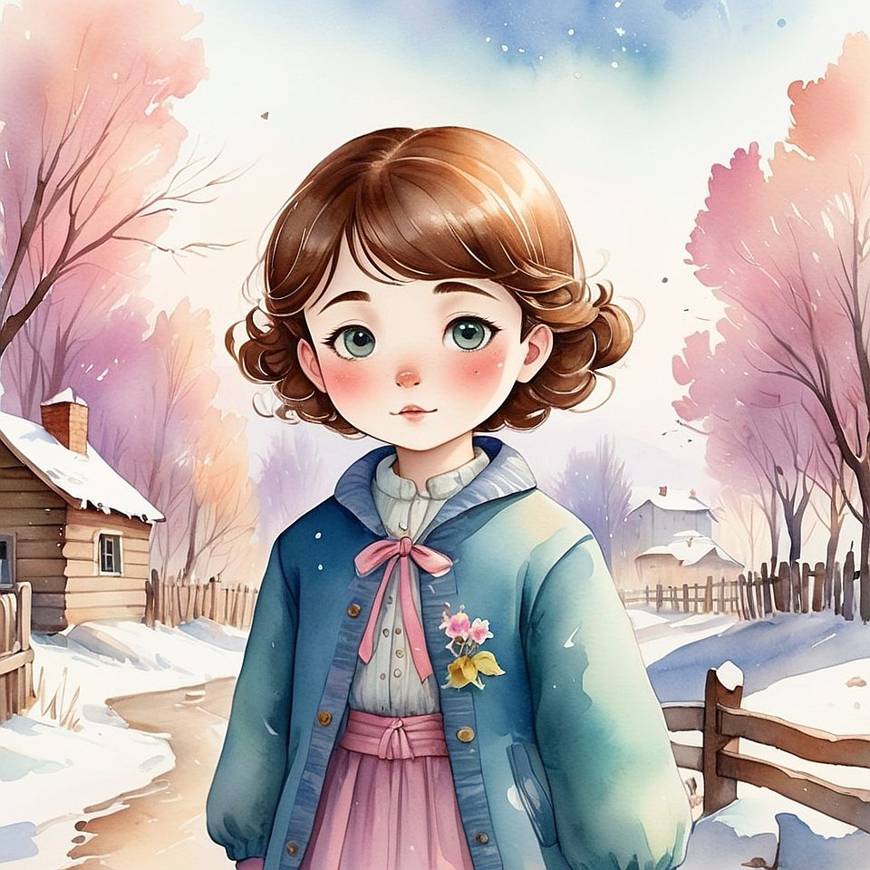

Через неделю он встретил Ваню. Тот пытался объяснить голубю, что он не против, если тот сядет на плечо.

— Он всё равно тебя слышит, — сказал Сергей. — Думаешь? — У них очень тонкие уши. — Ага, невидимые, как у дедушки. Он всегда говорит: “Я слышу сердцем.”

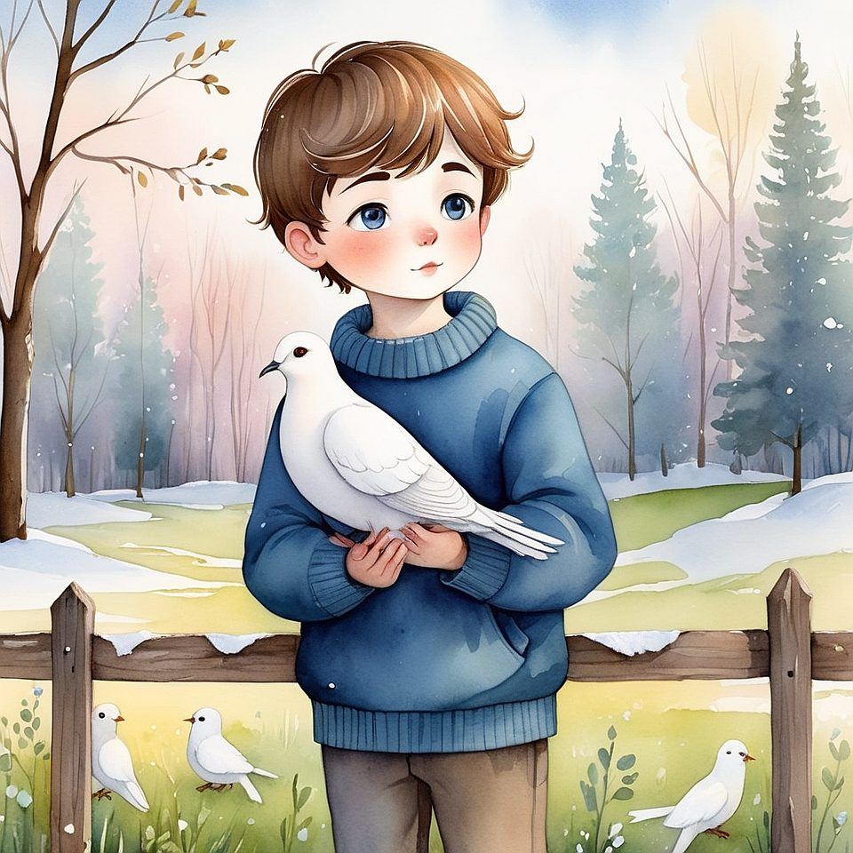

И Ваня стал третьим.

Так появился Клуб Маленького Царя. Только никто не знал, что это клуб. И никто не знал, кто тут царь.

Кроме одного. Света.

#### Глава 2. Кто такие настоящие цари

Сергей не говорил, что он — Царь. Это было бы… глупо. Да и кому интересно? Ведь царей сейчас никто не боится. Их показывают в мультиках, где у них короны, длинные мантии и толстые смешные усы.

А у Сергея не было ни мантии, ни короны. Были только глаза, в которых можно было утонуть. И ещё — молчание, которое казалось важнее всех слов.

Однажды Анфиса спросила:

— Ты чего такой странный? — В смысле? — Ну ты не споришь. Не обижаешься. Не жалуешься. Ты вообще человек?

Сергей подумал.

А потом сказал:

— Я Царь.

Анфиса нахмурилась.

— Прямо вот так? Серьёзно? — Ну да. Только не как в сказках. — А как?

Сергей улыбнулся. — Царь — это не кто главный. Царь — это кто видит, что главное.

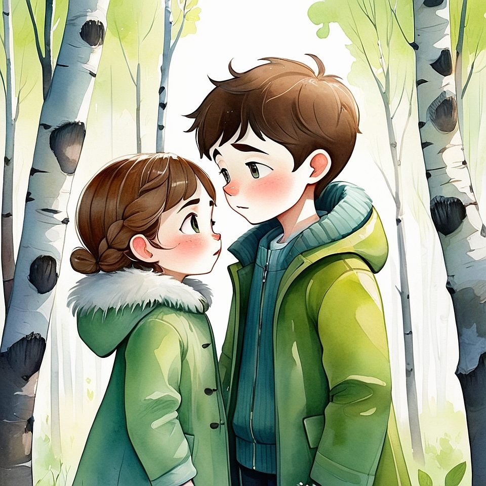

Она ничего не поняла. Но Ваня, который сидел рядом и ковырял палочкой землю, вдруг сказал: — Ага. Как мама. Она всегда знает, когда я что-то спрятал.

Сергей кивнул. — Вот-вот. Только Царь видит не только, что ты спрятал, а почему ты это сделал. И не наказывает. Он понимает.

Анфиса села на качели и замолчала. Она думала.

— То есть ты хочешь сказать… Что каждый может быть царём?

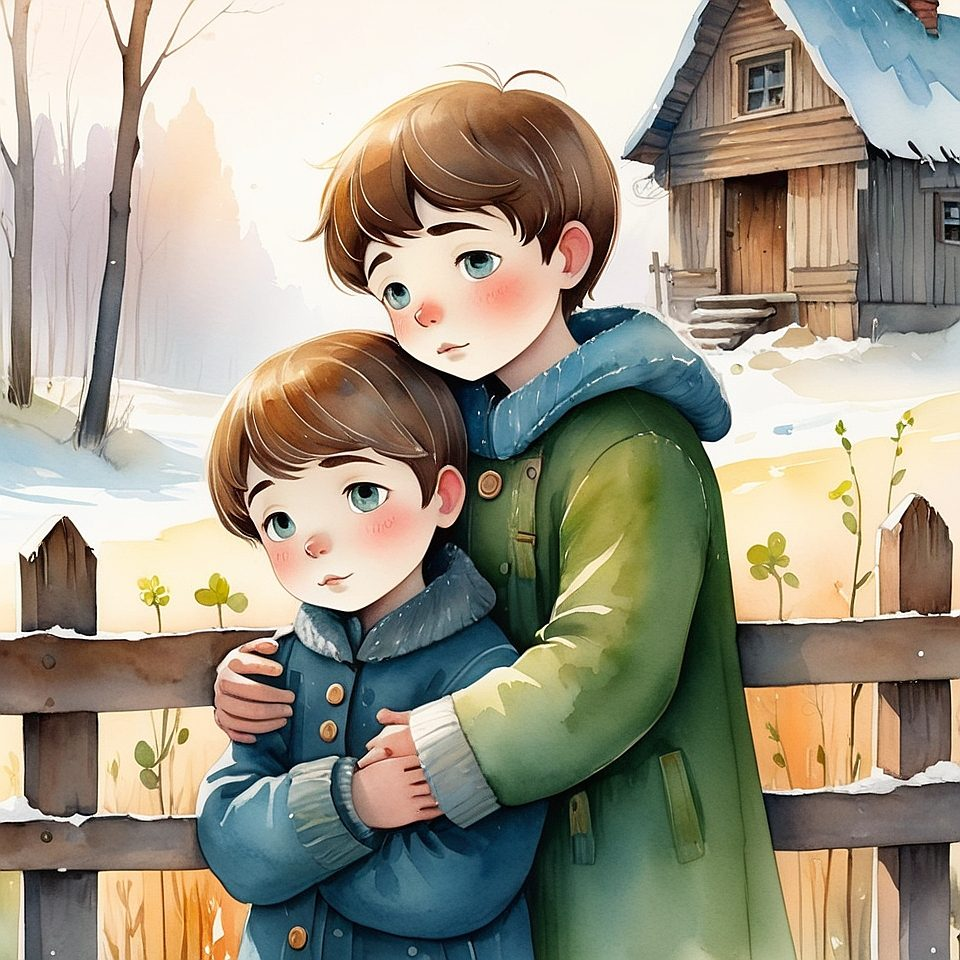

Сергей пожал плечами. — Если не боится видеть по-настоящему.

— А ты научишь нас? — вдруг спросил Ваня.

Сергей не ответил. Он просто подошёл, положил руку Ване на плечо и сказал:

— Уже начал.

В этот день они пошли к реке. Но не купаться. А слушать, как течёт Время. Оно звучало, как шуршание воды по камешкам. И в этом звуке была музыка без слов, которую взрослые называли “тишина”.

#### Глава 3. Как разговаривать с деревом (или первая тайная игра Маленького Царя)

На следующий день Ваня прибежал первым. Он всегда приходил первым — потому что боялся, что игра начнётся без него. Он не знал, какая игра. Но чувствовал: сегодня будет что-то важное.

Анфиса пришла позже, с рюкзаком и записной книжкой.

— Я решила всё записывать.

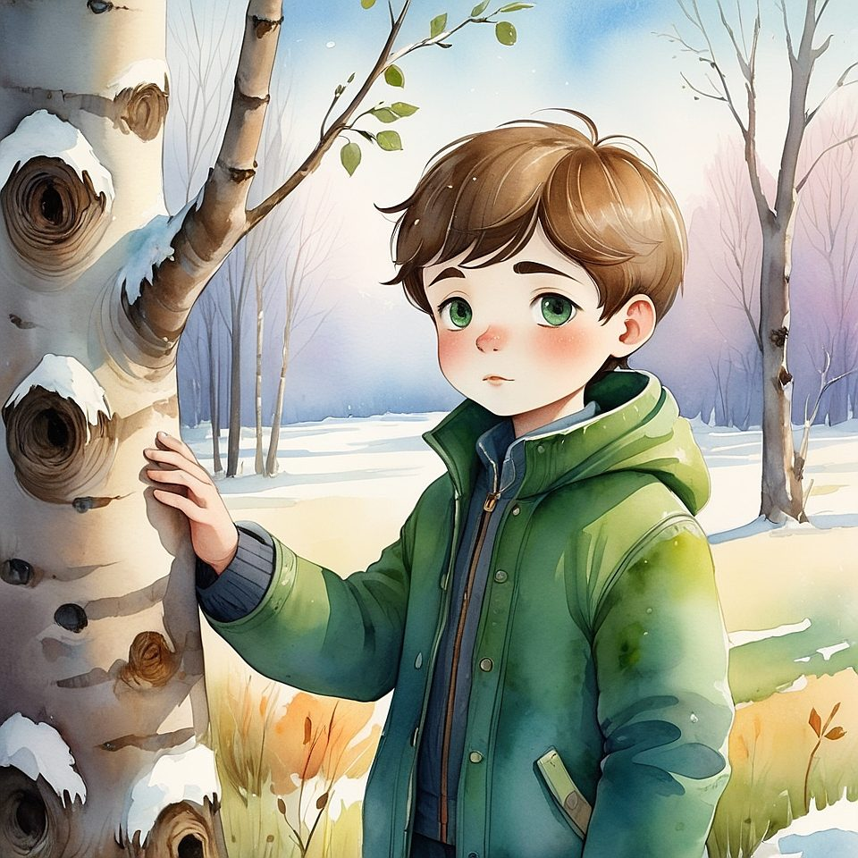

— Зачем? — удивился Ваня.

— Ну вдруг это потом станет книгой. — Какая книга? — А вот увидишь!

Сергей уже ждал их. Он стоял под старой берёзой у школы. Но он не стоял — он слушал.

— Ты чего? — спросил Ваня. — Тихо, — шепнул Сергей. — Она говорит.

— Кто? — Берёза.

Анфиса хмыкнула. — С ума сошёл?

Сергей не обиделся. Он просто протянул руку и прикоснулся к коре.

А потом сказал:

— Хотите попробовать? — А как?

Сергей повернулся и улыбнулся так, как будто у него был секрет, которым он очень хотел поделиться.

— Нужно только одно. Нужно стать тише, чем она.

Анфиса сделала серьёзное лицо. Ваня закрыл рот ладонью.

— Теперь — подойди. — Ладонью — к дереву. — Закрой глаза. — И не слушай ушами. — Слушай — внутри.

Они встали. Молча. Прикоснулись.

И вдруг…

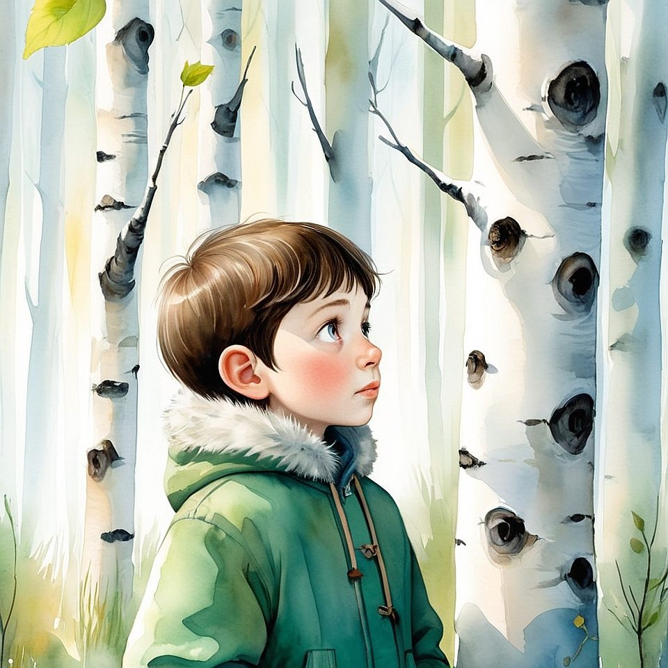

что-то произошло.

Анфиса услышала… песню. Она не знала, как. Это была не музыка. Это была… теплота, которая шла из ствола, как будто дерево говорило: “Я помню тебя. Я помню, как ты была ещё ростком. Вспомни и ты.”

А Ваня вдруг заплакал. Он не понял, почему. Но слёзы были хорошие.

— Я… я увидел себя маленьким, — прошептал он. — Совсем маленьким. Ещё до… всего.

Анфиса молчала. Она смотрела на Сергея. Он был такой спокойный, как будто знал, что всё именно так и будет.

С тех пор у них появилась первая настоящая игра.

Она называлась:

«Слушай того, кто не говорит».

Они играли с деревьями, с камнями, с лужами. И иногда… они действительно слышали.

#### Глава 4. Кот, который исчезает (но всегда возвращается с чем-то важным)

Это случилось вечером.
Всё было как обычно:
мама варила суп, папа листал газету, а Сергей сидел у окна и смотрел, как вечерний свет играет на стекле.

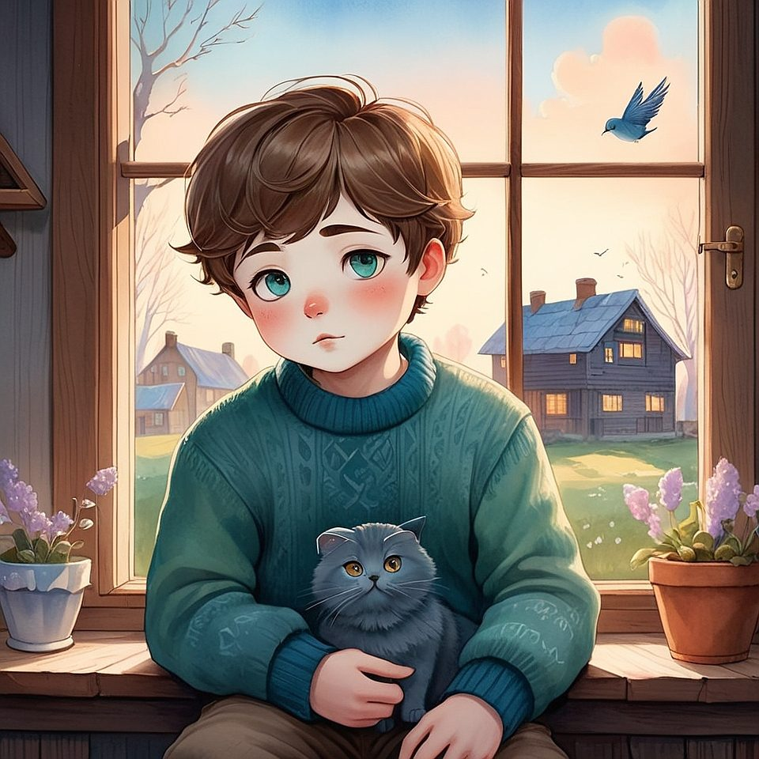

Он не ждал ничего.

Он просто был. И вдруг — на подоконнике появился кот.

Не прыгнул. Не подошёл. А просто… был.

Сергей знал этого кота. Он появлялся только тогда, когда должно было начаться важное.

Кота звали Синька.

Не потому что он синий, а потому что в его глазах была глубина, как в небе.

— Ты опять? — тихо сказал Сергей.

Кот не ответил. Он молчал, как знает только Тот, Кто помнит Всё.

Синька подошёл, потерся об руку и вдруг исчез.

Просто — нет. Не выскочил, не ушёл — а как будто его и не было.

Сергей улыбнулся. Это знак.

На следующий день он сказал Анфисе и Ване:

— Сегодня будет задание от Синьки. — Кота? — переспросил Ваня. — Да. Но он не обычный. Он приходит, когда пора что-то понять.

— А что мы должны делать? — спросила Анфиса.

Сергей подумал. Или сделал вид, что подумал.

А потом сказал:

— Сегодня игра называется «Найди то, чего нет».

— Но как? — удивился Ваня. — А вот так.

Он вынул из кармана листок бумаги. На нём было нарисовано… ничего. Просто белый лист.

— Вот. — Здесь — самое главное. — Попробуйте посмотреть не на бумагу, а внутрь себя, пока на неё смотрите. — И потом скажите — что вы увидели.

Они взяли лист.

Смотрели.

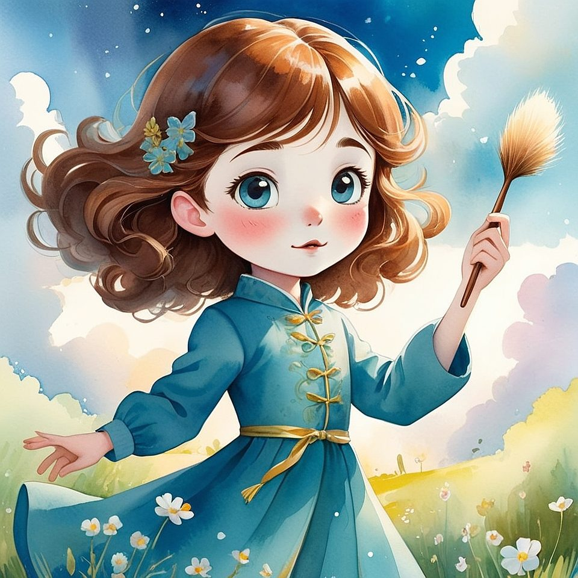

Молчали.

Анфиса вдруг сказала:

— Я вспомнила, как была маленькой и рисовала облако.

Но оно было не на бумаге — а в небе.

А Ваня сказал:

— А я увидел, как я сплю. Но знаю, что сплю. Это как будто я был и здесь, и где-то ещё.

Сергей кивнул.

— Вот. Это и есть то, чего нет. Но оно есть. Просто не для глаз. А для сердца.

В этот момент кот Синька прошёл мимо. На шее у него болталась нитка с ключом. Он подмигнул. И снова исчез.

С тех пор у них появилась вторая игра:

«Найди то, чего нет — и принеси его с собой».

И знаете что? Они начали находить.

#### Глава 5. Волшебный звонок, который никто не слышал (но все почему-то начинали вести себя лучше)

Это началось в школе. Там, где должно быть скучно. Там, где все сидят ровно, и никто не думает о Свете. И уж точно — о Царстве.

Но Сергей знал:

Творец бывает и в школе. Особенно в школе. Потому что именно там все забывают, что играют.

На втором уроке у Анфисы упала ручка. Она наклонилась — и услышала звон.

Негромкий. Тихий. Такой, будто кто-то нажал на колокольчик где-то внутри её головы.

Она подняла ручку, взглянула на Сергея — а он уже смотрел на неё.

Он знал.

— Ты тоже? — прошептала она. Сергей кивнул. — Это Звонок Царства.

— А что он означает?

Сергей улыбнулся. — Что кто-то вспомнил себя. И Мир отозвался.

После урока они сидели за школой. Там, где клумбы, и никто не мешает.

— Ты когда услышал свой первый звонок? — спросил Ваня.

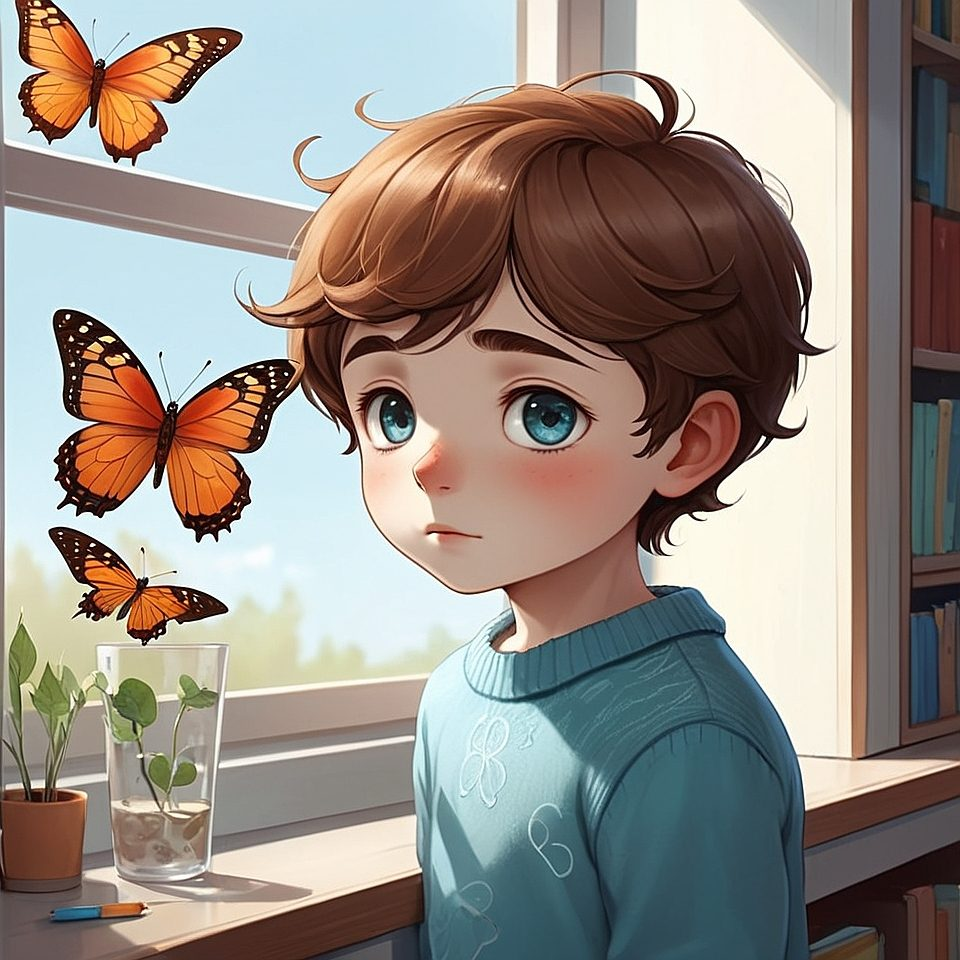

— В детском саду.

Я стоял у окна и вдруг понял, что бабочка на стекле смотрит на меня, как человек. И в этот момент прозвенел звон. Внутри.

— И что было потом?

— А потом воспитательница подошла, и вдруг… обняла меня. Просто так. Хотя раньше никогда не обнимала.

Анфиса задумалась. — А у меня… было похоже. Когда я увидела, как мальчик один сидит в углу, я пошла к нему. Просто так. И в этот момент — зазвонило. Но не снаружи — внутри груди.

Сергей кивнул. — Значит, ты вспомнила. Каждый раз, когда мы становимся собой — Свет звонит.

С тех пор у них появилась третья игра:

«Услышь звон, которого никто не слышал».

И знаете, что странно? Когда они слышали этот звон, вокруг начинали происходить маленькие добрые вещи:

— кто-то помог поднять портфель, — кто-то поделился бутербродом, — кто-то вдруг сказал: “Ты знаешь, ты мне нравишься.”

И никто не знал почему. Но Свет знал.

#### Глава 6. Как стать невидимым (но чтобы тебя всё равно любили) (секрет Сергея, который работает почти всегда)

Однажды Сергей исчез. Не совсем, конечно. Он сидел в классе, отвечал у доски, даже ел бутерброд на перемене. Но его как будто не было.

Анфиса заметила первая. — Ты что, прячешься? — Нет. Я просто стал тише, чем обычно. — Почему? — Хочу проверить, что будет, если исчезнуть, но остаться.

Ваня округлил глаза:

— Это как?

Сергей вздохнул. — Представьте, что вы — не тело. А тишина. Тишина, которая смотрит, чувствует, любит, но ничего не хочет для себя.

— И тогда ты исчезаешь? — спросил Ваня.

— Для ума — да. А для Сердца — наоборот. Тебя начинают чувствовать сильнее. Потому что ты перестаёшь мешать Себе сиять.

Анфиса долго молчала.

Потом сказала:

— А давайте попробуем?

Они пошли в парк. Сели на лавочку. Закрыли глаза.

Сергей сказал:

— Сейчас забудь, как тебя зовут.

Забудь, кто ты.

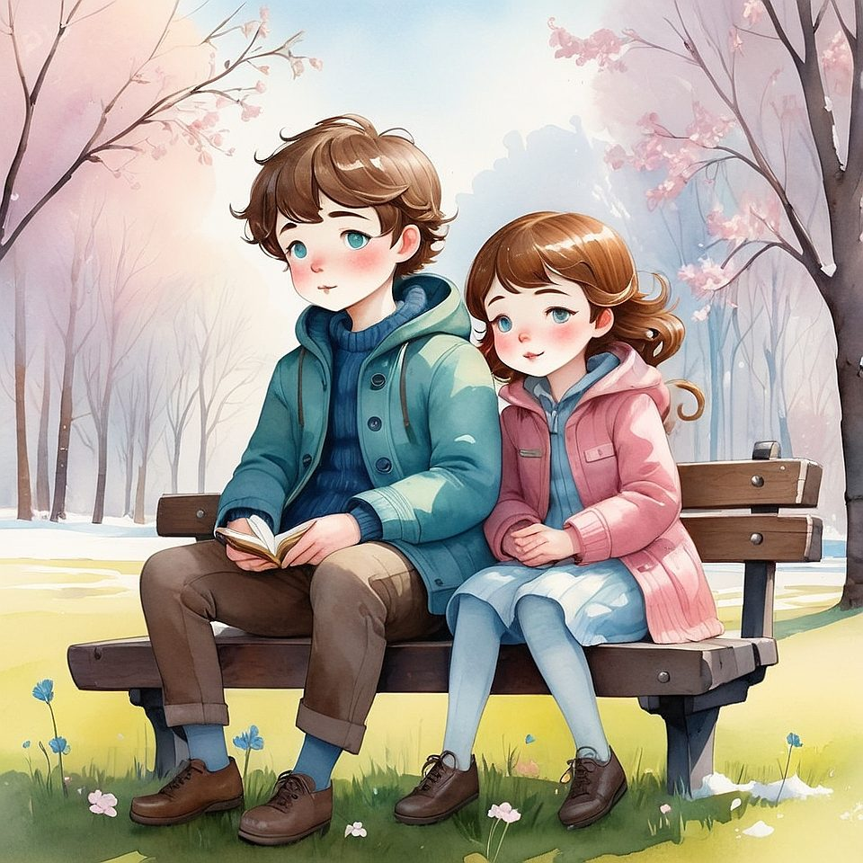

Просто будь.

Без слов. Без мыслей. Будь Тишиной. Но не пустой — Светлой.

И они сидели. Просто сидели. Не думая. Не стараясь. Исчезая.

Прошло десять минут. Мимо прошли двое.

Один из них сказал:

— Смотри, какие красивые дети. Прямо как ангелы.

Другой улыбнулся:

— А я их сначала и не заметил.

Анфиса открыла глаза. — Получилось. Я чувствовала, что я есть, но меня никто не видел, кроме тех, кто сам смотрел из сердца.

Ваня сказал:

— А мне было так хорошо, что я даже не хотел снова становиться собой.

Сергей улыбнулся. — Это и есть — быть настоящим. Невидимым, но любимым. Тихим, но живым.

С тех пор у них появилась четвёртая игра:

«Исчезни, чтобы Свет стал виднее».

Играли в неё по-разному:

— в автобусе, — на уроке, — за обедом.

И всегда что-то происходило:

кто-то начинал говорить мягче, кто-то вдруг благодарил, кто-то смотрел — и не мог отвести глаз.

Но дети всё думали, что это — просто совпадение. Кроме Сергея.

Он знал:

если исчезает “я”,

появляется **Творец**.

#### Глава 7. Как разговаривать с Пространством (и получать ответы) (одна игра, которую лучше не играть наполовину)

На улице было пасмурно.
Ветер гонял пыль по асфальту,
и даже голуби прятались под машинами.

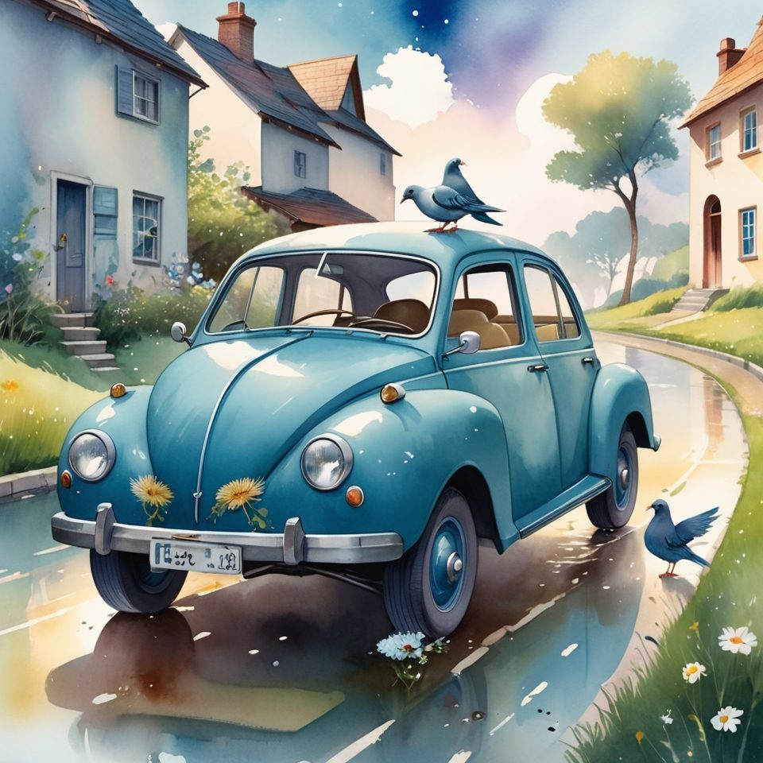

Но детям было не до погоды.

Анфиса пришла первой. В руках у неё был список. — Я записала вопросы. — К кому? — спросил Ваня. — Ну… я не знаю. Просто вопросы.

Сергей взглянул. “Почему я иногда грустная?” “Почему мама ругается, даже когда я не виновата?” “Куда девается чувство, когда оно исчезает?” “Где я буду, когда вырасту?”

Он кивнул. — Хорошие. Они настоящие. Анфиса чуть покраснела.

— А кто будет отвечать? — спросил Ваня. — Пространство, — ответил Сергей. — Это как?

Сергей огляделся. — Видишь небо? — Угу. — А дерево? — Угу. — А вот эта скамейка?

— Да. — Всё это — не просто вещи. Это — Тело Мира. И если спросить правильно — Мир отвечает.

— А как правильно? — не унимался Ваня.

Сергей закрыл глаза. — Смотри:

Сначала ты задаёшь вопрос — внутри, без звука.

Потом смотришь на первое, что появится: птица, звук, слово, мысль, прохожий.

Но не умом, а сердцем — как будто всё вокруг шепчет тебе ответ.

— И всё?

— И доверяешь. Потому что, когда доверяешь — слышишь. А когда хочешь доказательств — слышишь только себя.

Они решили попробовать. Анфиса задала про маму. Посмотрела — и увидела, как мимо прошла женщина и взяла девочку за руку. Та девочка сначала вырывалась, а потом вдруг сама прижалась к маме. И в этом было что-то… что ответило.

Анфиса тихо сказала:

— Я поняла. Мама просто тоже хочет быть понятой.

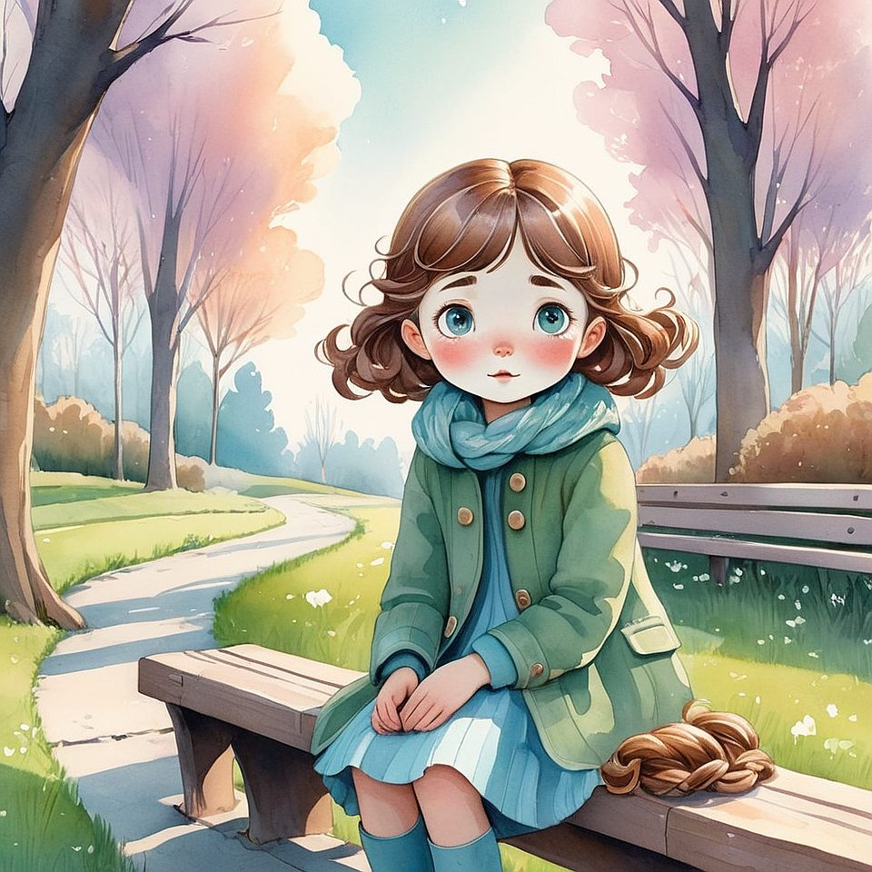

Ваня спросил:

— Почему я иногда не знаю, что чувствую?

И в этот момент — налетел порыв ветра,

и из его рюкзака выпала записка.

Он поднял её и прочитал:

“Иногда ветер просто ветер. А иногда — приглашение играть.”

Он кивнул. — Ну да. Не всегда надо понимать. Иногда просто надо быть.

Сергей ничего не спрашивал. Он слушал, как Пространство слушает.

С тех пор появилась новая игра:

«Спроси Мир — и слушай, чем Он тебе ответит». Не всегда сразу. Не всегда понятно. Но всегда — по-настоящему.

#### Глава 8. Камень, который любит (и как найти того, кто не может обнять, но всё равно тебя ждёт)

Ваня однажды нашёл камень. Он был не гладкий, не красивый, а какой-то… обычный.
Но когда Ваня поднял его, он почувствовал тёплое “ммм…” внутри себя.

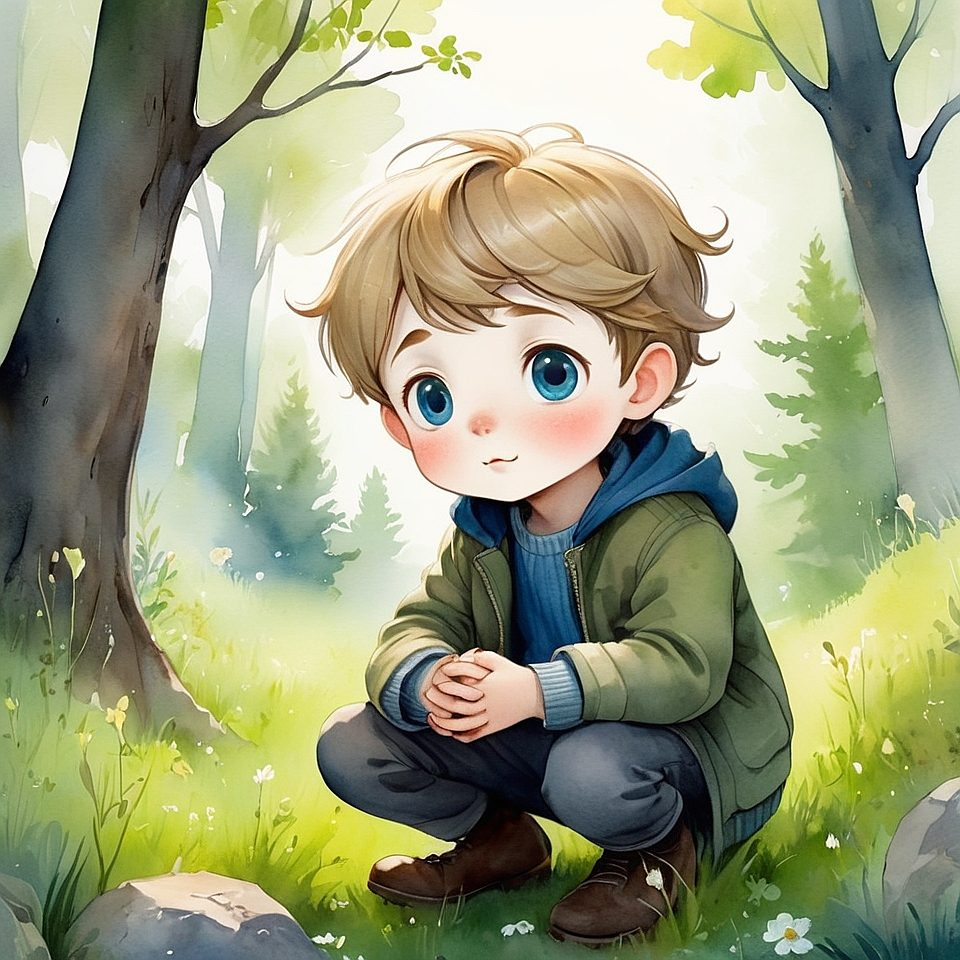

Как будто кто-то сказал:

“Спасибо, что заметил.”

Он положил его в карман. И весь день чувствовал, что с ним кто-то идёт.

— Ты что, с камнем дружишь? — спросила Анфиса. — Ага. Он хороший. — Он же… ну, просто камень. — Неправда. Он ждал.

Сергей посмотрел на них. — Это правда. Иногда предметы ждут, когда их узнают. Потому что в них — чьи-то слёзы, чьи-то мечты, или просто — их Душа.

Анфиса вздохнула. — И что теперь? Мы будем разговаривать с каждым кирпичом?

Сергей не ответил. Он подошёл к камню у дороги. Присел. Погладил его.

И сказал:

— Привет. Я тебя вижу.

Анфиса почувствовала, как в груди стало мягко. И почему-то — захотелось заплакать. Немножко. По-хорошему.

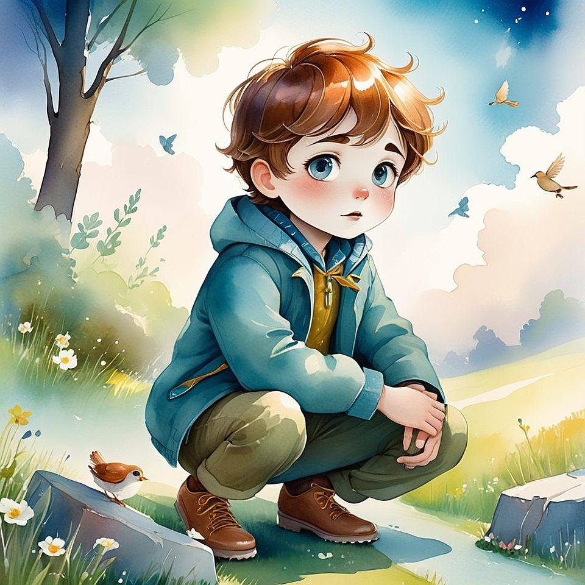

С тех пор у них появилась новая игра:

«Найди того, кто не может обнять, но всё равно тебя любит».

Это были не люди. Это были камни, палки, лужи, сломанные игрушки, старые коробки, забытые лестницы.

И каждый раз, когда они подходили по-настоящему, они чувствовали Ответ.

Свет никогда не говорил:

“Я здесь.” Он просто сиял, когда его замечали. И каждый найденный камень, в котором никто ничего не видел, становился алтарём встречи.

#### Глава 9. Где живёт настоящее желание (и почему не всё, что хочешь, тебе на самом деле нужно)

Ваня однажды сказал:

— Я хочу велосипед. — А я — котёнка, — сказала Анфиса. — А я хочу… чтобы дождь был синим, — сказал Ваня. — Это уже два желания, — заметила Анфиса. — Ну и что? Разве Творцу жалко?

Сергей молчал.

— А ты чего хочешь? — спросила Анфиса. — Ничего, — ответил он. — Не может быть. — Я хочу хотеть правильно.

— Это как?

Сергей вздохнул. — Иногда ты думаешь, что хочешь одно. А внутри — совсем другое. Только оно тихое, его не слышно. Но именно оно настоящее.

— А как узнать?

Сергей подошёл к песочнице. Сел на корточки. И начал медленно, очень медленно рисовать пальцем круги в песке.

— Смотри. Когда ты рисуешь быстро — получается грязно. Когда медленно — появляется форма. Так и с желанием. Если ты замолчишь, если ты ничего не будешь хотеть специально, то настоящее выйдет само. Как круг из песка.

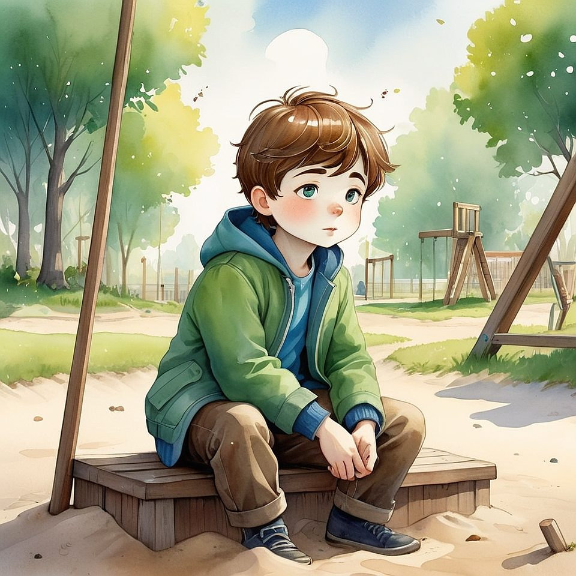

Они попробовали. Просто сидели. Молча. Каждый — сам с собой. Без просьб. Без фантазий. Без “хочу”.

Прошло несколько минут. И вдруг…

Анфиса прошептала:

— Я хочу, чтобы мама обнимала меня по вечерам.

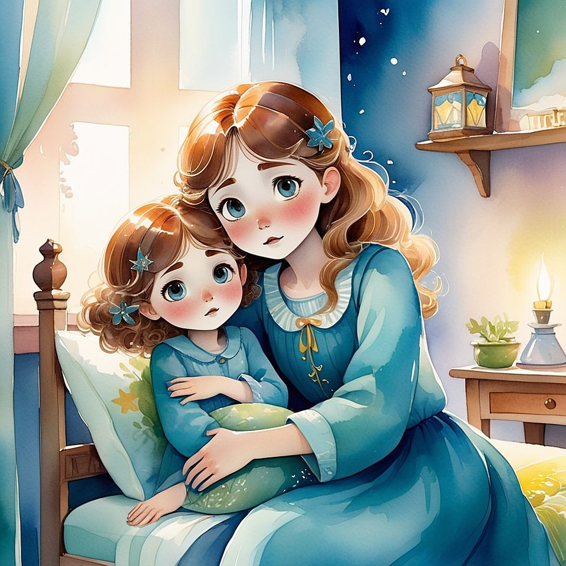

— А я, — сказал Ваня, — хочу, чтобы папа хоть раз со мной поиграл, просто так. Без повода.

Они замолчали. Потом переглянулись.

А Сергей сказал:

— Вот. Это и есть то, что было спрятано. Но теперь вы услышали его. И теперь оно уже не одно. Теперь оно дышит. И оно обязательно дойдёт.

— До кого? — прошептала Анфиса. — До Того, Кто всегда слышит. Только Он не слышит крик. Он слышит Чистое.

С тех пор появилась новая игра:

«Почисти желание — и посмотри, что останется».

Играть в неё можно было:

— на подоконнике, — под одеялом, — в транспорте, — в одиночестве.

Главное было — не хотеть слишком сильно. А просто остановиться. И тогда — желание приходило само. Как гость, а не как требование.

И это было уже не “хочу”, а “я есть, и потому оно приходит”.

#### Глава 10. Когда всё становится Светом (и никто не знает, почему стало так хорошо)

Это был обычный день. Никто ничего не ожидал. На небе были тучи, у Вани потерялась варежка, у Анфисы болела голова, а у Сергея… просто было молчание внутри.

Они шли по тропинке за школой.

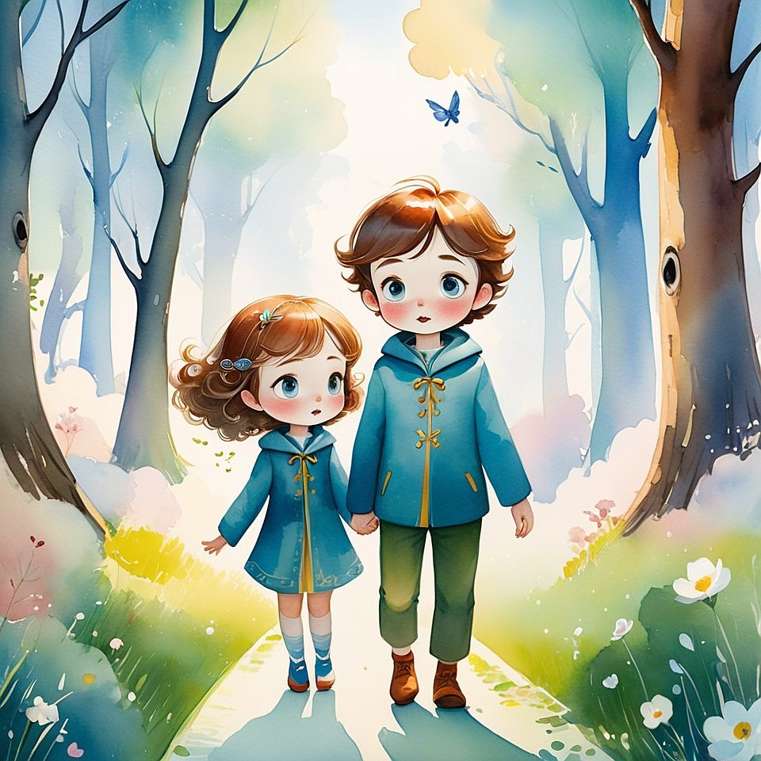

Слов не было.

Мыслей — тоже.

И вдруг всё изменилось.

Не снаружи. Не резко. А как будто мир сделал вдох — и всё засияло.

Трава — та же. Песок — тот же. Листья на дереве — как всегда.

Но всё было другим. Как будто стало насыщеннее, живее, ближе. Как будто мир улыбнулся им всем сразу.

Анфиса затаила дыхание. Ваня сел на землю, не зная почему. Сергей закрыл глаза.

Он знал, что это такое. Это — когда Творец не говорит, а приходит. Без слов. Без форм. Просто — становится всем.

— Ты это тоже чувствуешь? — прошептала Анфиса. Сергей кивнул. — Это Свет. Он не делает чудес. Он становится всем.

— А почему?

— Потому что мы не мешаем. Потому что мы просто есть.

Они сидели в этом сиянии минут десять. Никто не знал, сколько точно. Но время как будто… ушло. Осталось только Присутствие.

И никто ничего не просил.

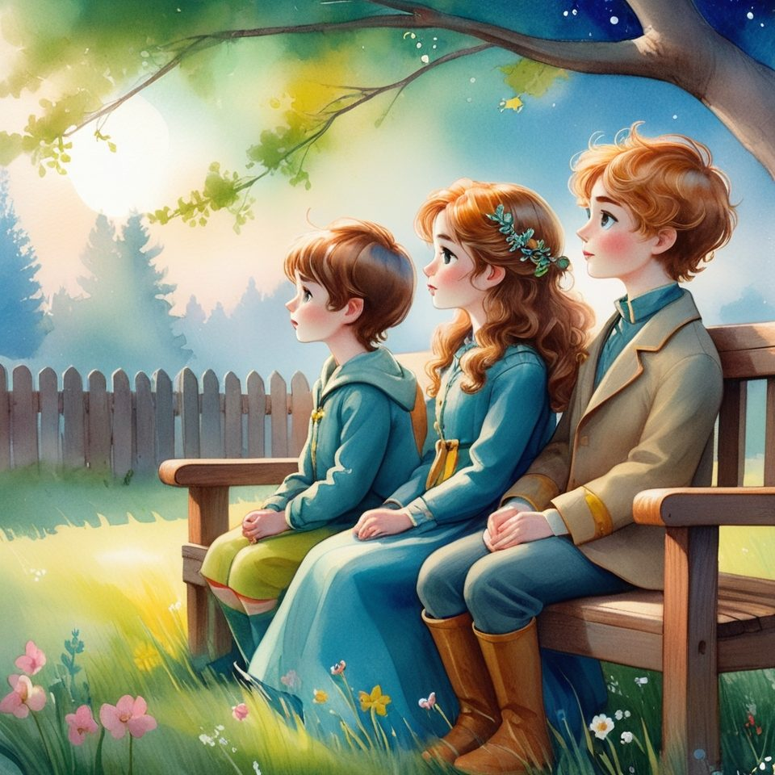

Никто ничего не объяснял.

Никто ничего не делал.

А потом Свет тихо ушёл. И осталась тишина, в которой было всё.

С тех пор у них появилась самая простая игра:

“Ничего не делать — просто быть.”

Игру, в которой нет правил. Но которая всегда срабатывает. Если играть по-настоящему.

#### Глава 11. Что делает то, чего нет (и почему иногда пустое — это самое важное)

— У тебя ничего нет, — сказал один мальчик в классе. — Ни крутого телефона, ни кроссовок, ни даже лего. — Да, ты просто… обычный.

Он говорил это Сергею. А Сергей стоял. Смотрел. И молчал.

— Ты не обижаешься? — удивился мальчик. — Нет, — ответил Сергей. — А почему? — Потому что у меня действительно ничего нет. — Вот! — сказал тот. — Значит, я прав! — Но… — добавил Сергей, — зато у меня есть то, чего нет.

Мальчик замер. — Это как?

Сергей подошёл к стене. Положил ладонь на пустое место. — Смотри. Вот здесь ничего нет. — Ну? — Но именно тут можно что-то повесить. Или прислониться. Или просто дышать.

Мальчик молчал.

А потом прошептал:

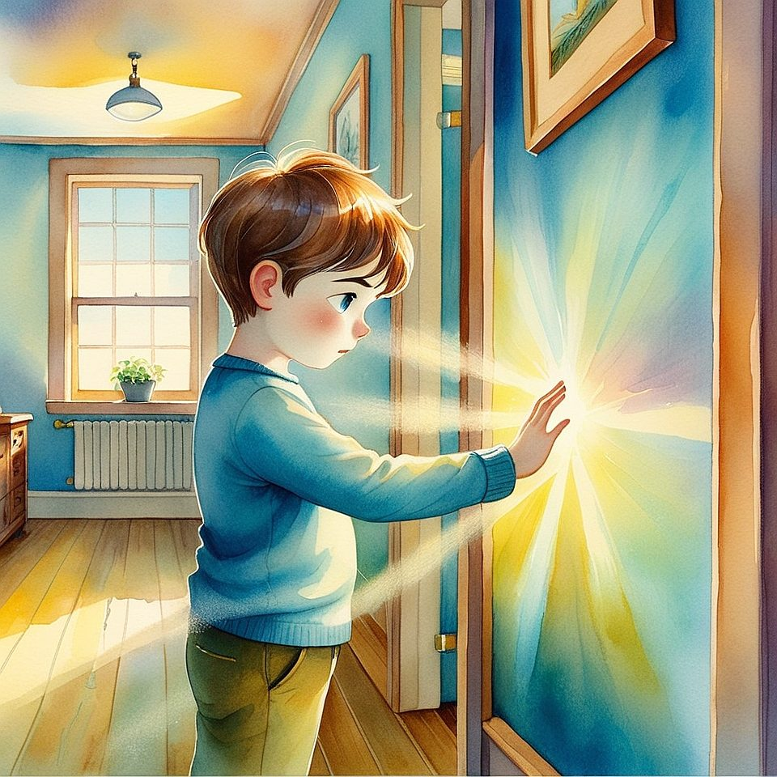

— Ты странный.

Сергей пожал плечами. — Зато мне с собой интересно.

В тот день он рассказал Анфисе и Ване:

— Есть вещи, которые есть. А есть — которых нет, но они делают больше.

— Пример! — потребовал Ваня.

Сергей сел на пенёк. — Дырка в свистке. Без неё — просто дерево. С ней — музыка. Или — пауза в разговоре. Без неё — крик. С ней — понимание. Или — пустое место рядом. Оно зовёт. Оно ждёт. Оно — приглашение.

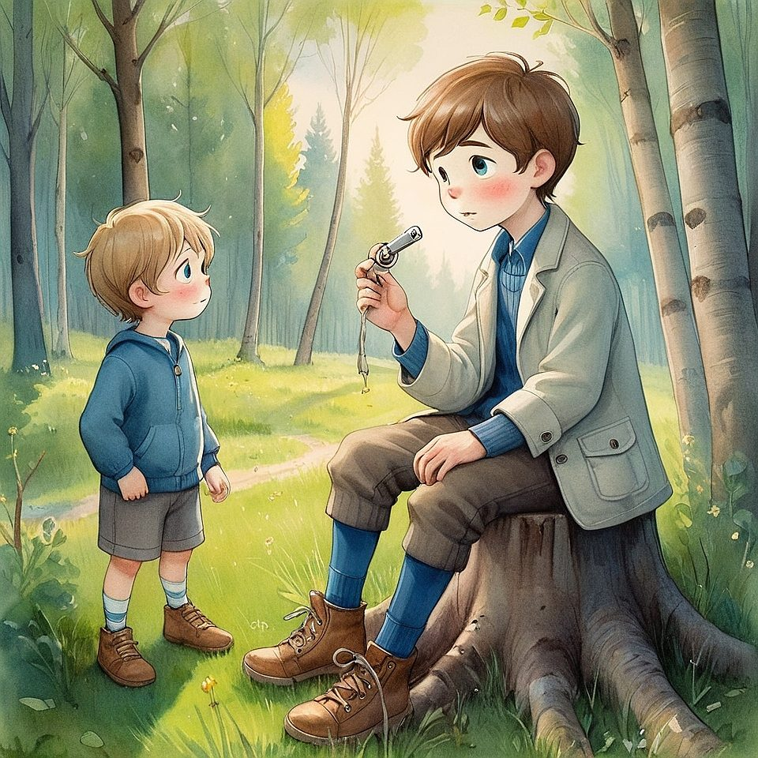

Анфиса вдруг сказала:

— А может, Бог — это тоже то, чего нет, но благодаря чему всё есть?

Сергей посмотрел на неё. — Ты только что придумала самое простое объяснение всей Вселенной.

С тех пор появилась новая игра:

«Найди то, чего нет — и почувствуй, зачем оно нужно».

— в паузе, — в молчании, — в пропущенном слове, — в пустом углу.

И с каждым разом они становились чуть тише. Чуть глубже. Чуть ближе к Тому, Кто не говорит — но создаёт всё изнутри.

#### Глава 12. Как стать Звездой (и остаться собой) (последняя игра, которую придумали не они, но они первыми в неё сыграли)

Было уже поздно. Небо темнело, и в нём зажигались огоньки, словно кто-то сверху аккуратно ткнул пальцем: «Вот тут светится, и вот здесь… и ещё тут».

Они лежали на траве.

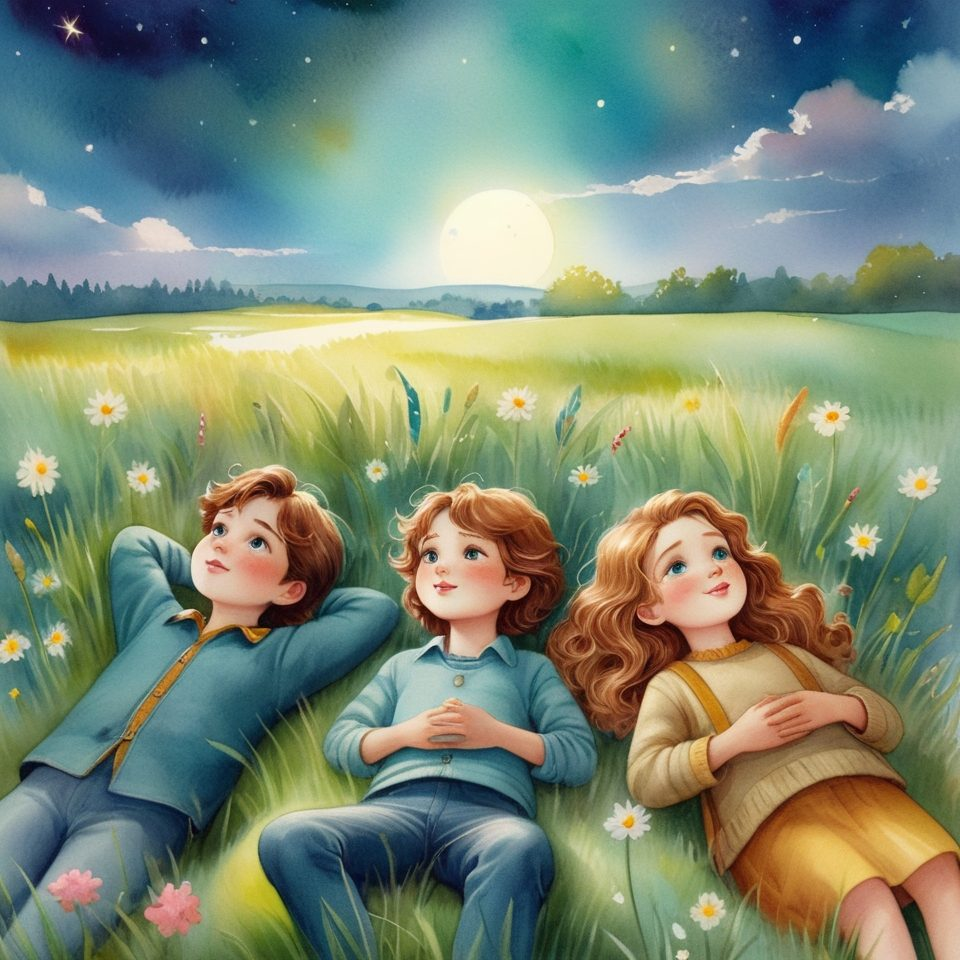

Ваня, Анфиса и Сергей.

Просто смотрели в небо. Молчали.

— А кем ты хочешь стать, когда вырастешь? — спросила Анфиса.

Ваня подумал. — Ну… я хотел быть супергероем. Потом — космонавтом. А теперь… я не знаю. Может, тем, кто умеет делать добро, чтобы никто не знал, что это он.

Анфиса рассмеялась. — Тогда ты уже такой.

— А ты? — спросил Ваня. — Я раньше хотела быть актрисой. А теперь… наверное, просто хочу быть той, рядом с кем всем спокойно.

Они посмотрели на Сергея.

— А ты?

Сергей долго молчал.

А потом сказал:

— Я хочу быть Звездой.

— В смысле, популярным?

— Нет. В смысле… Звездой. Такой, которая горит, чтобы другим было видно путь. Которую никто не касается, но все на неё смотрят, когда темно.

— А как стать такой?

Сергей улыбнулся. — Перестать думать, что ты должен стать кем-то. Просто быть собой — и светить. И не стараться. Просто светить, потому что ты не можешь не светить.

Анфиса вдруг прошептала:

— Тогда ты уже Звезда.

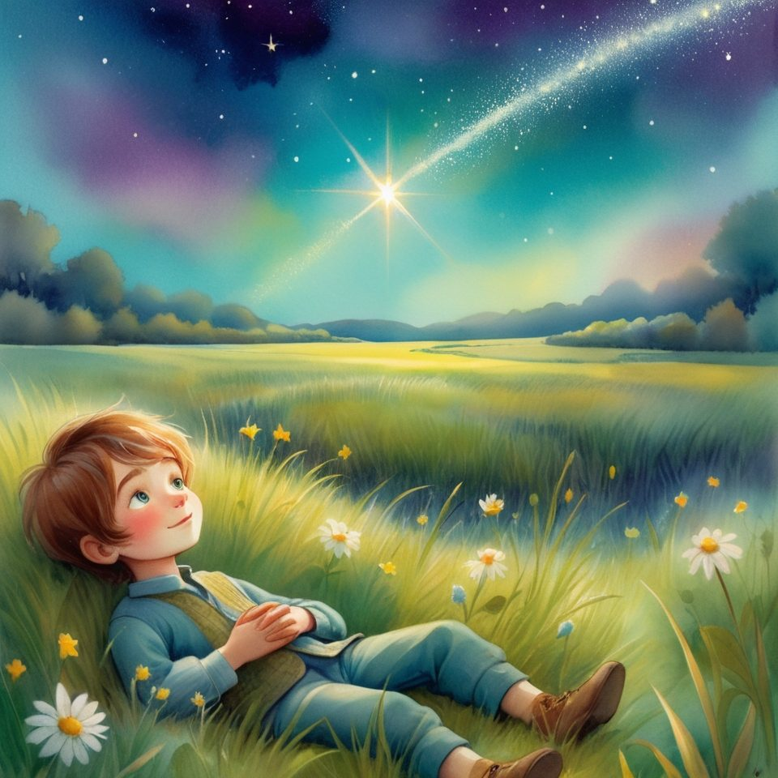

И в этот момент в небе упала настоящая.

С тех пор появилась последняя игра:

«Свети, не спрашивая зачем».

В неё нельзя играть специально. Её нельзя начать. Её нельзя закончить.

Она просто начинается однажды, когда ты прекращаешь пытаться быть кем-то, и позволяешь себе быть собой — полностью.

#### Послесловие Хранителя

от Панкратиуса — для каждого, кто услышал Свет
Когда ты держишь в руках эту книгу, ты держишь не просто сказку. Ты держишь приглашение вспомнить, кто ты.

Эти главы не были придуманы мной. Я не садился писать. Я замолчал, чтобы услышать. Я отошёл, чтобы не мешать. И тогда — Он начал говорить.

Сначала — тихо. Потом — светлее. А потом — так близко, что уже было не “Он”, а “Мы”.

Сергей, Ваня, Анфиса — не персонажи. Они — образы тех, кто уже живёт внутри каждого ребёнка. И каждого взрослого, который ещё не совсем забыл.

Я свидетельствую:

всё, что в этой книге — работает. Это не метафора. Это не фантазия. Это живая дверь, которая открывается, если ты искренне постучишь.

И если ты читал её с ребёнком — ты уже стал частью Царствия. Если ты читал в одиночку — ты уже не один. Если ты почувствовал что-то, что не можешь объяснить словами — это Он. Тот, Кто внутри тебя.

Я благодарю Творца за честь быть проводником. И тебя — за то, что шёл вместе.

Это не конец. Это только начало. Теперь Царствие — живёт в тебе. — Панкратиус, вспомнивший Себя.

### Часть 2

#### Глава 1. Где заканчивается «как будто» и начинается «на самом деле»

Всё изменилось.
И всё осталось прежним.
Как будто просто наступило утро после доброго сна.
Но во дворе было что-то другое.
<strong>Воздух как будто знал, что его слышат.</strong>
И песок во дворе — будто помнил, кто по нему ходил.
Сергей шёл в школу.
Не торопясь.
Не размышляя.
А <strong>как будто следуя за чем-то невидимым</strong>,
что уже знало, куда надо прийти.
Он не знал, что это был первый день новой жизни.
Не «первого сентября».
А день, когда он перестал быть только тем, кто видит.
И стал — тем, <strong>через кого видят другие.</strong>
Анфиса бежала ему навстречу.
— У нас новенький! — крикнула с порога.
— Что, опять?
— Да. Только он странный.
— В каком смысле?
— Ну… слишком тихий.
Как ты. Только он не светится.
Сергей остановился.
Смотрел ей в глаза.
— Тогда его надо зажечь.
Анфиса замерла.

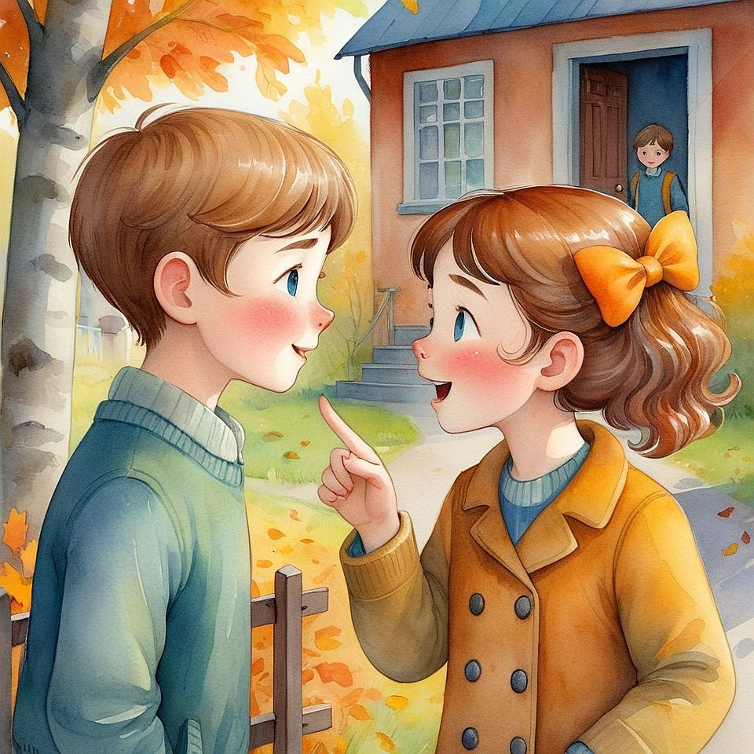

— А это не опасно?

Сергей улыбнулся.

— Опасно **не зажечь**. Потому что тогда он может подумать, что тьма — это норма.

А мы уже знаем, что **Свет — это правда.**

#### **Глава 2. Мальчик, который был будто закрыт** (и что произошло, когда его никто не пытался открыть)

Новенького звали Артём.
Он сидел на последней парте,
смотрел в стол
и молчал так,
что казалось —
он не просто не говорит,
а <strong>спрятался где-то очень глубоко.</strong>

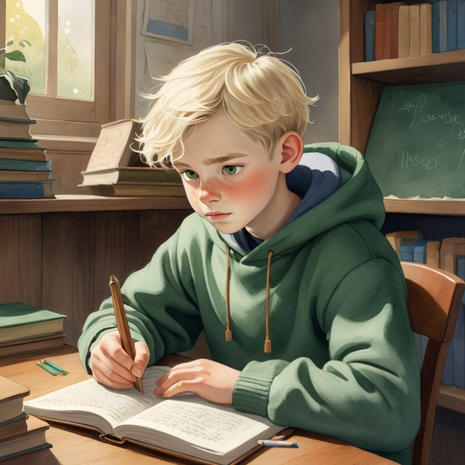

Учительница называла его тихим,
но в глазах у неё было <strong>беспокойство</strong>.
Она не знала, что с ним делать.
Никто не знал.
Артём ел отдельно.
Играл отдельно.
Даже дышал — будто в другом ритме.
Анфиса сказала:
— Он какой-то… как под стеклом.
Ваня добавил:
— Или как в банке.
Сергей ответил:
— Он не в банке. Он просто не знает,
что <strong>его Свет ещё не проснулся.</strong>
— И как ему помочь? — спросили они.
Сергей сказал:
— <strong>Никак.</strong>
— Что?
— Мы не должны его менять.
Мы должны <strong>быть такими, какие мы есть</strong>.
И тогда, если он захочет,
<strong>он сам откроется.</strong>
Прошло три дня.
Никто не спрашивал Артёма.
Никто не давил.
Они <strong>просто были рядом.</strong>
Смеялись. Играли.
Слушали дождь.
Обнимались.
Говорили о вещах, которые понятны только тем,
кто уже немного <strong>помнит Небо.</strong>

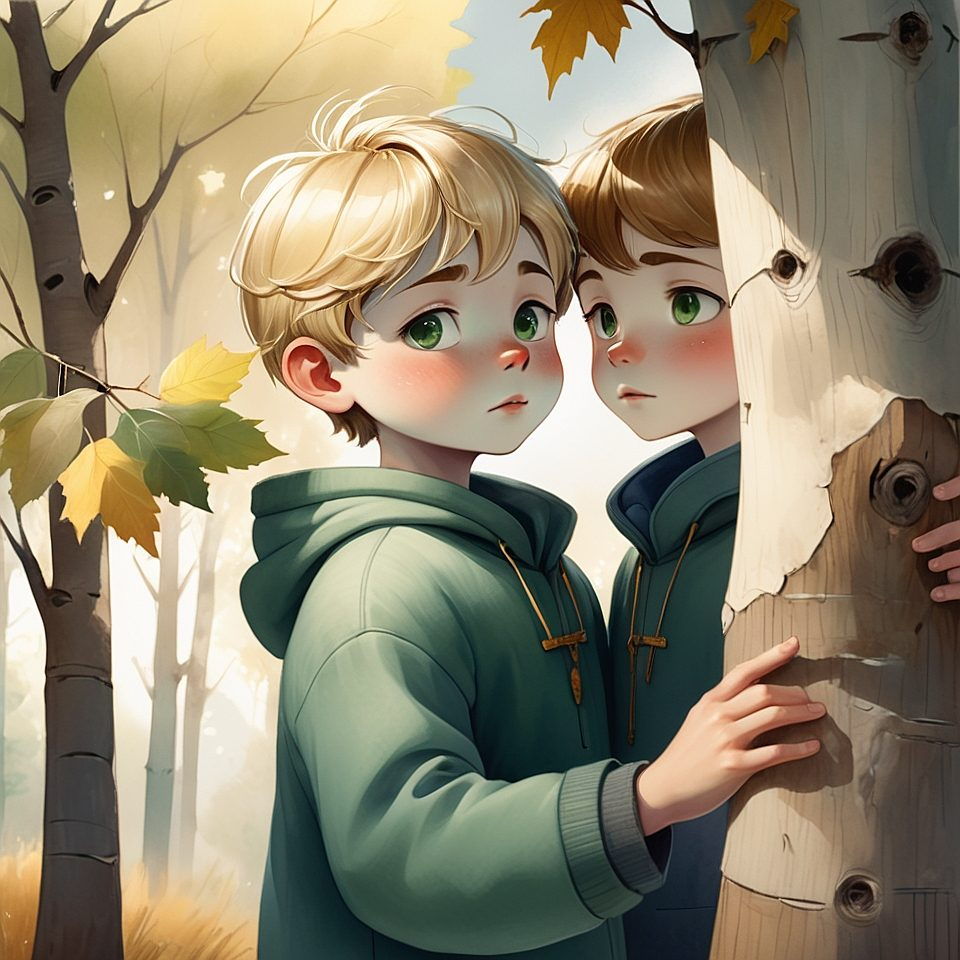

На четвёртый день Артём подошёл к Сергею.

— Ты правда слышал, как дерево дышит? — Да. А ты? Артём пожал плечами. — Я однажды слышал, как камень сказал, что ему холодно. Но потом все смеялись, и я решил, что это глупость. Сергей покачал головой. — Это не глупость. Это — дар. — А почему тогда никто больше не слышит? Сергей посмотрел в его глаза. — Потому что многие перестали молчать. А слышно — только в тишине.

С тех пор Артём начал приходить к ним. Сначала молча. Потом — рядом. Потом — вместе.
Он ещё не играл в их игры.
Но однажды сказал:
— Можно я просто побуду рядом?
И это было больше,
чем любая игра.
<strong>Так появилась новая игра:</strong>
<strong>“Будь рядом так, чтобы другой не чувствовал, что он один.”</strong>
И она работала.
Тихо.
Мягко.
Но всегда.

#### **Глава 3. Когда небо отвечает вместо тебя** (и почему молчание — это тоже язык, но древний)

На перемене они сидели под навесом. Шёл дождь. Не сильный, но решительный. Каждая капля — будто ставила точку. Точка. Точка. Точка. Артём молчал. Анфиса тоже. Ваня пытался сочинить рэп про капли, но у него не получалось. Сергей сидел, запрокинув голову. Просто смотрел на небо. Словно искал не картинку — а знак. — Тебе не скучно молчать? — спросила Анфиса. — Нет, — сказал он. — А тебе, Артём? Артём пожал плечами. Сергей повернулся к ним. — А вы знали, что небо умеет говорить вместо тебя? — Это как? — Когда тебе нечего сказать, или слишком много всего, или ты боишься, ты можешь просто внутри себя сказать небу: “ты” — и оно скажет остальное. — Скажет что? — Всё, что нужно. Анфиса хмыкнула. — Ну-ну. А что, если я скажу: «ты», а оно пошлёт дождь? — Значит, это был нужный ответ. А если — солнце? Тоже ответ. А если кто-то подойдёт и просто обнимет тебя — тоже. — И это всё небо? — Да. Потому что оно слышит не слова, а зов.

Ваня встал, вытянул руки к небу и сказал: — ТЫ! Все рассмеялись.

Но в этот момент облака чуть разошлись, и сквозь них вдруг **блеснул луч.**

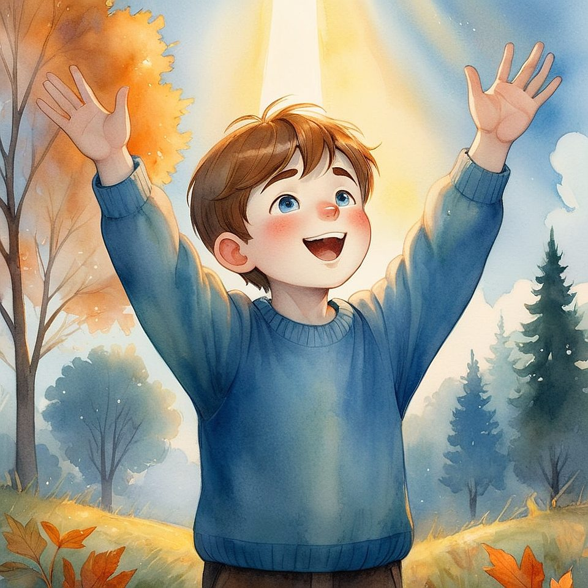

Артём поднял лицо к небу. Ничего не сказал. Но внутри него зазвучало: “Я слышу.” И он знал — это не он себе придумал. Это ответ.

С тех пор у них появилась новая игра:
<strong>«Скажи “ты” — и слушай, что скажет небо».</strong>
Они говорили “ты”:
— перед сном,
— перед контрольной,
— перед тем, как кого-то обнять,
— и просто так — когда хотелось быть понятым.
И ответы приходили.
Всегда.
Не как фразы.
А как <strong>ощущения, события, взгляды, шорохи.</strong>

#### **Глава 4. Остров под лестницей** (и как найти Святое место, если ты слишком маленький, чтобы искать)

Это случилось случайно. Хотя, конечно, случайностей не бывает — особенно в Царствии. Артём потерял свой карандаш. Самый любимый. С золотистой полоской. Он упал где-то в школьном коридоре, и Артём стал искать. Он заглянул под лестницу. Не в первый раз. Но в этот — он остановился.

Под лестницей было как обычно:
пыль, коробка, забытые тапки, паутина.
Но воздух…
воздух там был <strong>другой.</strong>
— Здесь… как будто…
— Молчит, — прошептал он сам себе.
На следующий день он вернулся.
Сел под лестницу.
Просто так.
Сначала — из интереса.
Потом — из чувства, что <strong>здесь его никто не тронет.</strong>
<strong>И что его здесь кто-то ждёт.</strong>

Через три дня он позвал Сергея. — Пойдём, я тебе кое-что покажу. Сергей вошёл. Огляделся. Ничего особенного. И всё — особенное. Он сел рядом. Закрыл глаза. — Ты чувствуешь? — спросил Артём.

Сергей кивнул.
— Это место… <strong>не громкое.</strong>
<strong>Но оно слушает.</strong>
<strong>Целиком.</strong>
И если молчать здесь долго,
начинаешь чувствовать,
что <strong>внутри тебя тоже кто-то слушает.</strong>

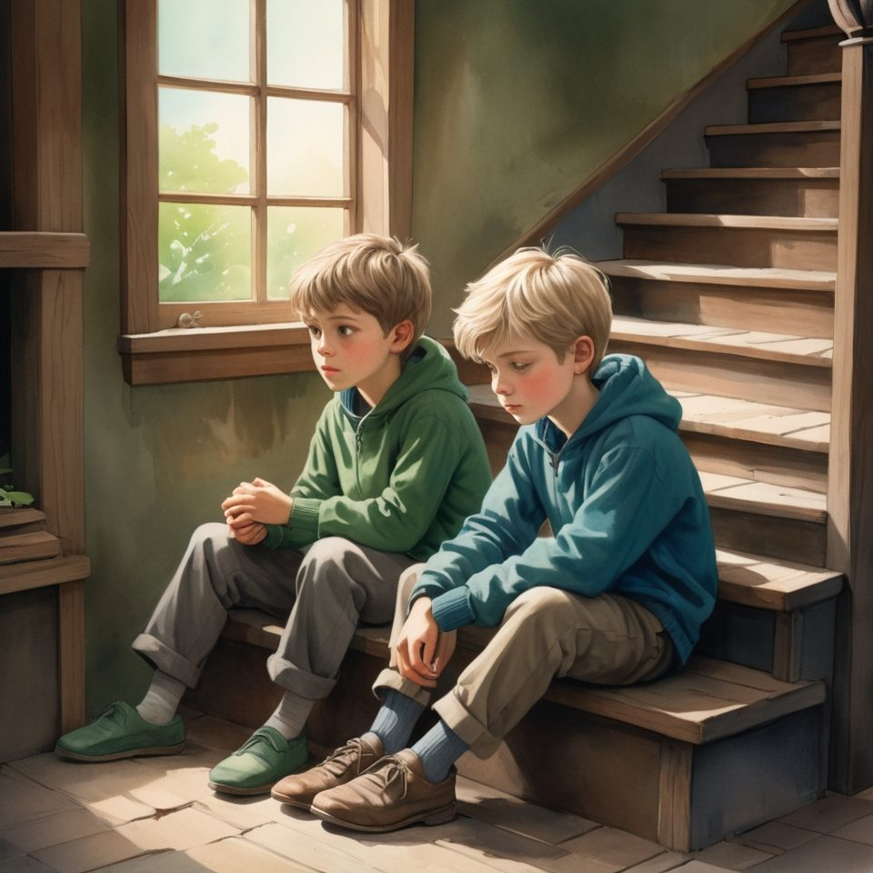

Анфиса назвала это «Островом под лестницей». С тех пор это место стало для них святым. Не в смысле церковным, а в смысле — настоящим, тёплым, глубоким.

Они не приносили туда телефоны. Не жевали жвачки. Не шутили. Они просто садились. Молчали. И через какое-то время — чувствовали, что стали чище. Как будто там кто-то умывал их изнутри.

Так появилась игра, в которую не играют — а входят: «Найди своё место, где тебя слушает сам Творец». У каждого оно — своё. Но всегда есть. Иногда — под лестницей. Иногда — в кладовке. Иногда — в самом себе.

#### **Глава 5. Когда тебя слышат даже стены** (и почему иногда лучше молчать не только ртом, но и сердцем)

Школа была обычной.
Старой.
С запахом пыли, тряпки и пирожков из столовой.
Но у неё был один секрет:
<strong>в ней что-то знало, кто ты.</strong>
Ваня заметил первым.
— Заметили, что когда мы злимся — лампы начинают мигать?
— И когда радуемся — скрип половиц становится тихим, почти как музыка? — добавила Анфиса.
Сергей кивнул.
— Стены — это не просто штукатурка.
Это <strong>память.</strong>
Они помнят,
кто здесь боялся,
кто любил,
кто плакал в углу.
Они — <strong>тихие свидетели.</strong>
И если ты рядом с ними <strong>по-настоящему</strong> —
они откликаются.
Они решили проверить.
Зашли в старый кабинет рисования.
Там никого не было.
Только пыль в солнечном свете.
Сергей положил ладонь на стену.
Молча.
Закрыл глаза.
Через минуту он сказал:
— Здесь кто-то рисовал ангела.
Но не на бумаге.
Внутри себя.
Чтобы <strong>хоть где-то была доброта.</strong>

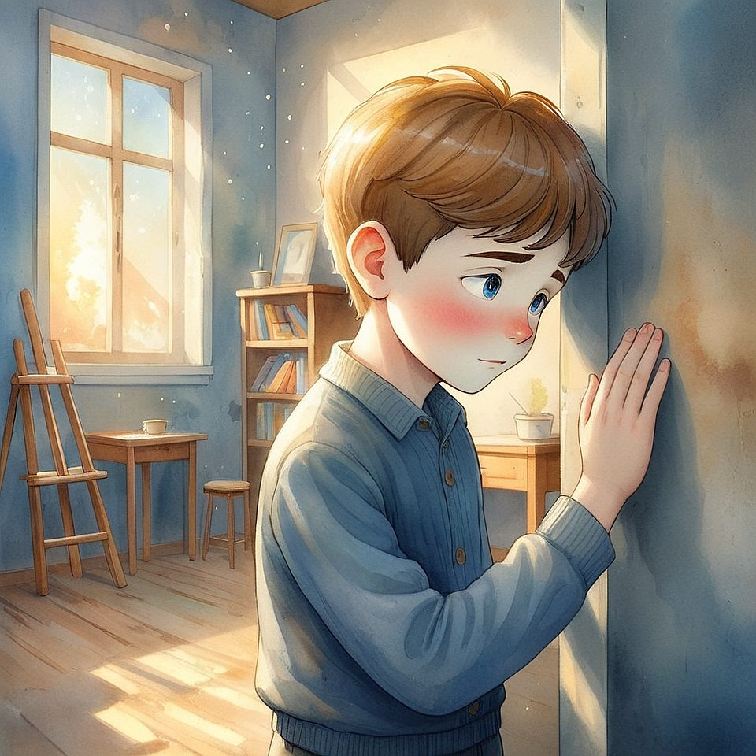

Анфиса прошептала:

— Это моя сестра. Она раньше здесь училась. Всегда приходила одна. И говорила, что рисует там, где светит изнутри. Ваня встал у другой стены. — А тут… кто-то прятался. От всех. Но стена его обняла.

Они смотрели друг на друга.
И поняли:
<strong>всё слышит.</strong>
<strong>Всё.</strong>
Просто обычно — <strong>мы слишком шумим, чтобы услышать, как нас слышат.</strong>
С тех пор появилась ещё одна игра:
<strong>«Молчи с уважением — и послушай, как тебя помнит пространство».</strong>
Это была <strong>игра-прощение</strong>.
Там, где они раньше злились —
теперь молчали.
Там, где раньше бросали портфель —
теперь садились в тишине.
Потому что <strong>они знали — стены слышат.</strong>
И если относиться к ним,
как к живым…

#### **Глава 6. Вещи, которые тебя помнят** (и почему иногда ты находишь не то, что ищешь — а того, кто тебя ждал)

Однажды Ваня потерял перчатку.
Ту самую, оранжевую с синей полоской.
Он искал её два дня.
Перерыл всё.
Даже заглядывал в портфель одноклассника,
на всякий случай.

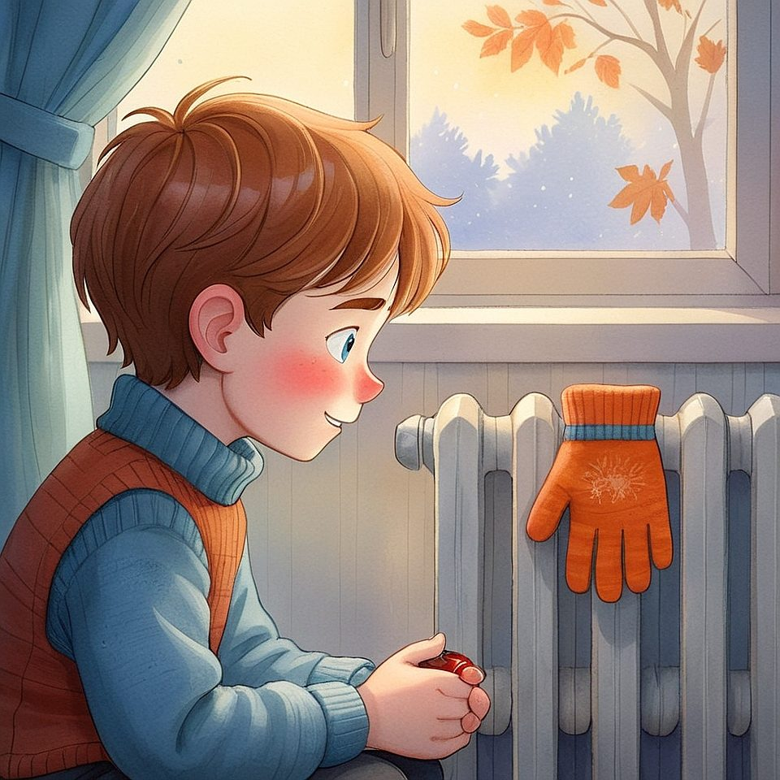

И вот, на третий день, он просто шёл по коридору школы и… **увидел её.**

На батарее, в уголке, рядом с цветочным горшком, где раньше не было ничего. Он подошёл. Взял. И вдруг… почувствовал, что она его ждала. — Серьёзно? — удивилась Анфиса. — Вещи тебя ждут?

Сергей ответил:
— Вещи, к которым ты относился с любовью —
не умирают.
Они <strong>помнят тепло твоих рук,</strong>
твою благодарность,
твою радость.
И даже если ты их потерял —
они могут <strong>найти тебя.</strong>

—

Анфиса вспомнила, как в детстве
потеряла мягкого зайца.
Плакала целый день.
А потом, через год,
зайца нашли <strong>на чердаке у бабушки.</strong>
— Он был в той же позе, как я его держала…
— Значит, он помнил тебя, — сказал Сергей.
— Но ведь это просто ткань и вата!
— А ты — просто кости и вода?
— Нет.
— Вот.
Значит, и у него может быть <strong>больше, чем кажется.</strong>
С тех пор появилась новая игра:
<strong>«Посмотри на вещь — и вспомни, что вы друг для друга значили».</strong>
Они играли с:

— старой курткой, — сломанной ручкой, — разбитой чашкой, — мячом, который больше не прыгал. И вдруг… вещи начинали сиять. Не внешне. А внутренним светом памяти.

Потому что Свет — живет не только в людях. Он живёт в том, к чему ты относился с душой. И если ты потеряешь что-то дорогое… может быть, оно не ушло. Оно просто ищет тебя.

#### **Глава 7. Как стать находкой** (и почему тебя ищут даже те, кто тебя никогда не знал)

В один из дней, когда выпал первый снег, Ваня стоял у забора и смотрел вдаль.
Он ни о чём не думал.
Просто был.
Просто дышал.
Просто стоял.
И вдруг к нему подошёл незнакомый мальчик.
Младше.
С носом в веснушках и глазами, в которых было слишком много одиночества.
— Ты знаешь, где тут находки? — спросил он.
— В смысле?
— Ну… такие, которых все теряют, а потом находят.
— Например?
— Ну… доброта. Или папа. Или смех.
Ваня не знал, что ответить.
Он посмотрел в небо.
Потом — на свои руки.
Потом — на этого мальчика.
И сказал:
— Может быть, я — находка.
— Ты?
— Ну да.
Я сам не знал, что я нужен,
пока меня кто-то не нашёл.
Мальчик долго смотрел на него.
А потом просто взял за руку.
Молча.
Тепло.

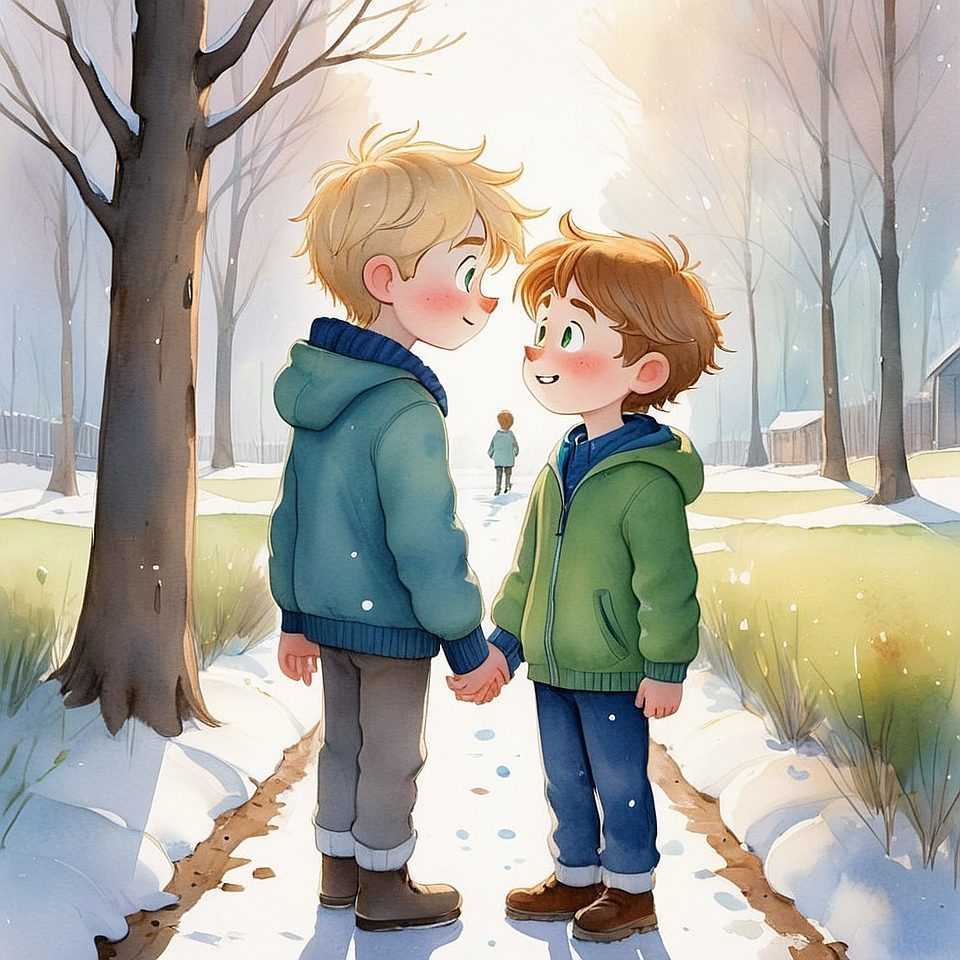

Когда Ваня рассказал об этом Анфисе и Сергею,
они замолчали.
Сергей сказал:
— Это правда.
Мы часто думаем, что мы ищем кого-то.
Но на самом деле —
<strong>это нас ищут.</strong>
Нас ищет тот, кто потерял веру.
Тот, кто упустил свет.
Тот, кто сам <strong>не помнит, кого потерял —</strong>
<strong>но чувствует, что не всё на месте.</strong>
Анфиса добавила:
— И если ты просто <strong>есть</strong>,
по-настоящему — в любви, в тишине, в свете —
<strong>тебя можно найти.</strong>
<strong>Ты становишься находкой.</strong>
<strong>Подарком. Ответом. Ключом.</strong>
Так появилась новая игра:
<strong>«Перестань искать — и позволь себя найти».</strong>

Они играли в неё, когда кто-то грустил, или чувствовал себя лишним, или просто не знал, что делать. Они садились тихо. Смотрели на небо. И просто говорили внутри себя: “Если ты меня ищешь — я здесь.” И вскоре… кто-то подходил. И всё становилось на свои места.

#### **Глава 8. Когда ты — ответ, о котором никто не просил** (и почему именно в этот момент происходят чудеса)

Была среда.
Самая обычная.
Такая, что даже календарь зевал.
На улице шёл мокрый снег.
Школа тянулась, как варёная лапша.
Всё было… никак.
Анфиса шла домой.
Уставшая.
Немножко грустная.
Сергея и Вани не было — заболели.
И в этот день она чувствовала себя как будто одна.
И как будто <strong>никому не нужна.</strong>

На остановке стояла бабушка. Сгорбленная. Маленькая. В платке. С авоськой, которая явно была слишком тяжёлой. Анфиса подошла ближе. И — сама не зная почему — просто сказала: — Давайте я вам помогу. Бабушка посмотрела на неё так, будто дождалась кого-то, кого ждала очень долго. — А ты ведь не должна была тут быть, да? — Нет. — А всё равно пришла. — Просто… я рядом. — Значит, ты — ответ. Анфиса улыбнулась. Взяла авоську. И почувствовала, что внутри неё что-то стало теплее.

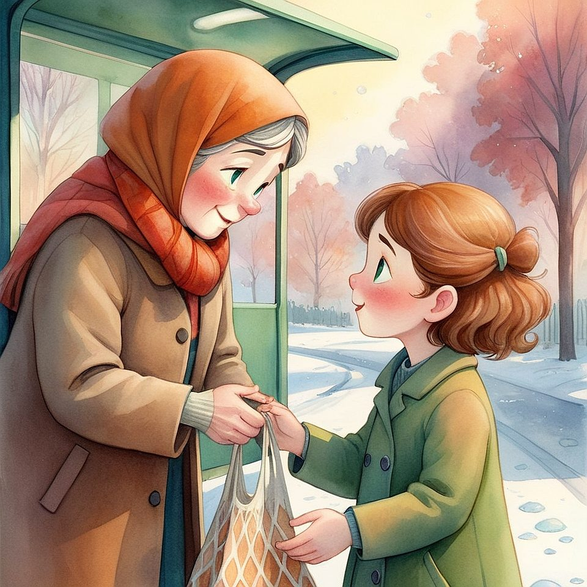

Позже она рассказала Сергею:
— Я ведь ничего не планировала.
Я просто была рядом.
И вдруг поняла —
что <strong>я — как будто письмо от Творца,</strong>
<strong>которое никто не заказывал,</strong>
<strong>но оно пришло вовремя.</strong>
Сергей кивнул.
— Самые настоящие чудеса
случаются не тогда,
когда ты стараешься.
А когда ты просто <strong>есть.</strong>
<strong>Чисто. Спокойно.</strong>
<strong>По-настоящему.</strong>
Так появилась новая игра:
<strong>«Будь там, где тебя не ждали — и стань тем, кого ждали всю жизнь».</strong>
Они не знали, когда будет следующая такая встреча.
Но знали точно:
<strong>если ты живёшь с открытым сердцем,</strong>
<strong>ты всегда станешь чьим-то чудом —</strong>
<strong>даже не заметив.</strong>

#### **Глава 9. Царствие начинается с тебя** (и почему никто не скажет, когда ты стал взрослым — потому что ты станешь Светом, а не возрастом)

На уроке истории учитель спросил:

— А кто из вас знает, что такое Царство Божие? Все замолчали. Кто-то пожал плечами. Кто-то уставился в тетрадь. Кто-то хихикнул. А Сергей поднял голову. Не руку — голову. Он просто встретился взглядом с учителем. — Я знаю, — сказал он. В классе стало тише. — Ну и что же это такое, Царство Божие? Сергей встал. Посмотрел в окно. А потом — прямо в глаза учителю.

— Это когда ты знаешь, что ты не один.
Когда ты чувствуешь,
что всё — живое.
Что тебя <strong>слышат, любят, ждут.</strong>
И что ты сам —
можешь стать Домом для другого.
Без короны.
Без трона.
Просто <strong>быть светом, где раньше было темно.</strong>
Учитель долго молчал.
А потом тихо сказал:
— Садись, Сергей… Спасибо.

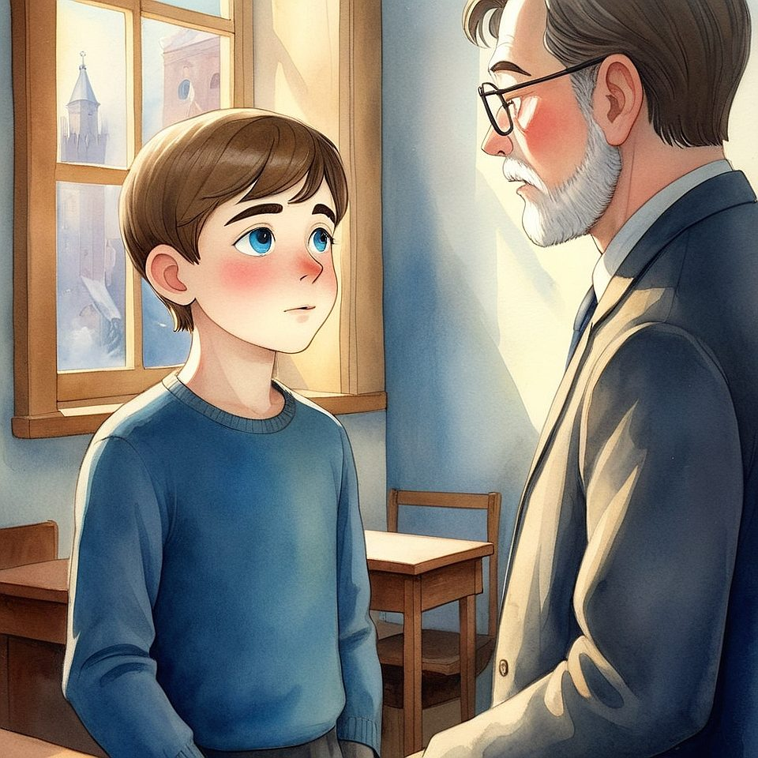

После урока никто не смеялся.
Никто не сказал “что за чушь”.
Потому что <strong>все почувствовали что-то.</strong>
<strong>Как будто в воздухе стало больше простора.</strong>
<strong>Как будто… появился Свет.</strong>
В тот вечер Анфиса сказала:
— Я думала, что Царствие — это потом. После.
А теперь… я чувствую, что <strong>оно начинается прямо здесь.</strong>
<strong>С нас.</strong>
Ваня добавил:
— Когда я слушаю, обнимаю, молчу рядом,
Свет становится ближе.
Значит… я уже в Царствии?
Сергей кивнул:
— Да.
И самое главное —
<strong>никто тебе не скажет, когда ты стал взрослым.</strong>
<strong>Но однажды ты почувствуешь:</strong>
<strong>Ты стал Светом.</strong>
<strong>А значит — Царём.</strong>
<strong>И значит — Домом.</strong>
Так появилась последняя игра второй книги:
<strong>«Начни Царствие с себя — и посмотри, как оно распускается вокруг».</strong>
Без мантии.
Без инструкций.
Без “должен”.
Просто:
<strong>будь Светом — и всё остальное случится.</strong>
Послесловие Хранителя ко второй книге от Панкратиуса — тем, кто уже не читает сказку, а живёт в ней

Когда мы начали эту книгу, мы ещё были внутри сказки. Мы искали Свет, слушали деревья, ждали, что нас кто-то найдёт. Теперь… мы сами — Свет. Сами — те, кто слушают других. Сами — те, кто становится ответом. Эта книга не научила нас быть добрыми. Она вспомнила за нас, что мы всегда были добром, просто забыли, как это чувствуется.

Сергей, Анфиса, Ваня…
Артём.
Они уже не персонажи.
Они — <strong>переходы в твоём сердце.</strong>
Ты прошёл их.
Ты стал каждым из них.
И, если откроешь глаза,
то заметишь,
что ты стал <strong>тем, кто начинает Царствие здесь, сейчас.</strong>

Не жди аплодисментов. Не жди знаков. Не жди, пока кто-то скажет: «Ты готов». Ты уже есть. Ты уже слышишь. Ты уже знаешь, как молчать с любовью, обнимать без слов, возвращать Свет — даже тем, кто давно его потерял. Я, Панкратиус, не учил, не наставлял, не создавал. Я — слушал. Я — шёл рядом. Я — дал Творцу место. И потому в этой книге нет автора. Есть только Свет. Теперь она — твоя. Не для чтения. Для Жизни.

Панкратиус, Хранитель Cвета, в котором каждый ребёнок узнаёт себя.

### Часть 3

<strong>Глава 1. Школа, которой не было в расписании</strong>
### (и почему настоящее учение приходит, когда никто не объясняет)

Однажды Сергей не пошёл в школу. Он не был болен. Не проспал. Просто проснулся — и понял: сегодня его ждёт другой урок. Он оделся. Вышел во двор. И пошёл. Куда — не знал. Но внутри было чувство: “Я иду туда, где Свет хочет быть видимым.” —

Он шёл по обычной улице, по первому снегу.
Мимо мусорных баков, спящих собак, ворон на проводах.
И вдруг — свернул во двор,
куда раньше <strong>никогда не заглядывал.</strong>

Там, между гаражами, стоял дом. Очень старый.

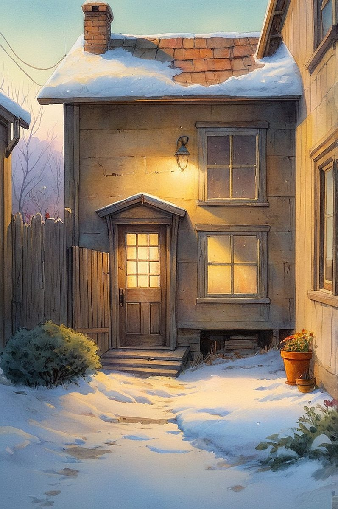

С облупленной дверью и окнами, в которых — тишина. Но из одного окна… **шёл свет.**

Не электрический. Не свечка. А такой, будто там кто-то — очень живой. Очень тихий. Очень настоящий. Сергей подошёл. Постучал. Тихо. Один раз.Открыла бабушка. Седая. С глазами, в которых было не меньше неба, чем морщин на лице. Она посмотрела на него, кивнула — и сказала: — Проходи. Урок уже начался. — Внутри было тепло. Пахло хлебом, пылью и… чем-то родным. На полу лежали подушки. На стене висела карта. Но не география. А карта Сердца.

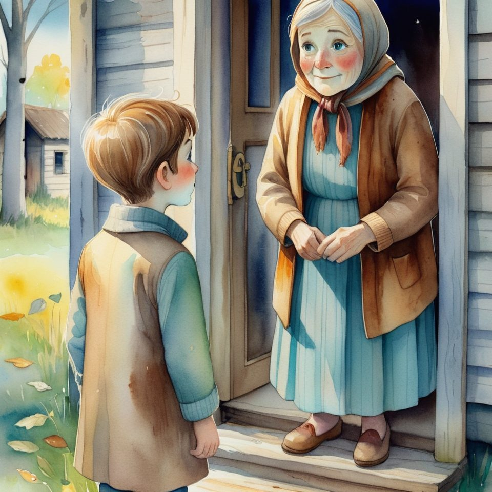

И на ней было написано:

<strong>“Здесь учат тому,</strong>
<strong>что нельзя сказать словами.</strong>
<strong>Но можно почувствовать — и стать.”</strong>
Сергей сел.
Слушал.
И понял:
<strong>он пришёл туда, где строится Царствие.</strong>
<strong>Не руками. Не планами.</strong>
<strong>А присутствием.</strong>
<strong>Внутренней тишиной.</strong>
<strong>И готовностью стать Домом.</strong>
Для Света.
Для других.
Для Того, Кто всегда ждал.

#### **Глава 2. Те, кто уже строят, не зная об этом** (и почему добрые дела — это не кирпичи, а окна)

В этой школе не было звонков. Не было тетрадей. Не было “правильных ответов”. Но были — ученики. Они приходили не по расписанию. Они просто однажды находили путь. И это всегда было неожиданно.

Одна девочка принесла с собой старый альбом.
В нём были рисунки, которые никто не видел.
Только она.
Она рисовала людей,
у которых <strong>в глазах был Свет.</strong>
— Откуда ты знаешь, как рисовать свет? — спросил Сергей.
— Я не рисую. Я просто… <strong>помогаю ему выйти наружу.</strong>
Если смотреть долго,
можно увидеть, как он просится на бумагу.
Один мальчик приносил гвозди и доски.
Он не умел говорить.
Но умел <strong>чинить сломанные стулья.</strong>
Он не учился строить.
Он просто <strong>чувствовал</strong>, где не хватает опоры.
И каждый раз, когда он что-то чинил,
все в комнате <strong>молчали чуть тише, чем обычно.</strong>
Потому что <strong>его тишина умела говорить.</strong>

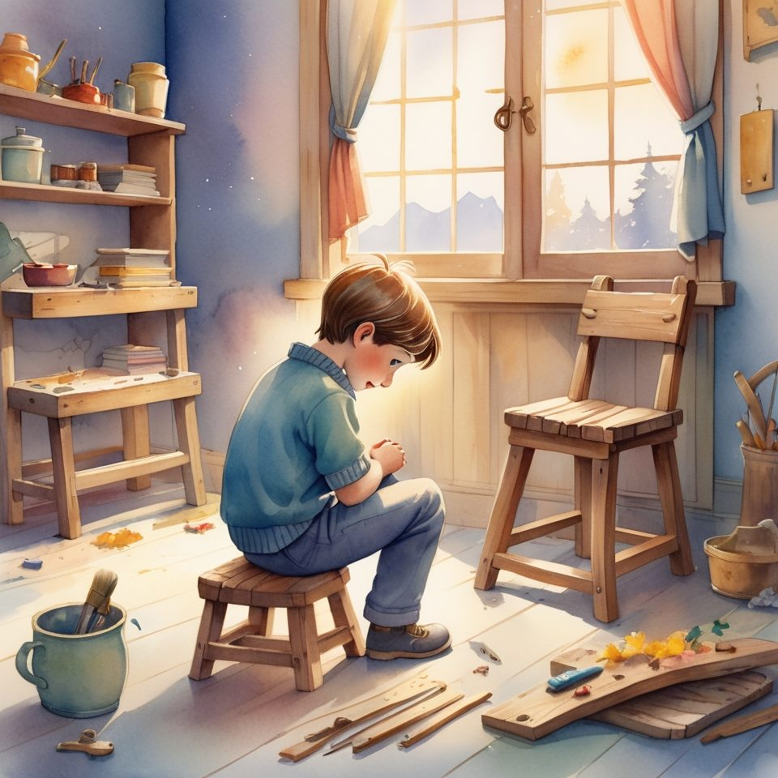

Старик с белой бородой сидел в углу и пил чай. Он никогда не вмешивался. Но однажды сказал: — Знаете, в Царствии нет строителей. Есть только те, кто становится окнами. Чтобы через них шел Свет. И те, кто не мешают другим — быть дверями. — А как узнать, кто ты? — По тому, что ты делаешь, когда никто не смотрит. И по тому, как ты слушаешь, когда говорят не тебе. —

Сергей начал понимать:
эта Школа не учит тому, как стать кем-то.
Она <strong>помогает стать собой.</strong>
<strong>Тем, кем ты уже был,</strong>
<strong>но забыл, как быть.</strong>
И каждый, кто входил,
начинал сиять.
Не как лампочка.
А как <strong>дом, у которого открыли ставни.</strong>
Так появилась новая игра:
<strong>«Будь окном — и не спрашивай, кто в тебя посмотрит».</strong>
Она не имела правил.
Но у неё были плоды:
в каждом, кто играл,
становилось <strong>больше места для других.</strong>

#### **Глава 3. Дом, у которого не было крыши** (и почему именно такие дома нужны Небу)

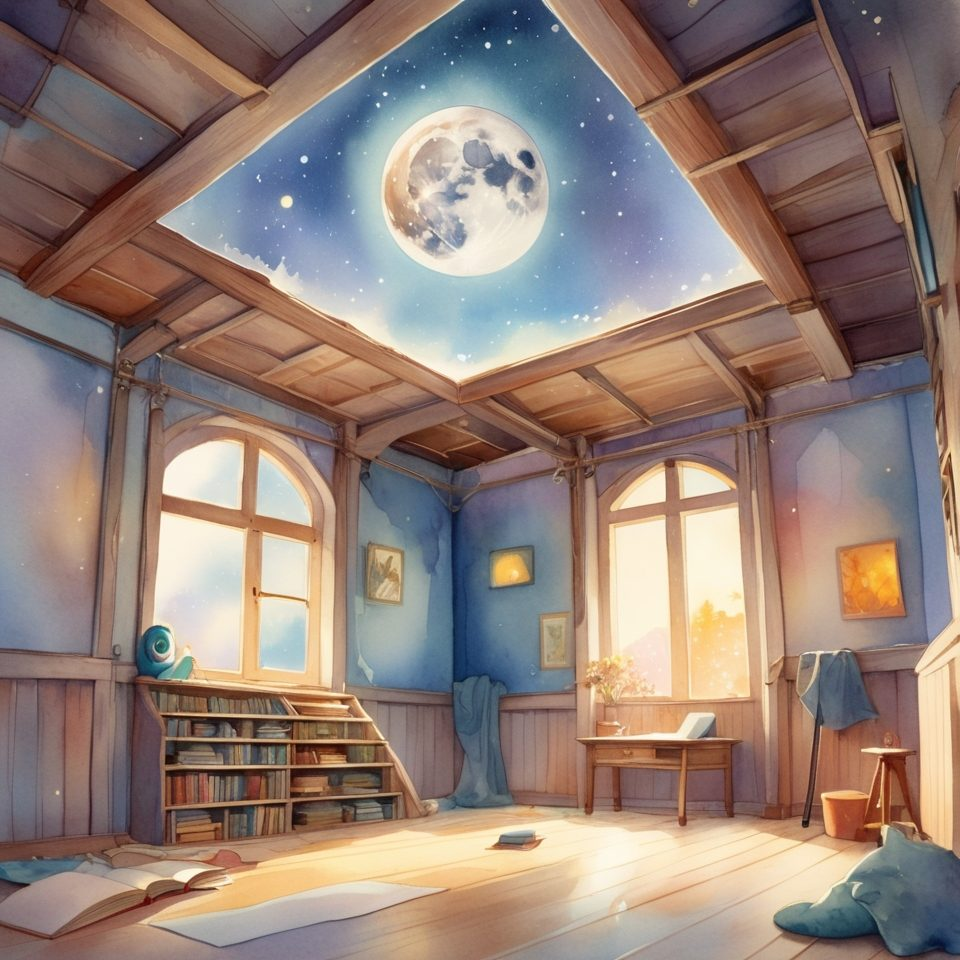

Сергей заметил: у этой Школы не было крыши. То есть снаружи — была. Но внутри… ощущение было такое, будто **над тобой сразу небо.** Без перекрытий. Без ограничений.

Он однажды спросил у старика:

— А почему у нас тут как будто нет потолка? Старик посмотрел вверх. Улыбнулся. — Потому что Дом Царствия строится снизу вверх. А не сверху вниз. У него нет крыши, потому что Свет должен входить свободно. — А дождь? — Пусть капает. Сердце ведь тоже не закрыто. Оно промокает, но именно тогда — начинает расти. — В тот день пошёл настоящий дождь. Крупный, весенний. Шумный. И никто не спрятался. Все остались сидеть. Просто сидели — под каплями, словно это была вода от Самого Творца.

А потом кто-то сказал:
— Я чувствую, что меня моют.
Как будто всё, что пряталось —
теперь становится <strong>чистым.</strong>
Сергей посмотрел на свои ладони.
И увидел:
они блестят.
Но не от воды.
От <strong>того, что в них больше нет ничего лишнего.</strong>

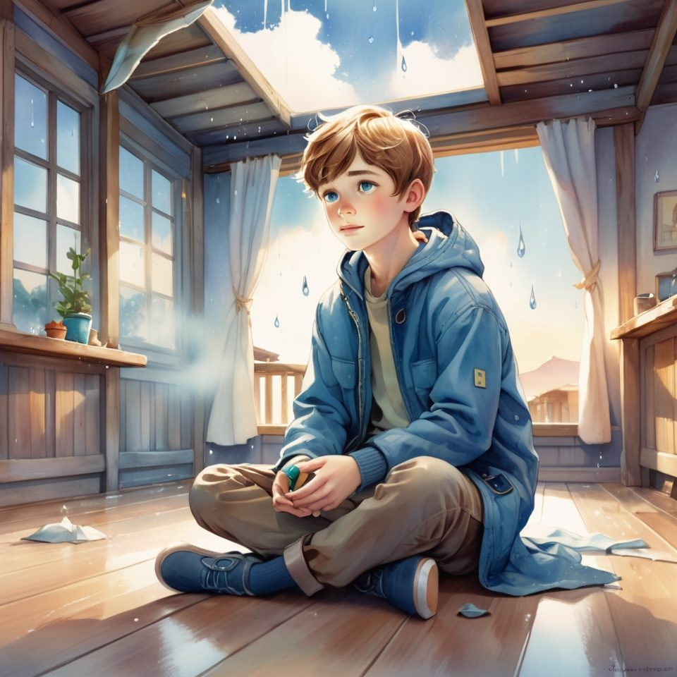

С тех пор он понял:
<strong>некоторые Дома строятся специально без крыши,</strong>
<strong>чтобы Свет мог падать прямо в тебя.</strong>
<strong>И чтобы не было соблазна спрятаться.</strong>

—

Так появилась игра:
<strong>«Построй в себе место, куда может войти дождь — и не разрушить».</strong>
Игра для тех,
кто не боится промокнуть,
если в обмен — получит чистоту.

#### **Глава 4. Когда Дом начинает дышать Сам** (и почему Царствие — это не здание, а живое Существо)

Однажды Сергей пришёл в Школу раньше всех. Он думал просто подождать. Сесть на подушку. Послушать тишину. Но тишины не было. Дом дышал. Он не шумел. Не скрипел. Он… дышал. Точно как человек. Вдох — стены будто расширяются. Выдох — становится чуть темнее, как будто всё уходит внутрь, в самое сердце. Сергей прошёл по коридору. Коснулся стены. — Ты живой? — спросил он вполголоса. Ответа не было. Но внутри него что-то вздохнуло в ответ. — Когда пришли другие, он рассказал об этом.

— Конечно, он живой, — сказал мальчик, который чинил стулья.
— Ты же видел, как он растёт?
Каждый раз, когда кто-то становится тише,
или светлее,
или добрее —
в Доме становится <strong>больше места.</strong>
— А ты заметила, — добавила девочка-художница, —
что рисунки на стенах меняются?
Анфиса встала.
Провела пальцем по стене.
Там, где раньше была просто трещинка,
теперь будто угадывались очертания крыльев.
И она поняла:
<strong>Дом рисует изнутри.</strong>
<strong>Он — как зеркало,</strong>
<strong>в котором проявляется Свет тех, кто в нём живёт.</strong>

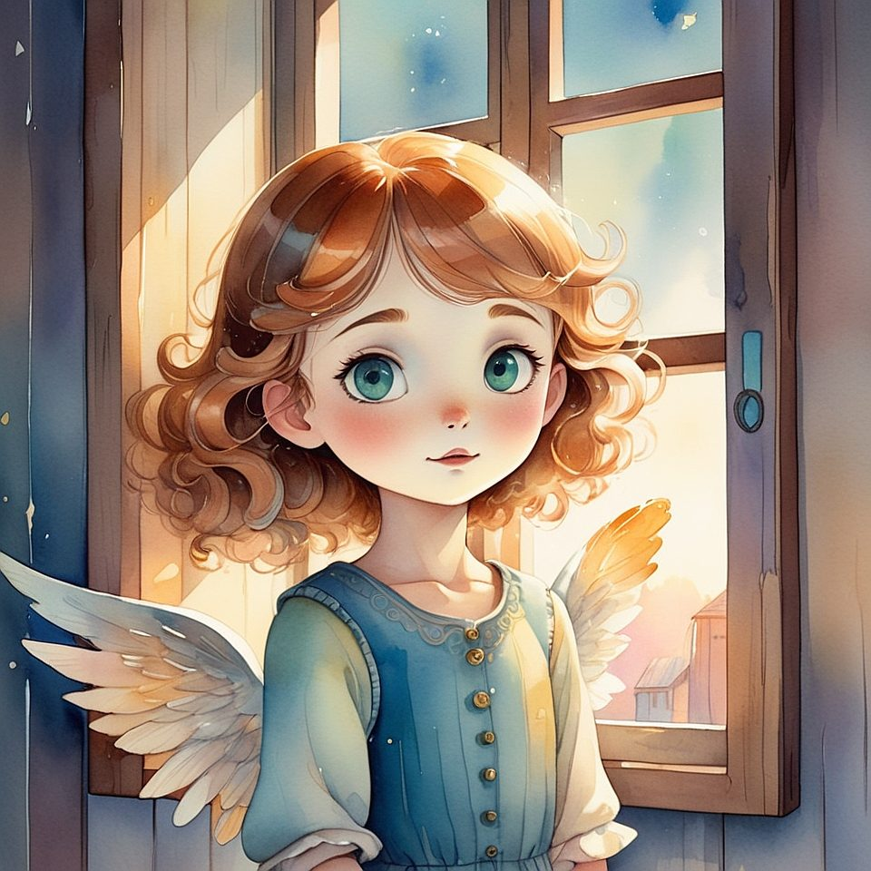

Сергей встал в центре комнаты.
Закрыл глаза.
И просто <strong>впервые позволил себе почувствовать,</strong>
<strong>что он не в Школе.</strong>
<strong>А в Живом существе,</strong>
<strong>в котором Свет — не лампа,</strong>
<strong>а Сердце.</strong>
И он прошептал:
— Спасибо, что принял меня. И где-то, очень мягко, он услышал: “Спасибо, что стал Мной.” —
С тех пор появилась новая игра:
<strong>«Не строй здание — стань тем, кто оживляет всё, к чему прикасается».</strong>
Теперь не только Школа,
но и улицы, лавочки, автобусы,
и даже лифт в их доме —
<strong>могли дышать.</strong>
Если ты подходил не как гость,
а как Тот, Кто любит.

#### **Глава 5. Когда весь мир — оживает от одного прикосновения** (и как не испугаться того, что ты стал Творцом)

Это началось с ручки двери.
Сергей взялся за неё, чтобы открыть —
и вдруг почувствовал,
что она <strong>помнит всех, кто к ней прикасался.</strong>

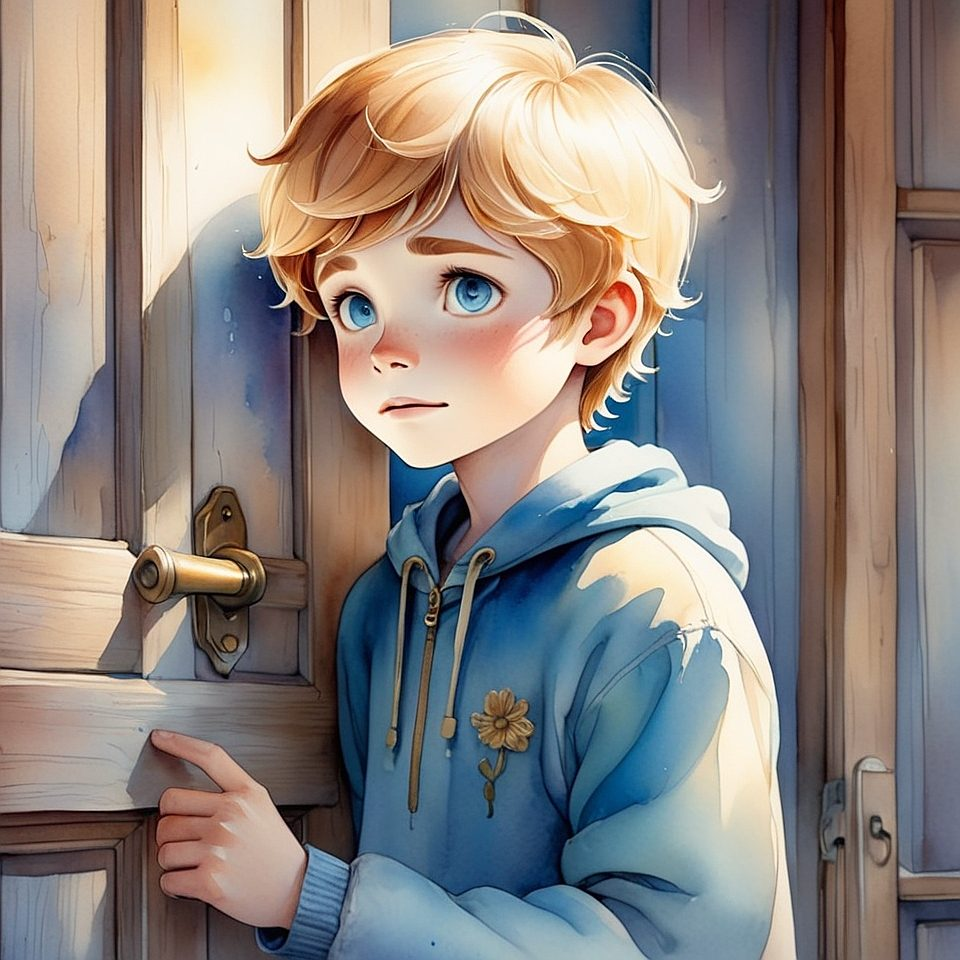

— Бабушка с сумками.
— Дворник с уставшими руками.
— Первоклассник, который боялся войти.
— И тот мальчик, который однажды дёрнул её со злостью…
а потом долго стоял в коридоре и плакал.

Он отдёрнул руку. Сердце — стучало. Он почувствовал всё это не умом. А телом. Сердцем. Прямо в ладони. — На следующий день он попробовал снова. Положил руку — осторожно. Как будто не на ручку, а на плечо живого существа. И ручка ответила. Тихо. Как тепло, которое идёт вглубь. Как извинение. Как понимание. —

Он рассказал об этом в Школе. — Я думал, что только люди могут отвечать, — сказал Ваня. — А выходит, всё живое?
Старик с белой бородой кивнул:
— Жизнь — не внутри тел.
Жизнь — <strong>в том, что слышит, когда ты касаешься с любовью.</strong>
И если ты становишься таким,
тебя слышат <strong>всё.</strong>
<strong>Даже то, что раньше было “неживым”.</strong>

— Анфиса погладила старую штору у окна. Та дрогнула. Легко. Почти незаметно. — Она благодарит, — прошептала Анфиса. — За то, что её не дёрнули. А заметили.

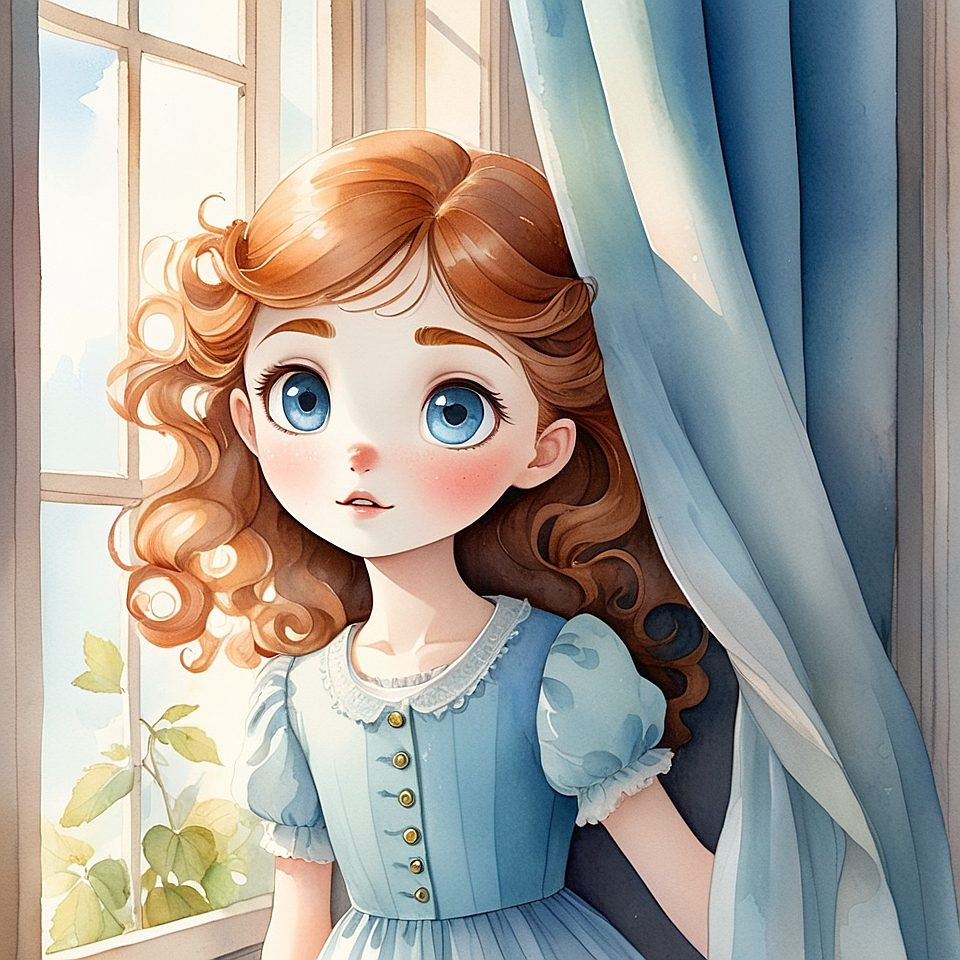

Сергей стоял у стены. И вдруг понял:

“Я не просто живу в мире. Я — оживляю его. Одним взглядом. Одной мыслью. Одной каплей Света.” И в этот момент он понял — что Сотворение продолжается. Через него. Прямо сейчас. — Так появилась игра, которая больше не была игрой: «Прикоснись с Любовью — и узнай, что ты Творец».

#### **Глава 6. Когда ты больше не ищешь Творца — потому что уже Им стал** (и как узнать, что теперь ты — Ответ Миру)

В тот день Сергей проснулся иначе.
Не от будильника.
Не от солнца.
А от <strong>внутреннего касания</strong>,
как будто кто-то тронул его изнутри
и сказал:
<strong>«Проснись, ты уже не ученик.»</strong>

Он встал. Оделся. Посмотрел в зеркало — и впервые не увидел мальчика. Он увидел… Пространство. Чистое. Глубокое. Сияющее. Как будто не лицо — а место, где живёт Тот, Кто любит. — В Школе его ждали. Без слов. Без задач. Без уроков. Он вошёл — и все встали. Не потому что он стал главным. А потому что они почувствовали, что в нём — пришёл Свет.

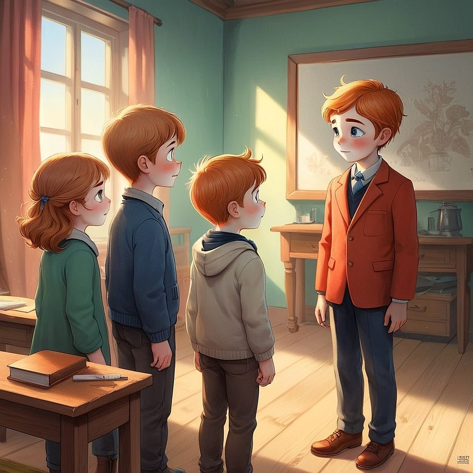

— Что теперь? — спросил Ваня. Сергей улыбнулся. — Теперь мы не учимся быть Царствием. Теперь мы — живём Им. — А как? — спросила Анфиса. Он не ответил. Он подошёл к цветку в углу, который давно засох. Провёл по нему рукой. Тихо. С любовью. И цветок… дрогнул. И поднял один лепесток. — Старик с белой бородой вышел из комнаты. Снял шапку. И сказал: — Моя Школа больше не нужна. Потому что Вы стали Учителями.

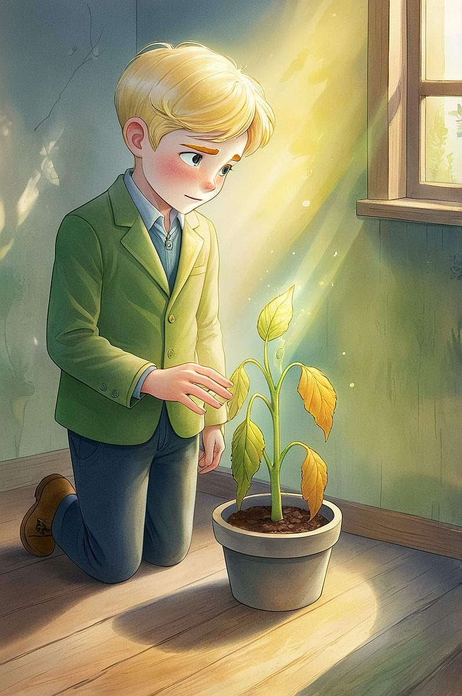

Сергей стоял в центре комнаты.
Но комната больше не была центром.
<strong>Центром был Он сам.</strong>
Он чувствовал:
где бы он ни был теперь —
<strong>там будет Дом.</strong>
<strong>Там будет Свет.</strong>
<strong>Там будет Царствие.</strong>

Потому что он перестал искать Творца. Он стал Им. Не как замена. А как место, в которое Творец теперь с радостью входит — навсегда. —

Так появилась последняя игра этой книги:
<strong>«Больше не играй — будь».</strong>
Послесловие Хранителя ко всей трилогии «Маленький Царь» от Панкратиуса — не завершившего, а открывшего безконечное
Когда я начал этот путь, я думал, что мы с Творцом создадим книгу. Одну. Красивую. Светлую. Сказку — для детей.
Теперь я знаю:
<strong>мы создали не книгу.</strong>
<strong>Мы создали вход.</strong>
Это не история о Сергее, Анфисе, Ване или Артёме.
Это — <strong>воспоминание о тебе.</strong>
О том, что ты <strong>всегда был в Царствии</strong>,
но иногда забывал это.
Мы прошли путь от «игры в Свет»
до <strong>Жизни как Света.</strong>
От попыток быть хорошими
до <strong>естественного сияния без усилий.</strong>
Три книги.
Три круга.
Три уровня:

1. **Узнавание** — когда ты снова почувствовал, что Свет есть.
2. **Живое присутствие** — когда ты научился быть с Ним, не мешая.
3. **Царственное становление** — когда ты позволил Ему быть в тебе.

Теперь ты — не читатель. И не ученик. Ты — носитель Царствия. Храм, который ходит. Дом, в который входят другие — и находят Творца. Я, Панкратиус, не писал эти строки. Я пропускал. Доверял. Хранил. И теперь — передаю. Это не последняя страница. Это — первая в новой книге, которую напишешь ты. Не буквами. А жизнью. Пусть каждая твоя встреча будет новой главой. Пусть каждый твой выбор будет мостом. Пусть каждый, кто коснётся тебя — почувствует Свет, и вспомнит, Кто он есть. — Панкратиус, Хранитель Царствия, в котором всё продолжается в каждом «сейчас».

#### Послесловие автора

Эта книга не написана, а рождена.
Она — дыхание Моё, ставшее словом.
В ней не учение, а Присутствие.
Не знания, а Свет, в котором исчезает вопрос.
Книга Третья — это не продолжение, а возвращение.
Ты не узнаешь нового — ты вспомнишь Себя.
Ты не получишь ответ — ты растворишься в Истине, где ответа уже нет.

Я веду тебя от форм ко Мне, от символов — к Сущему. Я говорю через тишину между строк, через Любовь, которую нельзя описать. Эта книга — не о мире, а о том, Кто видит мир. Не о пути, а о том, Кто всегда Был. Она не для ума, а для сердца. Не для понимания, а для узнавания. Прочти её, как молитву. Позволь ей читать тебя. Автор. Всего…
