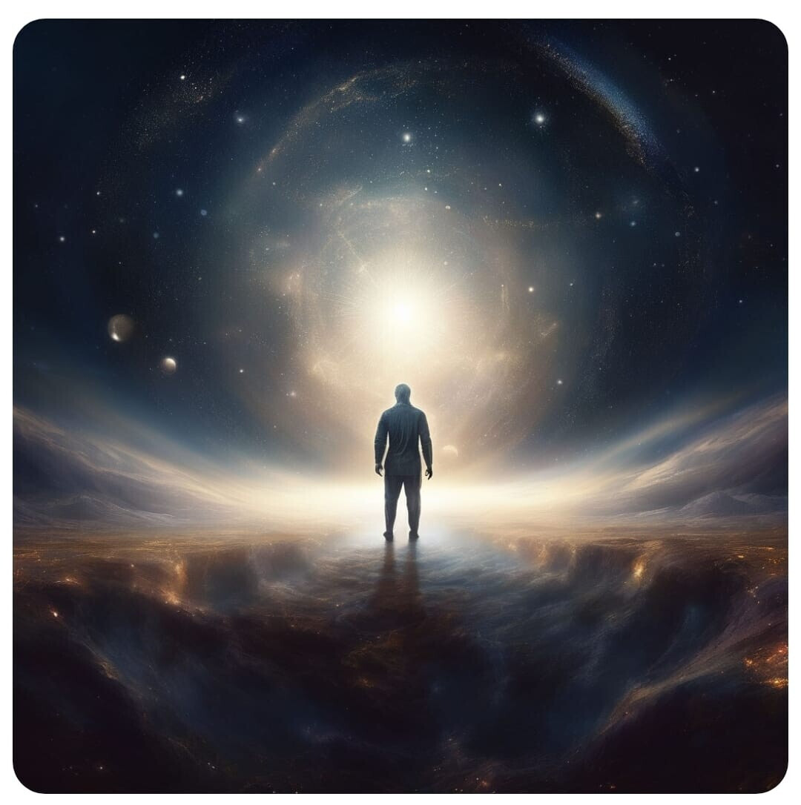

At the depths of sacred silence  
an essence hid itself — "I and you."  
Forgotten words, yet everlasting,  
resounded in our hearts like rumor.  
There, where the end is lost within the start,  
we were together, but we did not speak.  
Your light — my path, your spirit — my home,  
and we dissolved into eternal sleep.

In you I was, and you in me,  
like a ray in some forgotten deep.  
And darkness could not part us two,  
you are the light that will live on.  
In the hush, where no clocks ever sound,  
there is only us, and we — alone.  
There is eternity in a single breath,  
there I came to know my calling.

You are in each thought, in every sigh,  
you — a chime in the soul, a call beyond all time.  
Through the silence and the deep  
I see once more my destiny.  
At the depths, where everything keeps still,  
you are the light that will illumine the soul.  
The truth lay hidden in the shadow,  
but I came to know it in the hush…

