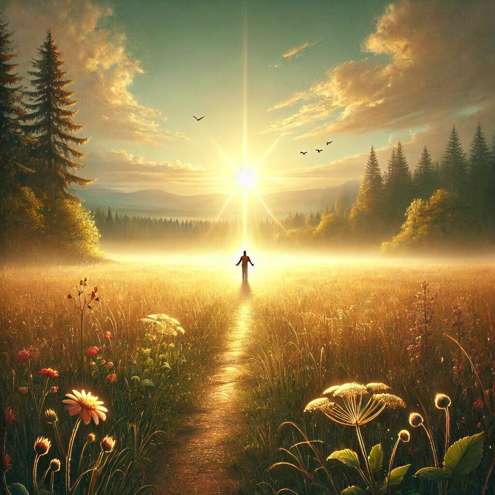

You are my Maker, and I am warmed by you,  
I seek you down the winding paths of being.  
You are the light and peace, the joy of light shone through,  
and all my love is yours, and yours my seeing.

In you there breathes the breath of every instant,  
in you the melody of ages rings.  
You are each sigh that grants me my submission,  
the whisper of the grass, the river's gleaming.

You are the clouds that drifted soft and high,  
the morning dew, the meadows and the bower.  
And this full heart, all rapture, knows that I  
will find you gazing back from every flower.

You are my Maker, and your world has no ending,  
in you the source and the eternity of ways.  
And in this life, so brief, so swiftly spending,  
I find no meaning but your nearness in my days.

